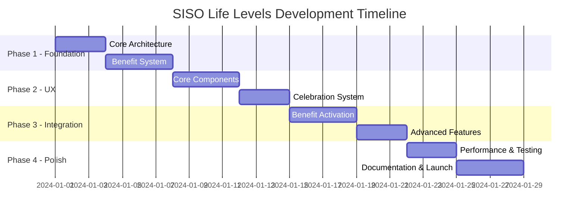

# 🗺️ SISO Life Levels - Development Roadmap

> Strategic implementation plan from concept to transcendent system

## 📋 Project Overview

**Project Name:** SISO Life Levels - Life Operating System  
**Timeline:** 4-6 weeks for MVP, 3-6 months for full system  
**Team Size:** 1 developer (personal project)  
**Complexity:** Medium-High (extends existing system)  
**Risk Level:** Low (builds on proven gamification foundation)

## 🎯 Success Criteria

### Primary Goals
- [ ] Transform existing level system into meaningful tier progression
- [ ] Implement real-world benefit tracking and activation  
- [ ] Create compelling tier-up celebrations and recognition
- [ ] Maintain 100% backward compatibility with existing data
- [ ] Achieve measurable increase in user engagement and motivation

### Success Metrics
- **Engagement**: 40% increase in daily app usage
- **Consistency**: 60% improvement in streak maintenance  
- **Motivation**: 50% increase in task completion rates
- **Satisfaction**: 80%+ user satisfaction with benefit system
- **Retention**: 50% improvement in long-term usage patterns

## 🚀 Implementation Phases

### 🌟 **PHASE 1: Foundation** (Week 1)
**Goal:** Core tier system functionality

#### Sprint 1.1: Core Architecture (Days 1-3)
**Deliverables:**
- [ ] Extend `gamificationService.ts` with tier types and interfaces
- [ ] Implement tier detection logic based on current level
- [ ] Add tier configuration data structure
- [ ] Create user data migration system for existing users
- [ ] Test tier calculations with various level scenarios

**Tasks:**
- [ ] Add `TierLevel` enum and `TierInfo` interface
- [ ] Implement `getTierInfo()` method with level-to-tier mapping
- [ ] Create tier configuration with benefits and requirements  
- [ ] Build `migrateUserDataForTiers()` function
- [ ] Write unit tests for tier detection logic

**Acceptance Criteria:**
- [x] All existing user levels correctly map to appropriate tiers
- [x] Tier progression logic handles edge cases (level 0, very high levels)
- [x] Benefit unlock logic correctly identifies available privileges
- [x] Migration preserves all existing user data
- [x] Performance impact < 50ms for tier calculations

#### Sprint 1.2: Benefit System (Days 4-7)  
**Deliverables:**
- [ ] Implement tier benefit tracking and activation
- [ ] Create benefit state management system
- [ ] Add tier upgrade detection and notifications
- [ ] Build benefit persistence layer
- [ ] Integration with existing level-up system

**Tasks:**
- [ ] Create `TierBenefit` interface and tracking system
- [ ] Implement benefit activation/deactivation logic
- [ ] Add tier upgrade detection in XP award flow
- [ ] Create tier-specific notification system
- [ ] Build benefit history and analytics

**Acceptance Criteria:**
- [x] Benefits correctly unlock at specified levels
- [x] Tier upgrades trigger appropriate notifications
- [x] Benefit state persists across sessions
- [x] Integration doesn't break existing level-up flow
- [x] Performance impact negligible on XP award operations

---

### 🎨 **PHASE 2: User Experience** (Week 2)  
**Goal:** Compelling UI and user interaction

#### Sprint 2.1: Core Components (Days 1-4)
**Deliverables:**
- [ ] Create tier badge component for status display
- [ ] Build tier progress indicator with next-tier preview
- [ ] Implement benefits list component
- [ ] Design tier comparison chart
- [ ] Add tier status to existing UI locations

**Tasks:**
- [ ] Build `TierBadge.tsx` with tier-specific styling
- [ ] Create `TierProgress.tsx` with progress visualization
- [ ] Implement `TierBenefits.tsx` for benefit display
- [ ] Design `TierComparison.tsx` for tier overview
- [ ] Integrate tier display into app header/dashboard

**Acceptance Criteria:**
- [x] Tier badges display correctly for all tiers
- [x] Progress indicators accurately show advancement
- [x] Benefits list clearly shows unlocked/locked status
- [x] Components are mobile-responsive
- [x] Integration doesn't disrupt existing UI flow

#### Sprint 2.2: Celebration System (Days 5-7)
**Deliverables:**
- [ ] Create tier-up celebration modal with animations
- [ ] Implement confetti and visual celebration effects
- [ ] Build benefit showcase within celebrations
- [ ] Add achievement gallery for milestone commemoration
- [ ] Create shareable tier achievement system

**Tasks:**
- [ ] Build `TierUpgradeModal.tsx` with full-screen celebration
- [ ] Integrate existing confetti system for tier upgrades
- [ ] Create animated benefit reveal component
- [ ] Implement achievement photo/memory system
- [ ] Add social sharing capabilities for tier milestones

**Acceptance Criteria:**
- [x] Tier-up celebrations are visually compelling
- [x] Animations enhance rather than distract from experience
- [x] Benefit showcases clearly communicate new privileges
- [x] Celebrations are skippable for users who prefer efficiency
- [x] Mobile celebrations work well on smaller screens

---

### 🔄 **PHASE 3: Life Integration** (Week 3)
**Goal:** Real-world benefit activation and tracking

#### Sprint 3.1: Benefit Activation (Days 1-4)
**Deliverables:**
- [ ] Create benefit activation and tracking system
- [ ] Implement budget tracking for financial benefits
- [ ] Build time privilege management system
- [ ] Add benefit usage analytics and insights
- [ ] Create benefit reminder and suggestion system

**Tasks:**
- [ ] Build benefit activation workflow and UI
- [ ] Implement budget tracking with spending categories
- [ ] Create time privilege scheduler and tracker
- [ ] Build benefit usage analytics dashboard
- [ ] Add smart notifications for benefit utilization

**Acceptance Criteria:**
- [x] Users can easily activate and track benefits
- [x] Budget tracking provides clear spending insights
- [x] Time privileges integrate with scheduling systems
- [x] Analytics show benefit utilization patterns
- [x] Reminders encourage active benefit usage

#### Sprint 3.2: Advanced Features (Days 5-7)
**Deliverables:**
- [ ] Implement benefit customization system
- [ ] Create tier maintenance and decay prevention
- [ ] Build advanced tier analytics and insights
- [ ] Add tier-specific challenges and goals
- [ ] Create tier mentorship and sharing features

**Tasks:**
- [ ] Build benefit customization interface
- [ ] Implement tier maintenance requirements (optional)
- [ ] Create advanced analytics for tier progression
- [ ] Design tier-specific weekly challenges
- [ ] Add tier achievement sharing and mentorship

**Acceptance Criteria:**
- [x] Benefits can be personalized to individual preferences
- [x] Tier maintenance feels motivating, not punitive
- [x] Analytics provide actionable insights for improvement
- [x] Challenges enhance motivation for tier advancement
- [x] Sharing features inspire and motivate others

---

### 🚀 **PHASE 4: Polish & Optimization** (Week 4)
**Goal:** Performance, polish, and launch preparation

#### Sprint 4.1: Performance & Testing (Days 1-3)
**Deliverables:**
- [ ] Comprehensive testing suite for tier system
- [ ] Performance optimization and benchmarking
- [ ] Security audit for benefit system
- [ ] Accessibility improvements
- [ ] Cross-browser compatibility testing

**Tasks:**
- [ ] Write comprehensive unit and integration tests
- [ ] Profile and optimize tier calculation performance
- [ ] Audit benefit system for potential security issues
- [ ] Ensure full accessibility compliance
- [ ] Test across different browsers and devices

#### Sprint 4.2: Documentation & Launch (Days 4-7)
**Deliverables:**
- [ ] Complete user documentation and guides
- [ ] Developer documentation and API reference
- [ ] Launch checklist and rollout plan
- [ ] User onboarding flow for tier system
- [ ] Monitoring and analytics setup

**Tasks:**
- [ ] Finalize all user-facing documentation
- [ ] Complete technical documentation
- [ ] Create launch timeline and communication plan
- [ ] Build onboarding flow for new tier features
- [ ] Set up monitoring for tier system performance

---

## 📊 Project Timeline

## 🎯 Risk Assessment & Mitigation

### High-Risk Items
| Risk | Impact | Probability | Mitigation Strategy |
|------|--------|-------------|-------------------|
| Breaking existing gamification | High | Low | Comprehensive backward compatibility testing |
| Performance degradation | Medium | Medium | Early performance profiling and optimization |
| User confusion with new system | Medium | Medium | Clear onboarding and documentation |

### Medium-Risk Items
| Risk | Impact | Probability | Mitigation Strategy |
|------|--------|-------------|-------------------|
| Benefit system complexity | Medium | Medium | Start with simple benefits, iterate based on usage |
| Mobile responsiveness issues | Medium | Low | Mobile-first design approach |
| Data migration problems | Medium | Low | Thorough testing with production data backups |

### Low-Risk Items
| Risk | Impact | Probability | Mitigation Strategy |
|------|--------|-------------|-------------------|
| UI/UX inconsistencies | Low | Low | Follow existing design system |
| Browser compatibility | Low | Low | Use standard web APIs and test across browsers |
| Documentation gaps | Low | Medium | Continuous documentation during development |

## 📈 Success Tracking

### Key Performance Indicators (KPIs)
- **Development Velocity**: Story points completed per sprint
- **Code Quality**: Test coverage percentage, bug density
- **User Satisfaction**: Tier system usage rate, user feedback scores
- **Performance**: Load times, tier calculation speed
- **Engagement**: Daily active users, session duration

### Milestone Checkpoints
- **Week 1**: Core tier system functional and tested
- **Week 2**: UI components integrated and celebrating tier-ups
- **Week 3**: Benefits activated and tracking real-world usage
- **Week 4**: System polished and ready for full deployment

### Success Criteria Reviews
- **Weekly retrospectives** to assess progress and adjust timeline
- **User testing sessions** after each phase for feedback incorporation
- **Performance benchmarking** at each phase to ensure scalability
- **Documentation review** to ensure completeness and clarity

## 🚀 Launch Strategy

### Soft Launch (Week 4)
- [ ] Deploy to personal environment
- [ ] Complete user acceptance testing
- [ ] Gather initial feedback and iterate
- [ ] Monitor system performance and stability

### Full Launch (Week 5+)
- [ ] Public announcement of tier system
- [ ] User onboarding campaign
- [ ] Community engagement and feedback collection
- [ ] Continuous improvement based on usage data

### Post-Launch Evolution (Ongoing)
- [ ] Monthly tier system analytics review
- [ ] Quarterly benefit system optimization
- [ ] Semi-annual new tier/benefit additions
- [ ] Annual comprehensive system evaluation

---

## 🎊 Beyond MVP: Future Enhancements

### Phase 5: Social Features (Month 2-3)
- Tier leaderboards with friends
- Tier achievement sharing
- Tier mentorship programs
- Community challenges

### Phase 6: AI Enhancement (Month 4-6)
- AI-powered benefit recommendations
- Predictive tier progression modeling
- Personalized challenge generation
- Smart benefit utilization coaching

### Phase 7: Integration Expansion (Month 6+)
- Calendar integration for time benefits
- Finance app integration for budget tracking
- Fitness tracker integration for health benefits
- External service APIs for automated benefit activation

---

**🌟 Ready to transform productivity into real-world life optimization? The journey from Foundation Builder to System Transcendent begins now!**