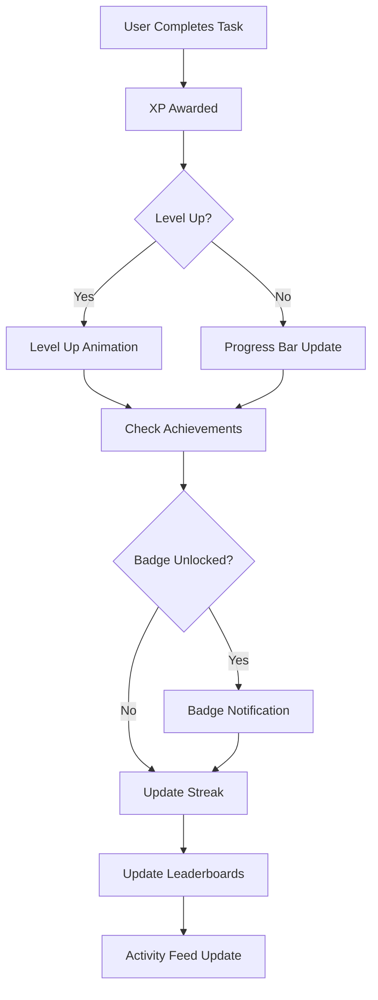
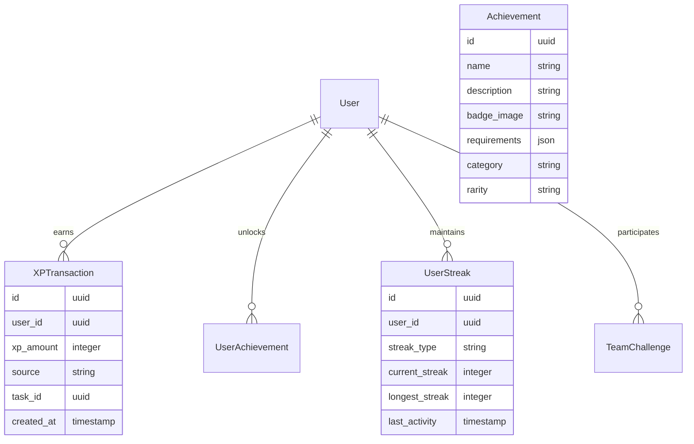

# SISO Internal - Gamification System PRD

**Project:** Advanced Gamification & Engagement Platform  
**Type:** Web Application Feature Enhancement  
**Version:** 2.0  
**Date:** [Current Date]  
**Owner:** Product Team  
**Status:** Example Template  

---

## 📋 **Executive Summary**

### Problem Statement
*SISO Internal users need enhanced motivation and engagement mechanisms to maintain consistent productivity and achieve long-term goals.*

Current SISO Internal provides task management capabilities, but lacks the psychological engagement mechanisms that drive consistent user behavior and goal achievement. Users struggle with:
- Maintaining motivation during long-term projects
- Visualizing progress and achievements
- Understanding their productivity patterns
- Competing healthily with teammates
- Celebrating milestones and successes

### Solution Overview
*Advanced gamification system with XP, levels, achievements, streaks, and social engagement features.*

**Application Type:** 
- [x] Dashboard/Analytics Platform Enhancement
- [x] SaaS Product Feature Addition
- [x] Gamification & Engagement System

**Key Capabilities:**
- XP-based leveling system with meaningful rewards
- Achievement badges for various accomplishments
- Streak tracking for consistent behavior
- Team challenges and friendly competition
- Progress visualization and analytics
- Social sharing and recognition features

### Success Metrics
- **User Engagement:** 40% increase in daily active users
- **Task Completion:** 25% improvement in task completion rates
- **Retention:** 35% increase in 30-day user retention
- **Session Duration:** 50% increase in average session time

---

## 🎯 **Objectives & Key Results (OKRs)**

### Objective 1: Increase User Engagement & Retention
- **KR1:** Achieve 75% DAU engagement with gamification features within 3 months
- **KR2:** Increase 30-day retention rate from 45% to 65%
- **KR3:** Reduce user churn rate by 30% through engagement mechanics

### Objective 2: Improve Productivity & Goal Achievement
- **KR1:** Increase task completion rate by 25% among active users
- **KR2:** Achieve 80% user participation in goal-setting features
- **KR3:** Improve average project completion time by 15%

### Objective 3: Foster Team Collaboration & Healthy Competition
- **KR1:** Launch 5 team-based challenges with 60% participation rate
- **KR2:** Achieve 40% user engagement with social sharing features
- **KR3:** Create 3 recognition programs with positive sentiment scores

---

## 👥 **Target Users & Stakeholders**

### Primary Users
| User Type | Description | Pain Points | Goals |
|-----------|-------------|-------------|-------|
| **Individual Contributors** | Developers, designers, analysts | Lack motivation for long-term goals | Want clear progress tracking and rewards |
| **Team Leads** | Project managers, team leads | Difficulty motivating team members | Need tools to encourage team engagement |
| **Executives** | Directors, VPs, C-suite | Want to improve team productivity | Need visibility into engagement metrics |

### Stakeholders
| Stakeholder | Role | Interest Level | Influence Level | Key Concerns |
|-------------|------|---------------|-----------------|--------------|
| Product Team | Feature Owners | High | High | User adoption, feature success metrics |
| Engineering | Implementation | High | High | Technical complexity, performance impact |
| Design Team | UX/UI Design | High | Medium | User experience, visual consistency |
| Analytics Team | Data & Metrics | Medium | Medium | Tracking implementation, success measurement |

---

## 🔧 **Functional Requirements**

### Core Features

#### Feature 1: XP & Leveling System
**Priority:** P0 (Must Have)  
**User Story:** As a SISO user, I want to earn XP for completing tasks and level up so that I feel a sense of progression and achievement.

**Acceptance Criteria:**
- [ ] Users earn XP for completing tasks (base: 10 XP per task, +5 XP per complexity level)
- [ ] Users level up every 1000 XP with exponential scaling (Level 1: 1000 XP, Level 2: 2100 XP, etc.)
- [ ] Level progression is visually displayed with progress bars and animations
- [ ] Users can view their XP history and level progression over time
- [ ] XP bonuses for streak achievements (daily, weekly, monthly)

**Technical Notes:** Store XP transactions in audit table for transparency and debugging

#### Feature 2: Achievement Badge System
**Priority:** P0 (Must Have)  
**User Story:** As a user, I want to earn badges for various accomplishments so that my diverse contributions are recognized.

**Acceptance Criteria:**
- [ ] 25+ unique achievement badges across categories (productivity, collaboration, consistency)
- [ ] Badge progress indicators show requirements and current progress
- [ ] Earned badges display in user profile and leaderboards
- [ ] Badge notifications with celebration animations upon earning
- [ ] Rare/legendary badges for exceptional achievements

**Achievement Categories:**
- **Productivity:** Task Master, Speed Demon, Quality Champion
- **Consistency:** Streak Warrior, Daily Grinder, Weekly Champion  
- **Collaboration:** Team Player, Mentor, Helpful Contributor
- **Innovation:** Creative Thinker, Problem Solver, Innovator
- **Leadership:** Goal Setter, Achievement Unlocked, Milestone Master

#### Feature 3: Streak Tracking System
**Priority:** P1 (Should Have)  
**User Story:** As a user, I want to maintain streaks for consistent behavior so that I stay motivated to work regularly.

**Acceptance Criteria:**
- [ ] Track daily task completion streaks with visual flame icons
- [ ] Weekly goal achievement streaks
- [ ] Streak recovery options (freeze streaks for planned breaks)
- [ ] Streak milestone rewards (7-day, 30-day, 100-day achievements)
- [ ] Push notifications for streak maintenance reminders

#### Feature 4: Social Recognition & Sharing
**Priority:** P1 (Should Have)  
**User Story:** As a user, I want to share achievements and see team accomplishments so that we can celebrate successes together.

**Acceptance Criteria:**
- [ ] Activity feed showing team member achievements and milestones
- [ ] Congratulations system for team member accomplishments
- [ ] Shareable achievement cards for external social media
- [ ] Team leaderboards with healthy competition metrics
- [ ] Recognition system for peer nominations and kudos

#### Feature 5: Team Challenges & Competitions
**Priority:** P2 (Could Have)  
**User Story:** As a team lead, I want to create team challenges so that we can work toward common goals together.

**Acceptance Criteria:**
- [ ] Create custom team challenges with defined goals and timeframes
- [ ] Track team progress toward collective goals
- [ ] Individual contribution visibility within team challenges
- [ ] Challenge completion rewards and recognition
- [ ] Pre-built challenge templates (Sprint Goals, Quality Metrics, Innovation Time)

### User Workflow

---

## ⚡ **Non-Functional Requirements**

### Performance Requirements
- **Response Time:** < 100ms for XP calculations and badge checks
- **Real-time Updates:** Leaderboards and activity feeds update within 5 seconds
- **Animation Performance:** 60fps for level-up and achievement animations
- **Database Performance:** Gamification queries don't impact core app performance by >10%

### Security Requirements
- **XP Integrity:** Server-side validation prevents XP manipulation
- **Fair Play:** Anti-gaming mechanisms prevent achievement abuse
- **Privacy:** Users can opt-out of leaderboards and social features
- **Data Protection:** Achievement data follows same privacy rules as user data

### Usability Requirements
- **Accessibility:** All gamification elements meet WCAG 2.1 AA standards
- **Mobile Responsiveness:** Full feature parity on mobile devices
- **Progressive Enhancement:** Core app works if gamification features fail
- **Customization:** Users can disable/customize gamification elements

### Technical Requirements
- **Technology Integration:** Seamless integration with existing React/TypeScript codebase
- **Database Schema:** Optimized for high-frequency read/write operations
- **Caching Strategy:** Redis caching for leaderboards and frequent calculations
- **Analytics Integration:** Comprehensive event tracking for feature success

---

## 🎨 **User Experience & Design**

### Design Principles
- **Motivation-Focused:** Every element should increase user motivation and engagement
- **Non-Intrusive:** Gamification enhances rather than distracts from core workflows
- **Celebratory:** Achievements feel genuinely rewarding with delightful animations

### Gamification UI Elements
- **XP Progress Bar:** Always-visible progress indicator in app header
- **Level Badge:** Current level prominently displayed in user avatar
- **Achievement Notifications:** Toast notifications with celebratory animations
- **Leaderboard Widget:** Optional sidebar widget for competitive users
- **Activity Feed:** Social tab showing team achievements and milestones

### Visual Design Requirements
- **Color Psychology:** Gold for achievements, blue for XP, green for streaks
- **Animation Strategy:** Satisfying micro-animations for reward moments  
- **Icon System:** Consistent iconography for badges, levels, and achievements
- **Progress Visualization:** Multiple progress bar styles for different contexts

---

## 🛠️ **Technical Architecture**

### Gamification Data Model

### API Endpoints
| Endpoint | Method | Purpose | Expected Response Time |
|----------|--------|---------|----------------------|
| `/api/gamification/xp` | GET | User XP and level data | < 50ms |
| `/api/gamification/achievements` | GET | User achievements and progress | < 100ms |
| `/api/gamification/leaderboard` | GET | Team/global leaderboards | < 200ms |
| `/api/gamification/activity-feed` | GET | Recent team activities | < 150ms |
| `/api/gamification/award-xp` | POST | Award XP for task completion | < 100ms |

### Integration Points
- **Task Management:** Automatic XP awards when tasks completed
- **User Profiles:** Achievement badges and level display
- **Analytics Dashboard:** Gamification engagement metrics
- **Notification System:** Achievement and level-up notifications
- **Mobile App:** Full feature parity with web application

---

## 📅 **Implementation Timeline**

### Phase 1: Core Gamification Engine (Weeks 1-3)
- [ ] **Backend Infrastructure**
  - [ ] Database schema design and migration
  - [ ] XP calculation engine and transaction system
  - [ ] Achievement definition framework
  - [ ] Basic API endpoints for XP and achievements
- [ ] **Frontend Foundation**
  - [ ] XP progress bar component
  - [ ] Level display in user interface
  - [ ] Basic achievement notification system

### Phase 2: Achievement & Badge System (Weeks 4-6)
- [ ] **Achievement Engine**
  - [ ] Achievement progress tracking system
  - [ ] Badge unlock logic and validation
  - [ ] 15 initial achievement badges
  - [ ] Achievement progress indicators
- [ ] **User Interface**
  - [ ] Achievement gallery and progress display
  - [ ] Badge notification animations
  - [ ] User profile integration

### Phase 3: Social Features & Leaderboards (Weeks 7-9)
- [ ] **Social Engagement**
  - [ ] Team leaderboards with ranking system
  - [ ] Activity feed for team achievements
  - [ ] Social sharing capabilities
  - [ ] Peer recognition and kudos system
- [ ] **Competition Features**
  - [ ] Streak tracking and display
  - [ ] Team challenge framework
  - [ ] Healthy competition metrics

### Phase 4: Polish & Advanced Features (Weeks 10-12)
- [ ] **Enhancement & Optimization**
  - [ ] Performance optimization for high-frequency operations
  - [ ] Advanced achievement categories (10 additional badges)
  - [ ] Customization options and user preferences
  - [ ] Mobile responsiveness and cross-platform consistency
- [ ] **Analytics & Insights**
  - [ ] Comprehensive gamification analytics dashboard
  - [ ] User engagement reports and insights
  - [ ] A/B testing framework for gamification features

---

## 📊 **Success Metrics & Analytics**

### Key Performance Indicators (KPIs)
| Metric | Current State | Target | Measurement Method | Review Frequency |
|--------|---------------|--------|--------------------|------------------|
| **Daily Active Users** | 65% | 75% | User login analytics | Daily |
| **Task Completion Rate** | 68% | 85% | Task analytics | Weekly |
| **30-day Retention** | 45% | 65% | Cohort analysis | Monthly |
| **Average Session Time** | 28 minutes | 42 minutes | Analytics tracking | Weekly |
| **Achievement Engagement** | N/A | 60% | Feature usage tracking | Weekly |

### Gamification-Specific Metrics
- **XP Distribution:** Average XP earned per user per day
- **Level Progression:** Distribution of users across levels
- **Achievement Unlock Rate:** Percentage of achievements unlocked per user
- **Streak Participation:** Percentage of users maintaining active streaks
- **Social Engagement:** Activity feed interactions and peer recognition usage

---

## ⚠️ **Risks & Mitigation Strategies**

| Risk | Probability | Impact | Mitigation Strategy | Contingency Plan |
|------|-------------|--------|-------------------|------------------|
| **User Gaming/Cheating** | Medium | High | Server-side validation, anti-gaming algorithms | Automated detection with manual review process |
| **Performance Degradation** | Low | High | Comprehensive load testing, caching strategy | Feature flags for quick disable if needed |
| **User Disengagement** | Medium | Medium | A/B testing, user feedback integration | Quick iteration cycles, feature customization options |
| **Social Features Toxicity** | Low | Medium | Moderation tools, positive-only interactions | Admin oversight, community guidelines enforcement |

### Technical Risks
- **Database Scalability:** High-frequency XP transactions may impact performance
- **Real-time Updates:** Leaderboards and activity feeds require efficient real-time updates
- **Cross-Platform Consistency:** Maintaining feature parity across web and mobile

### Business Risks
- **Feature Adoption:** Users may not engage with gamification features as expected
- **Development Scope:** Complex achievement logic may extend development timeline
- **Maintenance Overhead:** Ongoing content creation for new achievements and challenges

---

## 🧪 **Testing Strategy**

### Gamification Testing Approach
- **Unit Testing:** XP calculation logic, achievement unlock conditions
- **Integration Testing:** Task completion to XP award workflows
- **Performance Testing:** High-frequency XP transactions and leaderboard queries
- **User Acceptance Testing:** Engagement and motivation validation with real users
- **A/B Testing:** Different gamification mechanics and reward structures

### Test Scenarios
| Scenario | Priority | Expected Outcome | Test Method |
|----------|----------|------------------|-------------|
| **XP Award Accuracy** | High | Correct XP for various task types | Automated |
| **Level Up Functionality** | High | Proper level progression and rewards | Automated |
| **Achievement Unlock Logic** | High | Badges unlock at correct milestones | Automated |
| **Leaderboard Performance** | Medium | Sub-200ms response times under load | Performance |
| **User Engagement Flow** | High | Positive user experience and motivation | Manual UAT |

---

## 🚀 **Launch Strategy**

### Rollout Phases
#### Soft Launch (Week 13)
- **Internal Team Testing:** Full feature validation with SISO team
- **Performance Monitoring:** System performance under real usage
- **Bug Fixes:** Address any critical issues discovered
- **User Feedback Collection:** Gather insights for final optimizations

#### Beta Release (Week 14)  
- **Limited User Group:** 25% of active users get access
- **Feature Usage Analytics:** Monitor adoption and engagement patterns
- **Iterative Improvements:** Quick fixes based on user behavior data
- **Social Features Testing:** Validate team competition and collaboration aspects

#### Full Production Launch (Week 15)
- **All Users:** Complete rollout to entire user base
- **Launch Communication:** Announcement with feature tour and benefits
- **Support Readiness:** Customer support trained on new features
- **Success Monitoring:** Daily KPI tracking and user feedback monitoring

### Success Criteria for Launch
- [ ] 70% of users engage with at least one gamification feature within 7 days
- [ ] Zero critical bugs affecting core application functionality
- [ ] < 200ms average response time for all gamification API endpoints
- [ ] Positive user sentiment (>80%) in post-launch surveys
- [ ] 15% increase in daily task completion within first month

---

## 📚 **Resources & Implementation Notes**

### SISO Internal Integration Points
**Existing Systems:**
- **Task Management:** Leverage existing task completion events for XP awards
- **User Profiles:** Extend current user system with gamification data
- **Dashboard:** Integrate gamification widgets into existing dashboard
- **Mobile App:** Ensure feature parity with responsive web design

**Technology Stack Alignment:**
- **Frontend:** React components with TypeScript for type safety
- **Backend:** Node.js/Express APIs with Prisma ORM integration  
- **Database:** PostgreSQL with optimized indexes for gamification queries
- **Styling:** Tailwind CSS with shadcn/ui components for consistency

### Development Team Structure
| Role | Responsibilities | Time Allocation |
|------|------------------|-----------------|
| **Frontend Developer** | React components, animations, UI/UX | 60% |
| **Backend Developer** | API endpoints, database schema, business logic | 50% |
| **Designer** | Achievement badges, animations, UX flows | 30% |
| **Product Manager** | Requirements, testing, launch coordination | 25% |

---

*This PRD demonstrates how the template framework applies to a specific SISO Internal feature, showing the level of detail and consideration needed for successful gamification implementation.*