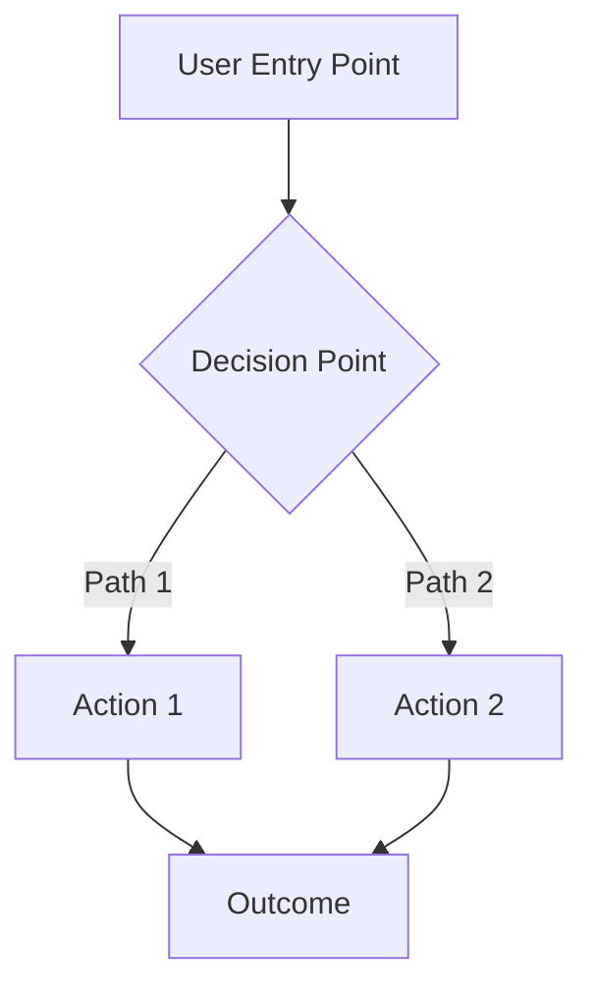
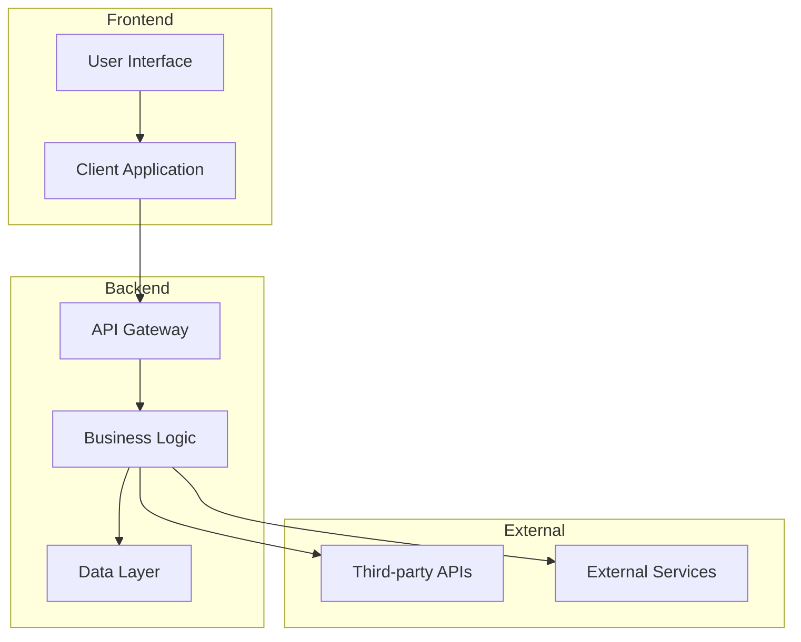

# Product Requirements Document (PRD)

**Project:** [PROJECT_NAME]  
**Version:** 1.0  
**Date:** [DATE]  
**Owner:** [PRODUCT_OWNER]  
**Status:** Draft | Review | Approved | In Development | Complete  

---

## 📋 **Executive Summary**

### Problem Statement
*What problem are we solving and why does it matter?*

[Describe the core problem or opportunity this project addresses. Include market context, user pain points, and business impact.]

### Solution Overview
*What are we building and how does it solve the problem?*

[High-level description of the proposed solution, key capabilities, and expected outcomes.]

### Success Metrics
*How will we measure success?*

- **Primary KPI:** [e.g., 25% increase in user engagement]
- **Secondary KPIs:** [e.g., 15% reduction in support tickets]
- **Timeline:** [Target completion date]
- **Budget:** [Development investment required]

---

## 🎯 **Objectives & Key Results (OKRs)**

### Objective 1: [Primary Business Goal]
- **KR1:** [Measurable outcome 1]
- **KR2:** [Measurable outcome 2]
- **KR3:** [Measurable outcome 3]

### Objective 2: [Secondary Goal]
- **KR1:** [Measurable outcome 1]
- **KR2:** [Measurable outcome 2]

### Objective 3: [Technical/Operational Goal]
- **KR1:** [Measurable outcome 1]
- **KR2:** [Measurable outcome 2]

---

## 👥 **Target Users & Stakeholders**

### Primary Users
| User Type | Description | Pain Points | Goals |
|-----------|-------------|-------------|-------|
| [User Persona 1] | [Demographics & characteristics] | [Current frustrations] | [What they want to achieve] |
| [User Persona 2] | [Demographics & characteristics] | [Current frustrations] | [What they want to achieve] |

### Stakeholders
| Stakeholder | Role | Interest Level | Influence Level | Key Concerns |
|-------------|------|---------------|-----------------|--------------|
| [Name/Team] | [Position] | High/Medium/Low | High/Medium/Low | [Primary concerns] |
| [Name/Team] | [Position] | High/Medium/Low | High/Medium/Low | [Primary concerns] |

---

## 🔧 **Functional Requirements**

### Core Features

#### Feature 1: [Feature Name]
**Priority:** P0 (Must Have) | P1 (Should Have) | P2 (Could Have) | P3 (Won't Have)  
**User Story:** As a [user type], I want to [capability] so that [benefit].

**Acceptance Criteria:**
- [ ] [Specific, measurable criterion 1]
- [ ] [Specific, measurable criterion 2]
- [ ] [Specific, measurable criterion 3]

**Technical Notes:** [Any technical constraints or considerations]

#### Feature 2: [Feature Name]
**Priority:** P0 | P1 | P2 | P3  
**User Story:** As a [user type], I want to [capability] so that [benefit].

**Acceptance Criteria:**
- [ ] [Specific, measurable criterion 1]
- [ ] [Specific, measurable criterion 2]

#### Feature 3: [Feature Name]
**Priority:** P0 | P1 | P2 | P3  
**User Story:** As a [user type], I want to [capability] so that [benefit].

**Acceptance Criteria:**
- [ ] [Specific, measurable criterion 1]
- [ ] [Specific, measurable criterion 2]

### User Workflow

---

## ⚡ **Non-Functional Requirements**

### Performance Requirements
- **Response Time:** [e.g., < 200ms for API calls]
- **Throughput:** [e.g., Handle 1000 concurrent users]
- **Availability:** [e.g., 99.9% uptime]
- **Scalability:** [e.g., Support 10x user growth]

### Security Requirements
- **Authentication:** [Requirements for user authentication]
- **Authorization:** [Role-based access control needs]
- **Data Protection:** [Privacy and data handling requirements]
- **Compliance:** [Relevant regulations - GDPR, CCPA, etc.]

### Usability Requirements
- **Accessibility:** [WCAG 2.1 AA compliance, screen reader support]
- **Browser Support:** [Chrome, Firefox, Safari, Edge versions]
- **Mobile Responsiveness:** [Responsive design requirements]
- **User Experience:** [Loading states, error handling, feedback]

### Technical Requirements
- **Technology Stack:** [Required technologies, frameworks, tools]
- **Integration Points:** [APIs, third-party services, internal systems]
- **Data Requirements:** [Database, storage, backup needs]
- **Deployment:** [Environment requirements, CI/CD, monitoring]

---

## 🎨 **User Experience & Design**

### Design Principles
- [Principle 1: Description]
- [Principle 2: Description]
- [Principle 3: Description]

### User Interface Requirements
- **Visual Design:** [Branding, color scheme, typography requirements]
- **Information Architecture:** [Navigation structure, content organization]
- **Interaction Design:** [User flows, micro-interactions, feedback]

### Wireframes & Mockups
*[Include links to design files, Figma boards, or embed images]*

### Design System Integration
*[How this project integrates with existing design systems or creates new patterns]*

---

## 🛠️ **Technical Architecture**

### System Architecture

### Data Model
*[Key entities, relationships, and data flow]*

### API Specifications
*[Endpoint definitions, request/response formats, authentication]*

### Third-Party Integrations
| Service | Purpose | API Version | Authentication | Rate Limits |
|---------|---------|-------------|---------------|-------------|
| [Service Name] | [What it does] | [Version] | [Auth method] | [Limits] |

---

## 📅 **Timeline & Milestones**

### Development Phases

#### Phase 1: Foundation (Weeks 1-2)
- [ ] **Discovery & Planning**
  - [ ] Stakeholder interviews complete
  - [ ] Technical architecture review
  - [ ] Design system audit
- [ ] **Core Setup**
  - [ ] Development environment setup
  - [ ] Database schema design
  - [ ] Authentication implementation

#### Phase 2: Core Features (Weeks 3-6)
- [ ] **Feature Development**
  - [ ] [Feature 1] implementation
  - [ ] [Feature 2] implementation  
  - [ ] Basic user interface
- [ ] **Testing & Quality**
  - [ ] Unit tests implementation
  - [ ] Integration testing
  - [ ] Security review

#### Phase 3: Enhancement & Polish (Weeks 7-8)
- [ ] **Advanced Features**
  - [ ] [Feature 3] implementation
  - [ ] Performance optimization
  - [ ] Mobile responsiveness
- [ ] **Launch Preparation**
  - [ ] User acceptance testing
  - [ ] Production deployment
  - [ ] Monitoring setup

### Key Milestones
| Milestone | Target Date | Success Criteria | Dependencies |
|-----------|-------------|------------------|--------------|
| **MVP Complete** | [Date] | [Specific criteria] | [What needs to be done first] |
| **Beta Release** | [Date] | [Specific criteria] | [Dependencies] |
| **Production Launch** | [Date] | [Specific criteria] | [Dependencies] |

---

## 🧪 **Testing Strategy**

### Testing Approach
- **Unit Testing:** [Coverage goals, testing frameworks]
- **Integration Testing:** [API testing, end-to-end workflows]
- **User Acceptance Testing:** [Testing criteria, user scenarios]
- **Performance Testing:** [Load testing, stress testing]
- **Security Testing:** [Penetration testing, vulnerability assessment]

### Test Scenarios
| Scenario | Priority | Expected Outcome | Test Method |
|----------|----------|------------------|-------------|
| [Test case 1] | High/Medium/Low | [Expected result] | Manual/Automated |
| [Test case 2] | High/Medium/Low | [Expected result] | Manual/Automated |

---

## 📊 **Success Metrics & Analytics**

### Key Performance Indicators (KPIs)
| Metric | Current State | Target | Measurement Method | Review Frequency |
|--------|---------------|--------|-------------------|------------------|
| [Metric 1] | [Baseline] | [Goal] | [How to measure] | Weekly/Monthly |
| [Metric 2] | [Baseline] | [Goal] | [How to measure] | Weekly/Monthly |

### Analytics Implementation
- **Tracking Events:** [List of events to track]
- **User Behavior:** [Key user journey metrics]
- **Performance Monitoring:** [System performance metrics]
- **Business Metrics:** [Revenue, conversion, retention metrics]

---

## ⚠️ **Risks & Mitigation**

| Risk | Probability | Impact | Mitigation Strategy | Contingency Plan |
|------|-------------|--------|-------------------|------------------|
| [Risk 1] | High/Medium/Low | High/Medium/Low | [How to prevent] | [What to do if it happens] |
| [Risk 2] | High/Medium/Low | High/Medium/Low | [How to prevent] | [What to do if it happens] |
| [Risk 3] | High/Medium/Low | High/Medium/Low | [How to prevent] | [What to do if it happens] |

### Technical Risks
- **Scalability Concerns:** [Potential bottlenecks and solutions]
- **Integration Challenges:** [Third-party dependencies and alternatives]
- **Security Vulnerabilities:** [Potential attack vectors and protections]

### Business Risks
- **Market Changes:** [Competition, user behavior shifts]
- **Resource Constraints:** [Budget, team availability, timeline pressures]
- **Stakeholder Alignment:** [Changing requirements, conflicting priorities]

---

## 📚 **Resources & References**

### Documentation
- **Technical Specs:** [Links to technical documentation]
- **Design Files:** [Links to Figma, Sketch, or other design tools]
- **Research:** [User research, market analysis, competitive analysis]

### Team & Contacts
| Role | Name | Email | Responsibilities |
|------|------|-------|------------------|
| **Product Owner** | [Name] | [Email] | [Key responsibilities] |
| **Technical Lead** | [Name] | [Email] | [Key responsibilities] |
| **Design Lead** | [Name] | [Email] | [Key responsibilities] |
| **QA Lead** | [Name] | [Email] | [Key responsibilities] |

### External Dependencies
- **Third-party Services:** [List of external dependencies]
- **Legal/Compliance:** [Regulatory requirements, legal review needs]
- **Marketing/Launch:** [Go-to-market dependencies]

---

## 🔄 **Change Management**

### Change Request Process
1. **Submit Request:** Use [change request template/tool]
2. **Impact Assessment:** Evaluate technical, timeline, and resource impact
3. **Stakeholder Review:** Get approval from key stakeholders
4. **Documentation Update:** Update PRD and communicate changes
5. **Implementation:** Proceed with approved changes

### Version History
| Version | Date | Author | Changes |
|---------|------|--------|---------|
| 1.0 | [Date] | [Author] | Initial PRD creation |
| [Future versions will be tracked here] |

---

## ✅ **Approval & Sign-off**

### Stakeholder Approval
- [ ] **Product Owner:** [Name] - [Date] - [Signature/Approval]
- [ ] **Technical Lead:** [Name] - [Date] - [Signature/Approval]
- [ ] **Design Lead:** [Name] - [Date] - [Signature/Approval]
- [ ] **Business Stakeholder:** [Name] - [Date] - [Signature/Approval]

### Final Approval
**Approved for Development:** [Date]  
**Next Review Date:** [Date]  
**PRD Status:** Approved ✅

---

*This PRD is a living document that will be updated as the project evolves. All changes will be tracked in the version history above.*