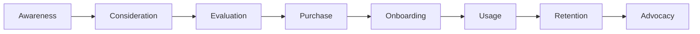
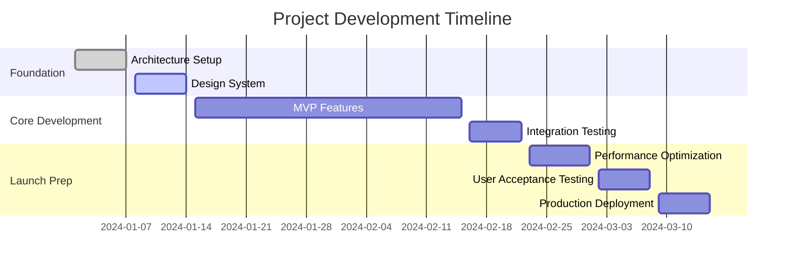

# Project Development Report (PDR)

**Project:** [PROJECT_NAME]  
**Client:** [CLIENT_NAME]  
**Date:** [DATE]  
**Prepared by:** [AGENT_TEAM]  
**Status:** Draft | Review | Client Approved | Development Ready  

---

## 📋 **Executive Summary**

### Problem Statement
*What specific business challenge or opportunity is this project addressing?*

[Describe the core business problem, market gap, or strategic opportunity that necessitates this project. Include quantifiable impact where possible.]

### Solution Overview  
*What are we building and how will it transform the client's business?*

[High-level description of the proposed solution, key capabilities, and transformational impact on client's operations.]

### Strategic Value Proposition
*Why is this the optimal approach for maximum business impact?*

- **Primary Value:** [e.g., 40% increase in customer acquisition]
- **Secondary Benefits:** [e.g., 60% reduction in manual processes]  
- **Competitive Advantage:** [e.g., First-to-market with AI-powered features]
- **ROI Projection:** [e.g., 300% ROI within 18 months]

---

## 👤 **Client Intelligence Deep Dive**

### Business Profile
| Attribute | Details |
|-----------|---------|
| **Company Name** | [CLIENT_NAME] |
| **Industry** | [INDUSTRY_VERTICAL] |
| **Business Model** | [B2B/B2C/Marketplace/SaaS/etc.] |
| **Stage** | [Startup/Growth/Mature/Enterprise] |
| **Location** | [GEOGRAPHIC_MARKETS] |
| **Team Size** | [EMPLOYEE_COUNT] |
| **Annual Revenue** | [REVENUE_RANGE] |

### Business Model Innovation Analysis
**Current Model Assessment:**
- **Revenue Streams:** [Primary revenue sources and mechanisms]
- **Customer Segments:** [Target customer categories and characteristics]
- **Value Propositions:** [Unique value delivered to each segment]
- **Key Activities:** [Core business activities and processes]

**Enhancement Opportunities:**
- **Subscription Potential:** [Monthly recurring revenue opportunities]
- **Marketplace Features:** [Multi-sided platform possibilities] 
- **Freemium Strategy:** [Free tier to premium conversion paths]
- **Usage-Based Pricing:** [Pay-per-use or consumption models]
- **Bundle Architecture:** [Package offerings and cross-selling]

### Stakeholder Ecosystem
| Role | Name | Influence | Decision Power | Key Concerns |
|------|------|-----------|----------------|--------------|
| **CEO/Founder** | [NAME] | High | Final approval | ROI, strategic alignment |
| **CTO/Tech Lead** | [NAME] | High | Technical decisions | Scalability, security, integration |
| **Marketing Lead** | [NAME] | Medium | Feature input | User acquisition, conversion |
| **Operations Lead** | [NAME] | Medium | Process input | Efficiency, workflow optimization |

---

## 🎯 **Target Audience Intelligence**

### Primary Personas (Deep Analysis)

#### Persona 1: [PERSONA_NAME]
**Demographics:**
- Age: [AGE_RANGE]  
- Location: [GEOGRAPHIC_DISTRIBUTION]
- Income: [INCOME_BRACKETS]
- Education: [EDUCATION_LEVELS]
- Occupation: [JOB_ROLES]

**Behavioral Profile:**
- **Daily Routine:** [Hour-by-hour typical day]
- **Device Usage:** [Primary devices and usage patterns]  
- **Digital Behavior:** [Apps used, time spent online, preferred channels]
- **Purchase Patterns:** [Decision-making process, budget considerations]
- **Pain Points:** [Current frustrations and unmet needs]

**Needs & Goals:**
- **Functional Needs:** [What they need to accomplish]
- **Emotional Needs:** [How they want to feel]
- **Social Needs:** [Status, belonging, recognition desires]
- **Job-to-be-Done:** [The underlying job they're hiring this solution for]

#### Persona 2: [PERSONA_NAME]
[Similar detailed breakdown for each additional persona...]

### User Journey Mapping


**Journey Stage Analysis:**
- **Awareness:** [How users discover the need/solution]
- **Consideration:** [Information gathering and option exploration]  
- **Evaluation:** [Comparison criteria and decision factors]
- **Purchase:** [Conversion process and potential friction]
- **Onboarding:** [Initial experience and success factors]
- **Usage:** [Regular interaction patterns and value realization]
- **Retention:** [Factors that drive continued usage]
- **Advocacy:** [What motivates referrals and recommendations]

---

## 📊 **Market Intelligence & Analysis**

### Industry Landscape
**Market Size & Growth:**
- **Total Addressable Market (TAM):** $[AMOUNT] [timeframe]
- **Serviceable Addressable Market (SAM):** $[AMOUNT] [timeframe]  
- **Serviceable Obtainable Market (SOM):** $[AMOUNT] [timeframe]
- **Growth Rate:** [PERCENTAGE]% CAGR
- **Market Maturity:** [Emerging/Growth/Mature/Declining]

**Industry Trends (Current Year):**
- **Technology Adoption:** [Key tech trends affecting industry]
- **Regulatory Changes:** [Compliance requirements and policy shifts]
- **Consumer Behavior:** [Shifting preferences and expectations]
- **Economic Factors:** [Market conditions and spending patterns]
- **Innovation Patterns:** [Emerging solutions and disruption areas]

### Competitive Intelligence System

#### Direct Competitors (Head-to-Head)
| Competitor | Market Share | Strengths | Weaknesses | Pricing | Threat Level |
|------------|--------------|-----------|------------|---------|--------------|
| **[COMPETITOR_1]** | [PERCENTAGE]% | [KEY_STRENGTHS] | [WEAKNESSES] | $[PRICING] | High/Medium/Low |
| **[COMPETITOR_2]** | [PERCENTAGE]% | [KEY_STRENGTHS] | [WEAKNESSES] | $[PRICING] | High/Medium/Low |
| **[COMPETITOR_3]** | [PERCENTAGE]% | [KEY_STRENGTHS] | [WEAKNESSES] | $[PRICING] | High/Medium/Low |

#### Indirect Competitors (Alternative Solutions)
- **Category:** [ALTERNATIVE_CATEGORY_1]
- **Examples:** [COMPANIES/SOLUTIONS]
- **User Overlap:** [PERCENTAGE]%
- **Switching Probability:** [HIGH/MEDIUM/LOW]

#### Substitute Products/Services
- **Manual Processes:** [Current non-digital alternatives]
- **DIY Solutions:** [Self-service tools and platforms]
- **Generic Software:** [Non-specialized solutions being used]

### Competitive Feature Analysis
**Feature Forensics (Top 3 Competitors):**

| Feature Category | [COMPETITOR_1] | [COMPETITOR_2] | [COMPETITOR_3] | Our Opportunity |
|------------------|----------------|----------------|----------------|-----------------|
| **Core Functionality** | [RATING/DESCRIPTION] | [RATING/DESCRIPTION] | [RATING/DESCRIPTION] | [DIFFERENTIATION_OPPORTUNITY] |
| **User Experience** | [RATING/DESCRIPTION] | [RATING/DESCRIPTION] | [RATING/DESCRIPTION] | [DIFFERENTIATION_OPPORTUNITY] |
| **Integration Capabilities** | [RATING/DESCRIPTION] | [RATING/DESCRIPTION] | [RATING/DESCRIPTION] | [DIFFERENTIATION_OPPORTUNITY] |
| **Mobile Experience** | [RATING/DESCRIPTION] | [RATING/DESCRIPTION] | [RATING/DESCRIPTION] | [DIFFERENTIATION_OPPORTUNITY] |
| **Pricing Model** | [RATING/DESCRIPTION] | [RATING/DESCRIPTION] | [RATING/DESCRIPTION] | [DIFFERENTIATION_OPPORTUNITY] |
| **Customer Support** | [RATING/DESCRIPTION] | [RATING/DESCRIPTION] | [RATING/DESCRIPTION] | [DIFFERENTIATION_OPPORTUNITY] |

---

## 🎨 **Design System Intelligence**

### Visual Identity Strategy
**Brand Alignment Analysis:**
- **Current Brand Guidelines:** [Existing visual identity elements]
- **Industry Visual Patterns:** [Common design approaches in sector]
- **Competitive Differentiation:** [Visual opportunities to stand out]
- **Target Audience Preferences:** [Design preferences from persona research]

**Design System Architecture:**
```
Color Psychology Strategy:
├── Primary: [COLOR] - [EMOTIONAL_ASSOCIATION]
├── Secondary: [COLOR] - [EMOTIONAL_ASSOCIATION] 
├── Accent: [COLOR] - [EMOTIONAL_ASSOCIATION]
└── Neutral: [COLOR_PALETTE]

Typography Hierarchy:
├── Headlines: [FONT_FAMILY] - [USAGE_CONTEXT]
├── Body Text: [FONT_FAMILY] - [USAGE_CONTEXT]
├── UI Elements: [FONT_FAMILY] - [USAGE_CONTEXT]
└── Code/Data: [FONT_FAMILY] - [USAGE_CONTEXT]

Iconography Style:
├── Style: [OUTLINED/FILLED/MIXED]
├── Weight: [LIGHT/REGULAR/BOLD]
├── Corner Radius: [ROUNDED/SHARP/MIXED]
└── Cultural Considerations: [LOCALIZATION_NEEDS]
```

### User Interface Patterns
**Layout Strategy:**
- **Grid System:** [12-column/16-column/Custom]
- **Spacing Scale:** [Consistent spacing methodology]
- **Component Architecture:** [Atomic design principles]
- **Responsive Approach:** [Mobile-first/Desktop-first/Adaptive]

**Interaction Design:**
- **Navigation Patterns:** [Primary navigation approach]
- **Micro-interactions:** [Feedback and delight moments]
- **Animation Strategy:** [Performance-optimized motion design]
- **Accessibility Compliance:** [WCAG 2.1 AA standards implementation]

---

## 🏗️ **Technical Architecture Strategy**

### Technology Stack Recommendation
**Frontend Architecture:**
```
Framework: [REACT/VUE/ANGULAR/NATIVE]
├── Rationale: [Why this choice for client's needs]
├── Ecosystem: [Key libraries and tools]
├── Scalability: [How it handles growth]
└── Team Alignment: [Client team capability match]

Styling Approach: [STYLED-COMPONENTS/CSS-IN-JS/TAILWIND]
├── Design System Integration
├── Performance Implications  
├── Maintainability Benefits
└── Designer-Developer Workflow
```

**Backend Architecture:**
```
Server Framework: [NODE.JS/PYTHON/RUBY/PHP]
├── API Design: [REST/GRAPHQL/RPC]
├── Database: [POSTGRESQL/MYSQL/MONGODB/FIREBASE]
├── Authentication: [JWT/OAUTH/SAML/CUSTOM]
└── File Storage: [AWS S3/GOOGLE CLOUD/AZURE]

Infrastructure: [SERVERLESS/CONTAINERS/VPS/CLOUD]
├── Hosting Platform: [VERCEL/AWS/GOOGLE/AZURE]
├── CDN Strategy: [CLOUDFLARE/AWS CLOUDFRONT]
├── Monitoring: [DATADOG/NEW RELIC/SENTRY]
└── Scaling Strategy: [AUTO-SCALING/LOAD BALANCING]
```

### Security & Compliance Framework
**Data Protection Strategy:**
- **Encryption:** [At-rest and in-transit encryption methods]
- **Authentication:** [Multi-factor authentication implementation]
- **Authorization:** [Role-based access control design]
- **Audit Logging:** [Comprehensive activity tracking]
- **Backup & Recovery:** [Data protection and disaster recovery]

**Regulatory Compliance:**
- **GDPR Compliance:** [EU data protection requirements]
- **CCPA Compliance:** [California privacy law adherence]  
- **Industry Standards:** [Sector-specific compliance needs]
- **Security Certifications:** [SOC 2, ISO 27001 considerations]

---

## 🚀 **Feature Roadmap & Prioritization**

### MVP Feature Set (Launch Ready)
**Core Features (Must-Have):**
1. **[FEATURE_NAME]**
   - **User Story:** As a [USER_TYPE], I want [CAPABILITY] so that [BENEFIT]
   - **Business Value:** [QUANTIFIED_IMPACT]
   - **Technical Complexity:** [HIGH/MEDIUM/LOW]
   - **Development Estimate:** [HOURS/DAYS/WEEKS]

2. **[FEATURE_NAME]**
   - **User Story:** As a [USER_TYPE], I want [CAPABILITY] so that [BENEFIT]  
   - **Business Value:** [QUANTIFIED_IMPACT]
   - **Technical Complexity:** [HIGH/MEDIUM/LOW]
   - **Development Estimate:** [HOURS/DAYS/WEEKS]

[Continue for all MVP features...]

### Version 1.0 Enhancements (Post-Launch)
**Performance Features (Should-Have):**
[Similar detailed breakdown for V1.0 features...]

### Future Vision Features (Could-Have)
**Innovation Features:**
[Advanced features for future consideration...]

### Feature Prioritization Matrix
| Feature | Impact Score (1-10) | Effort Score (1-10) | Priority | Dependencies |
|---------|-------------------|-------------------|----------|--------------|
| [FEATURE_1] | [SCORE] | [SCORE] | High | [LIST] |
| [FEATURE_2] | [SCORE] | [SCORE] | Medium | [LIST] |
| [FEATURE_3] | [SCORE] | [SCORE] | Low | [LIST] |

---

## 📅 **Implementation Timeline & Resource Planning**

### Development Phases


### Resource Allocation Strategy
**Development Team Composition:**
- **Project Manager:** [PERCENTAGE]% allocation - [RESPONSIBILITIES]
- **UI/UX Designer:** [PERCENTAGE]% allocation - [RESPONSIBILITIES]  
- **Frontend Developer:** [PERCENTAGE]% allocation - [RESPONSIBILITIES]
- **Backend Developer:** [PERCENTAGE]% allocation - [RESPONSIBILITIES]
- **QA Engineer:** [PERCENTAGE]% allocation - [RESPONSIBILITIES]
- **DevOps Engineer:** [PERCENTAGE]% allocation - [RESPONSIBILITIES]

**AI Agent Coordination:**
- **Research Agent:** Continuous market and competitor monitoring
- **Design Agent:** UI pattern analysis and component optimization
- **Technical Agent:** Architecture monitoring and optimization suggestions
- **Analytics Agent:** User behavior analysis and performance tracking

---

## 💰 **Investment & ROI Analysis**

### Development Investment Breakdown
**Fixed Development Costs:**
- **Planning & Research:** $[AMOUNT] ([HOURS] hours)
- **Design System:** $[AMOUNT] ([HOURS] hours)
- **Frontend Development:** $[AMOUNT] ([HOURS] hours)  
- **Backend Development:** $[AMOUNT] ([HOURS] hours)
- **Testing & QA:** $[AMOUNT] ([HOURS] hours)
- **Deployment & Launch:** $[AMOUNT] ([HOURS] hours)
- **Total Development:** $[TOTAL_AMOUNT]

**Ongoing Operational Costs:**
- **Hosting & Infrastructure:** $[AMOUNT]/month
- **Third-party Services:** $[AMOUNT]/month
- **Maintenance & Updates:** $[AMOUNT]/month  
- **Support & Monitoring:** $[AMOUNT]/month
- **Total Monthly:** $[TOTAL_MONTHLY]

### Revenue Projections & Business Case
**Revenue Model Analysis:**
```
Revenue Stream 1: [DESCRIPTION]
├── Year 1: $[AMOUNT]
├── Year 2: $[AMOUNT] 
└── Year 3: $[AMOUNT]

Revenue Stream 2: [DESCRIPTION]
├── Year 1: $[AMOUNT]
├── Year 2: $[AMOUNT]
└── Year 3: $[AMOUNT]

Total Projected Revenue:
├── Year 1: $[TOTAL_Y1]
├── Year 2: $[TOTAL_Y2]  
└── Year 3: $[TOTAL_Y3]
```

**ROI Analysis:**
- **Break-even Point:** Month [NUMBER]
- **3-Year ROI:** [PERCENTAGE]%
- **Net Present Value:** $[AMOUNT]
- **Internal Rate of Return:** [PERCENTAGE]%

---

## ⚠️ **Risk Assessment & Mitigation Strategy**

### Technical Risks
| Risk | Probability | Impact | Mitigation Strategy | Contingency Plan |
|------|-------------|--------|-------------------|------------------|
| **Scalability Issues** | [HIGH/MEDIUM/LOW] | [HIGH/MEDIUM/LOW] | [PREVENTION_APPROACH] | [BACKUP_PLAN] |
| **Security Vulnerabilities** | [HIGH/MEDIUM/LOW] | [HIGH/MEDIUM/LOW] | [PREVENTION_APPROACH] | [BACKUP_PLAN] |
| **Integration Challenges** | [HIGH/MEDIUM/LOW] | [HIGH/MEDIUM/LOW] | [PREVENTION_APPROACH] | [BACKUP_PLAN] |
| **Performance Degradation** | [HIGH/MEDIUM/LOW] | [HIGH/MEDIUM/LOW] | [PREVENTION_APPROACH] | [BACKUP_PLAN] |

### Business Risks  
| Risk | Probability | Impact | Mitigation Strategy | Contingency Plan |
|------|-------------|--------|-------------------|------------------|
| **Market Changes** | [HIGH/MEDIUM/LOW] | [HIGH/MEDIUM/LOW] | [PREVENTION_APPROACH] | [BACKUP_PLAN] |
| **Competitive Response** | [HIGH/MEDIUM/LOW] | [HIGH/MEDIUM/LOW] | [PREVENTION_APPROACH] | [BACKUP_PLAN] |
| **User Adoption Issues** | [HIGH/MEDIUM/LOW] | [HIGH/MEDIUM/LOW] | [PREVENTION_APPROACH] | [BACKUP_PLAN] |
| **Resource Constraints** | [HIGH/MEDIUM/LOW] | [HIGH/MEDIUM/LOW] | [PREVENTION_APPROACH] | [BACKUP_PLAN] |

### Risk Monitoring Framework
**Early Warning Indicators:**
- **Technical:** [METRICS_TO_MONITOR]
- **Business:** [METRICS_TO_MONITOR]
- **User:** [METRICS_TO_MONITOR]
- **Market:** [METRICS_TO_MONITOR]

---

## 📊 **Success Metrics & KPI Framework**

### Launch Success Criteria (Month 1)
**Technical Performance:**
- **Page Load Speed:** < [X] seconds
- **System Uptime:** > [X]%  
- **Error Rate:** < [X]%
- **Security Score:** > [X]/100

**User Engagement:**  
- **User Registration:** [TARGET_NUMBER] users
- **Feature Adoption:** > [X]% for core features
- **Session Duration:** > [X] minutes average
- **User Satisfaction:** > [X]/10 rating

**Business Impact:**
- **Conversion Rate:** > [X]%
- **Revenue Generation:** $[TARGET_AMOUNT]
- **Cost per Acquisition:** < $[TARGET_AMOUNT]  
- **Customer Lifetime Value:** > $[TARGET_AMOUNT]

### Growth Metrics (Months 2-12)
**User Growth:**
- **Monthly Active Users:** [TARGET_GROWTH]% month-over-month
- **Retention Rate:** > [X]% 30-day retention
- **Viral Coefficient:** > [X] referrals per user
- **Net Promoter Score:** > [X]

**Revenue Growth:**
- **Monthly Recurring Revenue:** [TARGET_GROWTH]% month-over-month  
- **Average Revenue Per User:** $[TARGET_AMOUNT]
- **Gross Margin:** > [X]%
- **Payback Period:** < [X] months

### Long-term Vision Metrics (Years 2-3)
**Market Position:**
- **Market Share:** [TARGET_PERCENTAGE]% of addressable market
- **Brand Recognition:** [TARGET_METRICS]
- **Competitive Advantage:** [MEASURABLE_DIFFERENTIATORS]
- **Industry Leadership:** [THOUGHT_LEADERSHIP_METRICS]

---

## 🔄 **Post-Launch Evolution Strategy**

### Continuous Improvement Framework
**Data Collection Strategy:**
- **User Behavior Analytics:** [TRACKING_IMPLEMENTATION]
- **Performance Monitoring:** [SYSTEM_MONITORING_SETUP]
- **Customer Feedback:** [FEEDBACK_COLLECTION_METHODS]
- **Competitive Intelligence:** [ONGOING_ANALYSIS_PROCESS]

**Iteration Planning:**
- **Weekly Reviews:** Performance metrics and immediate optimizations
- **Monthly Assessments:** Feature performance and user feedback integration
- **Quarterly Planning:** Major feature additions and strategic pivots
- **Annual Strategy:** Market positioning and technology evolution

### Scaling Strategy
**Growth Phases:**
```
Phase 1: Market Validation (Months 1-6)
├── Focus: Product-market fit
├── Metrics: User satisfaction and retention
└── Investments: UX optimization

Phase 2: Growth Acceleration (Months 7-18)
├── Focus: User acquisition and retention  
├── Metrics: Growth rate and unit economics
└── Investments: Marketing and feature expansion

Phase 3: Market Leadership (Months 19-36)
├── Focus: Market dominance and expansion
├── Metrics: Market share and competitive advantage
└── Investments: Innovation and international expansion
```

---

## 📚 **Technical Specifications & Documentation**

### API Documentation  
**Endpoint Architecture:**
```
Authentication Endpoints:
├── POST /auth/login
├── POST /auth/register  
├── POST /auth/refresh
└── DELETE /auth/logout

Core Business Logic:
├── GET /api/[resource]
├── POST /api/[resource]
├── PUT /api/[resource]/{id}
└── DELETE /api/[resource]/{id}
```

### Database Schema Design
**Entity Relationship Overview:**
```sql
-- Core entities with relationships
Users (1:Many) --> UserProfiles
Users (1:Many) --> [BusinessEntities]
[BusinessEntities] (Many:Many) --> [RelatedEntities]

-- Audit and tracking
AuditLog --> All Entities
Analytics --> User Interactions
```

### Integration Specifications  
**Third-party Services:**
- **Payment Processing:** [STRIPE/PAYPAL/SQUARE] integration
- **Authentication:** [OAUTH/SAML/JWT] implementation  
- **Analytics:** [GOOGLE ANALYTICS/MIXPANEL] tracking
- **Communication:** [SENDGRID/TWILIO] messaging
- **Storage:** [AWS S3/CLOUDINARY] asset management

---

## 🎯 **Next Steps & Action Items**

### Immediate Actions (Week 1)
- [ ] **Stakeholder Sign-off:** Present PDR and obtain client approval
- [ ] **Technical Setup:** Initialize development environment and repositories
- [ ] **Design System:** Begin component library and style guide creation
- [ ] **Resource Allocation:** Confirm team assignments and timeline commitments

### Development Kickoff (Week 2)  
- [ ] **Architecture Implementation:** Set up core technical infrastructure
- [ ] **Design Implementation:** Create initial UI components and layouts
- [ ] **Integration Planning:** Establish third-party service connections
- [ ] **Testing Framework:** Implement automated testing and quality assurance

### Launch Preparation (Final Weeks)
- [ ] **Performance Optimization:** Ensure all performance targets are met
- [ ] **Security Audit:** Complete comprehensive security testing
- [ ] **User Acceptance Testing:** Conduct final client approval testing
- [ ] **Production Deployment:** Execute go-live plan with monitoring

### Post-Launch Success (Month 1+)
- [ ] **Performance Monitoring:** Track all KPIs and success metrics  
- [ ] **User Feedback Collection:** Gather and analyze initial user responses
- [ ] **Iteration Planning:** Plan first round of improvements and enhancements
- [ ] **Success Measurement:** Evaluate against initial success criteria

---

## ✅ **PDR Approval & Sign-off**

### Client Stakeholder Approval
- [ ] **CEO/Decision Maker:** [NAME] - [DATE] - [SIGNATURE/APPROVAL]
- [ ] **Technical Lead:** [NAME] - [DATE] - [SIGNATURE/APPROVAL]  
- [ ] **Project Sponsor:** [NAME] - [DATE] - [SIGNATURE/APPROVAL]
- [ ] **Budget Approver:** [NAME] - [DATE] - [SIGNATURE/APPROVAL]

### SISO Team Confirmation
- [ ] **Project Manager:** [NAME] - [DATE] - Ready to proceed
- [ ] **Technical Lead:** [NAME] - [DATE] - Architecture approved
- [ ] **Design Lead:** [NAME] - [DATE] - Design strategy confirmed
- [ ] **Quality Lead:** [NAME] - [DATE] - Success criteria validated

### Final PDR Status
**Approved for Development:** [DATE]  
**Next Review Date:** [DATE]  
**PDR Version:** [VERSION_NUMBER]  
**Development Start Date:** [DATE]  

---

*This comprehensive PDR provides the strategic foundation for exceptional project outcomes. All analysis, recommendations, and specifications are based on thorough research and industry best practices, ensuring maximum probability of project success and client satisfaction.*