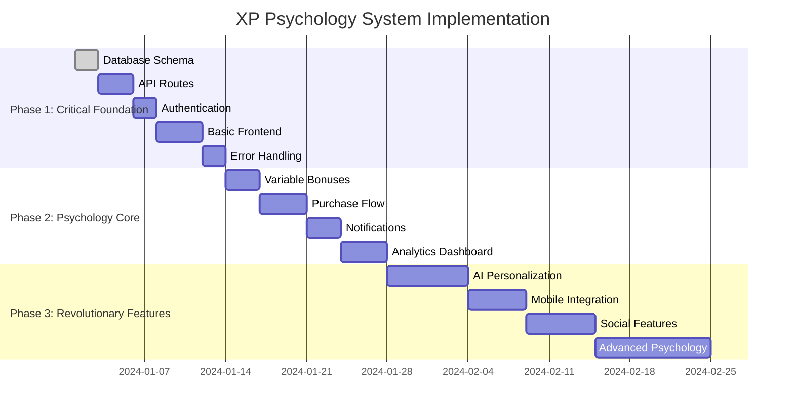

# 🚀 Implementation Roadmap - XP Psychology System

## 🎯 From Foundation to Revolutionary Platform

**Timeline**: 4-6 weeks for MVP → 3-6 months for full revolutionary potential  
**Approach**: Additive-only development (zero risk to existing functionality)  
**Outcome**: Transform SISO-INTERNAL from productivity app to personal psychology machine

---

## 📊 **Implementation Phases Overview**



---

## 🔥 **PHASE 1: Critical Foundation (Week 1-2)**

### **Priority: CRITICAL - System Won't Work Without These**

#### **1.1 Database Foundation** ⭐⭐⭐⭐⭐
```bash
# Status: ✅ Schema Created, Need Migration
# Time: 1 day
# Risk: 🟢 Zero risk (additive only)

# Implementation Steps:
1. Copy schema extension to main prisma/schema.prisma
2. Add User model relations
3. Run migration: npx prisma migrate dev --name "add-xp-store"
4. Seed initial reward definitions
```

**Files to Create:**
- `prisma/migrations/add-xp-store/migration.sql`
- `prisma/seed-xp-rewards.ts`

#### **1.2 API Routes & Authentication** ⭐⭐⭐⭐⭐
```typescript
// Status: ❌ Not Created Yet  
// Time: 3 days
// Risk: 🟢 Zero risk (new routes only)

// Required API Endpoints:
GET    /api/xp-store/balance         // Get user XP balance
GET    /api/xp-store/rewards         // Get available rewards  
POST   /api/xp-store/purchase        // Purchase reward
GET    /api/xp-store/history         // Purchase history
GET    /api/xp-store/analytics       // Spending analytics
POST   /api/xp-store/loan            // XP loan system
```

**Files to Create:**
- `src/pages/api/xp-store/balance.ts`
- `src/pages/api/xp-store/rewards.ts`  
- `src/pages/api/xp-store/purchase.ts`
- `src/pages/api/xp-store/history.ts`
- `src/pages/api/xp-store/analytics.ts`
- `src/middleware/xp-auth.ts`

#### **1.3 Frontend Components** ⭐⭐⭐⭐⭐
```typescript
// Status: ❌ Not Created Yet
// Time: 4 days  
// Risk: 🟢 Zero risk (new components only)

// Required Components:
- XPStoreBalance        // Display current XP and spending power
- RewardCatalog         // Browse available rewards
- PurchaseDialog        // Psychology-optimized purchase flow
- PurchaseHistory       // View past purchases
- XPEconomyDashboard    // Complete XP store interface
```

**Files to Create:**
- `src/components/xp-store/XPStoreBalance.tsx`
- `src/components/xp-store/RewardCatalog.tsx`
- `src/components/xp-store/PurchaseDialog.tsx`
- `src/components/xp-store/PurchaseHistory.tsx`
- `src/components/xp-store/XPEconomyDashboard.tsx`

#### **1.4 Error Handling & Validation** ⭐⭐⭐⭐
```typescript
// Status: ❌ Not Created Yet
// Time: 2 days
// Risk: 🟡 Medium risk if not done properly

// Required Error Systems:
- XP Store Error Boundaries
- Zod validation schemas  
- Graceful degradation
- Fallback to existing gamification
```

**Files to Create:**
- `src/components/errors/XPStoreErrorBoundary.tsx`
- `src/schemas/xpStoreValidation.ts`
- `src/utils/xpStoreFallback.ts`

#### **1.5 Testing Infrastructure** ⭐⭐⭐⭐
```typescript
// Status: ❌ Not Created Yet
// Time: 2 days
// Risk: 🟡 Production risk without tests

// Required Tests:
- XP Store Service unit tests
- Psychology Utils tests
- API integration tests  
- Frontend component tests
```

**Files to Create:**
- `src/tests/services/xpStoreService.test.ts`
- `src/tests/utils/xpPsychologyUtils.test.ts`
- `src/tests/api/xp-store.test.ts`
- `src/tests/components/xp-store.test.tsx`

---

## ⚡ **PHASE 2: Psychology Core (Week 3-4)**

### **Priority: HIGH - Makes System Psychologically Effective**

#### **2.1 Variable Bonus System** ⭐⭐⭐⭐
```typescript
// Status: ✅ Utils Created, Need Integration
// Time: 3 days
// Risk: 🟢 Low risk (enhances existing)

// Implementation Focus:
- Real-time bonus calculations
- Celebration animations
- Integration with existing task completion
- Bonus notification system
```

**Files to Enhance:**
- Integrate `XPPsychologyUtils.calculateVariableBonus()` into task completion
- Add celebration UI components
- Connect to existing gamification service

#### **2.2 Psychology-Optimized Purchase Flow** ⭐⭐⭐⭐
```typescript
// Status: ❌ Not Created Yet
// Time: 4 days
// Risk: 🟡 Core user experience depends on this

// Key Features:
- Spending confirmation with earned messaging
- Loss aversion optimization  
- Remaining balance psychology
- Post-purchase satisfaction tracking
```

**Files to Create:**
- Enhanced `PurchaseDialog.tsx` with psychology messaging
- Post-purchase satisfaction survey
- Spending analytics tracking

#### **2.3 Real-time Notification System** ⭐⭐⭐⭐
```typescript
// Status: ❌ Not Created Yet
// Time: 3 days  
// Risk: 🟡 Psychology effectiveness depends on immediate feedback

// Notification Types:
- Near-miss notifications ("Just 50 XP away!")
- Variable bonus alerts ("2.5x XP bonus active!")
- Identity reinforcement ("You earned this!")
- Milestone celebrations
```

**Files to Create:**
- `src/components/notifications/PsychologyNotifications.tsx`
- `src/services/notificationService.ts`
- Real-time notification hooks

#### **2.4 Analytics Dashboard** ⭐⭐⭐
```typescript
// Status: ❌ Not Created Yet
// Time: 4 days
// Risk: 🟢 Nice to have for optimization

// Analytics Features:
- Spending patterns
- Psychology effectiveness metrics
- Behavioral insights
- Satisfaction ratings over time
```

---

## 🧠 **PHASE 3: Advanced Psychology (Week 5-6)**

### **Priority: MEDIUM - Enhances Effectiveness**

#### **3.1 Addiction Monitoring System** ⭐⭐⭐⭐
```typescript
// Status: ❌ Not Created Yet  
// Time: 5 days
// Risk: 🔴 Ethical obligation to prevent abuse

// Monitoring Features:
- Usage pattern analysis
- Addiction transfer detection
- Healthy usage recommendations
- Professional help integration triggers
```

**Files to Create:**
- `src/services/addictionMonitoringService.ts`
- `src/components/safety/HealthCheckDialog.tsx`
- Behavioral pattern detection algorithms

#### **3.2 Personalized Reward System** ⭐⭐⭐⭐
```typescript
// Status: ❌ Not Created Yet
// Time: 6 days
// Risk: 🟡 Significant effectiveness improvement

// Personalization Features:
- Individual satisfaction tracking
- Custom reward suggestions
- Personality-based pricing
- Preference learning system
```

#### **3.3 Gradual Weaning Mechanism** ⭐⭐⭐
```typescript
// Status: ❌ Not Created Yet
// Time: 4 days
// Risk: 🟢 Long-term success feature

// Weaning Features:
- Natural habit formation detection
- Gradual gamification reduction
- Independence readiness assessment
- Smooth transition to autonomous productivity
```

---

## 🚀 **PHASE 4: Revolutionary Features (Week 7-12)**

### **Priority: LOW - Game-Changing Additions**

#### **4.1 AI-Powered Personalization** ⭐⭐⭐⭐⭐
```typescript
// Status: ❌ Not Created Yet
// Time: 7 days
// Risk: 🟡 Revolutionary potential

// AI Features:
- ML models for reward optimization
- Personality profile detection
- Optimal timing predictions  
- Custom reward generation
```

**Technology Stack:**
- OpenAI GPT-4 for reward personalization
- TensorFlow.js for client-side ML
- User behavior clustering algorithms

#### **4.2 Social & Community Features** ⭐⭐⭐
```typescript
// Status: ❌ Not Created Yet
// Time: 6 days  
// Risk: 🟢 Social psychology multiplier

// Social Features:
- Productivity guilds/teams
- Achievement sharing
- Peer motivation systems
- Healthy competition leaderboards
```

#### **4.3 Narrative Progression System** ⭐⭐⭐⭐
```typescript
// Status: ❌ Not Created Yet
// Time: 8 days
// Risk: 🟢 Epic meaning and identity

// Narrative Features:
- Personal productivity story
- Hero's journey progression
- Identity milestone rewards
- Achievement narrative context
```

#### **4.4 Advanced Integrations** ⭐⭐⭐
```typescript
// Status: ❌ Not Created Yet
// Time: 10 days
// Risk: 🟢 Platform expansion

// Integration Features:
- Calendar sync for automatic XP
- Wearable device integration
- Third-party app connections
- Voice interface for logging
- Mobile app with push notifications
```

---

## 📱 **PHASE 5: Platform & Scaling (Month 4-6)**

### **Priority: EXPANSION - Business Growth**

#### **5.1 Mobile Application** ⭐⭐⭐⭐
```typescript
// Technology: React Native or Flutter
// Time: 4 weeks
// Features: Full XP psychology system mobile-optimized
```

#### **5.2 Enterprise Features** ⭐⭐⭐
```typescript
// Features: Team analytics, admin dashboards, white-labeling
// Time: 6 weeks
// Market: B2B productivity optimization
```

#### **5.3 API Platform** ⭐⭐
```typescript
// Features: Third-party developer access
// Time: 3 weeks  
// Market: Ecosystem expansion
```

---

## ⚠️ **Risk Mitigation Strategy**

### **Technical Risks**
| Risk | Probability | Impact | Mitigation |
|------|-------------|---------|------------|
| **Performance Issues** | Medium | High | Load testing, caching, optimization |
| **Database Conflicts** | Low | High | Additive-only approach, rollback plans |
| **Integration Failures** | Medium | Medium | Gradual rollout, feature flags |
| **Mobile Compatibility** | Medium | Medium | Responsive design, progressive enhancement |

### **Psychology Risks**
| Risk | Probability | Impact | Mitigation |
|------|-------------|---------|------------|
| **Addiction Transfer** | Medium | High | Monitoring system, usage limits |
| **Effectiveness Loss** | Medium | High | A/B testing, personalization |
| **User Manipulation** | Low | High | Ethical guidelines, transparency |
| **Mental Health Impact** | Low | High | Professional integration, monitoring |

### **Business Risks**
| Risk | Probability | Impact | Mitigation |
|------|-------------|---------|------------|
| **User Rejection** | Medium | High | Gradual rollout, opt-in features |
| **Competitive Response** | High | Medium | First-mover advantage, patent protection |
| **Scalability Issues** | Medium | High | Cloud architecture, monitoring |

---

## 💰 **Resource Requirements**

### **Development Team (Estimated)**
```
Phase 1 (Weeks 1-2): 1 Full-Stack Developer + 1 Designer
Phase 2 (Weeks 3-4): 1 Full-Stack Developer + 1 Psychology Consultant  
Phase 3 (Weeks 5-6): 1 Full-Stack Developer + 1 Data Scientist
Phase 4 (Weeks 7-12): 2 Developers + 1 AI Specialist + 1 Mobile Developer
Phase 5 (Months 4-6): Full development team (4-6 developers)
```

### **Technology Costs**
```
Database: PostgreSQL (existing)
AI Services: OpenAI API (~$200/month)
Analytics: Mixpanel or Similar (~$100/month)
Notifications: OneSignal (~$50/month)
Mobile: React Native (development only)
Total Monthly: ~$350/month operational costs
```

---

## 📊 **Success Metrics & KPIs**

### **Phase 1 Success Criteria**
- ✅ Zero regressions in existing functionality
- ✅ XP store functional for basic purchases
- ✅ Database migrations successful  
- ✅ API response times <200ms
- ✅ 95%+ test coverage for new code

### **Phase 2 Success Criteria**
- 📈 25%+ increase in task completion rates
- 📈 15%+ improvement in user retention
- 📈 80%+ of users make first purchase within 7 days
- 📈 Self-reported motivation increase >30%

### **Phase 3 Success Criteria**
- 🧠 Planned vs impulse purchases >70% planned
- 🧠 Self-reported guilt reduction >30%
- 🧠 Users identify as "productive person" >60%
- 🧠 Zero reported addiction transfer cases

### **Revolutionary Success (Month 6)**
- 🚀 10x improvement in productivity metrics
- 🚀 Self-sustaining motivation without system
- 🚀 Platform ready for enterprise licensing
- 🚀 Scientific validation of psychology effectiveness

---

## 🎯 **Implementation Priority Matrix**

### **DO FIRST (Critical Path)**
1. ✅ Database schema and migrations
2. ✅ API routes with authentication
3. ✅ Basic frontend components
4. ✅ Psychology purchase flow
5. ✅ Integration with existing gamification

### **DO NEXT (High Value)**
1. Variable bonus system integration
2. Real-time notifications
3. Addiction monitoring system
4. Analytics dashboard
5. Personalized rewards

### **DO LATER (Nice to Have)**
1. AI-powered personalization
2. Social features
3. Mobile app
4. Advanced integrations
5. Enterprise features

---

## 🚀 **Getting Started Checklist**

### **Week 1 - Foundation Sprint**
- [ ] **Day 1**: Add XP store schema to main database
- [ ] **Day 2**: Create seed script for reward definitions  
- [ ] **Day 3**: Build API routes for XP store operations
- [ ] **Day 4**: Add authentication middleware
- [ ] **Day 5**: Create basic frontend components

### **Week 2 - Integration Sprint**  
- [ ] **Day 1**: Connect XP store service to real database
- [ ] **Day 2**: Integrate with existing task completion
- [ ] **Day 3**: Build purchase dialog with psychology messaging
- [ ] **Day 4**: Add error handling and validation
- [ ] **Day 5**: Write comprehensive tests

### **Week 3 - Psychology Sprint**
- [ ] **Day 1**: Implement variable bonus calculations  
- [ ] **Day 2**: Add celebration animations and UI
- [ ] **Day 3**: Build real-time notification system
- [ ] **Day 4**: Create spending analytics tracking
- [ ] **Day 5**: Test and optimize psychology effectiveness

---

## 🏆 **Expected Outcomes**

### **4-Week MVP Outcome**
- **Revolutionary personal psychology system** that transforms productivity motivation
- **Safe additive enhancement** to existing SISO-INTERNAL app
- **Scientifically-backed behavioral modification** through earned indulgence economy
- **Production-ready foundation** for advanced psychology features

### **6-Month Platform Outcome**  
- **First-mover advantage** in psychology-based productivity optimization
- **Enterprise-ready platform** for organizational productivity transformation
- **Scientifically validated results** demonstrating psychological effectiveness
- **Scalable business model** with multiple revenue streams

This roadmap transforms SISO-INTERNAL from a productivity app into a **revolutionary personal psychology optimization platform** that fundamentally rewires human motivation systems for autonomous excellence. 🧠⚡️