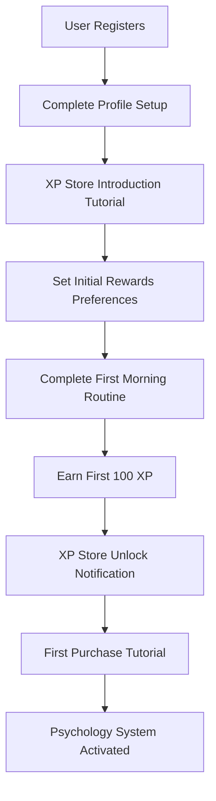
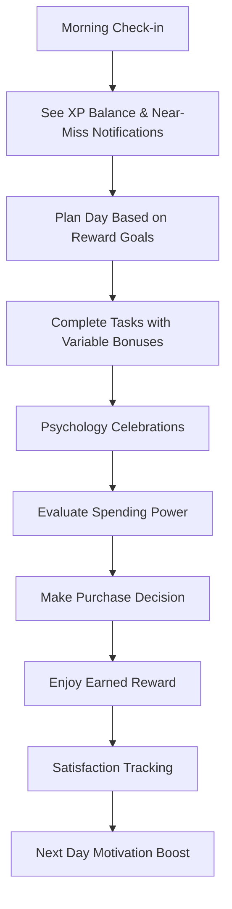
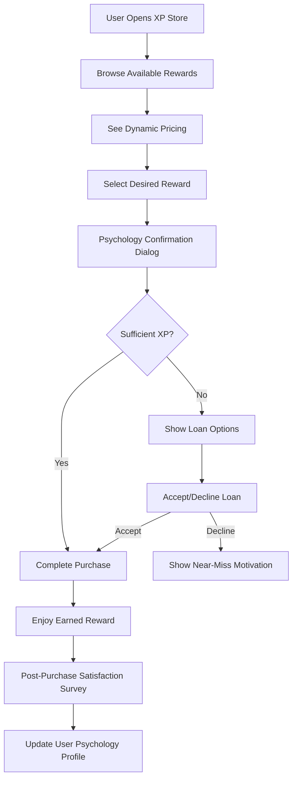

# 🔄 Integration Workflows & User Journeys Guide

## 🎯 Complete User Journey Documentation

This guide maps out how users will experience the XP Psychology System integration with the existing SISO-INTERNAL productivity app.

---

## 🌅 **User Journey 1: First-Time User Onboarding**

### **Scenario**: New user signs up for SISO-INTERNAL



### **Detailed Workflow:**

**Step 1-2: Registration & Profile (Existing Flow)**
- User creates account using existing auth system
- Completes standard SISO profile setup

**Step 3: XP Store Introduction (NEW)**
```typescript
// Integration Point 1: After profile completion
const showXPStoreIntro = async (userId: string) => {
  const tutorial = {
    title: "🛒 Welcome to Your Earned Indulgence System",
    message: "Transform guilt into motivation. Earn XP through productivity, spend on things you love.",
    demoRewards: ["Cannabis Session", "Netflix Binge", "Gaming Marathon"],
    nextAction: "Complete your morning routine to earn your first 100 XP!"
  };
  
  // Initialize XP balance
  await XPBridgeService.initializeNewUser(userId);
  return tutorial;
};
```

**Step 4: Reward Preferences (NEW)**
- User selects reward categories they're interested in
- System personalizes reward catalog
- Creates psychological profile for future optimization

**Step 5-6: First XP Earning (ENHANCED)**
```typescript
// Integration Point 2: Enhanced task completion
const completeTask = async (userId: string, taskId: string) => {
  // Existing gamification continues
  const oldSystemXP = gamificationService.awardXP(taskId, 1.0);
  
  // NEW: XP psychology system activation
  const psychologyResult = await XPBridgeService.awardXPWithPsychology(
    userId, 
    taskId, 
    100, // Base XP for morning routine
    { isFirstTime: true }
  );
  
  return {
    ...psychologyResult,
    celebrationMessage: "🎉 You earned your first 100 XP! The XP Store is now unlocked!",
    unlockedFeatures: ["xp_store", "reward_purchasing"]
  };
};
```

**Step 7-9: First Purchase Experience (NEW)**
- Psychology-optimized purchase flow
- Spending confirmation with earned motivation messaging
- Post-purchase satisfaction tracking

---

## ⚡ **User Journey 2: Daily Productivity Workflow**

### **Scenario**: Existing user's typical day with XP psychology



### **Morning Integration Workflow:**

```typescript
// Integration Point 3: Enhanced morning routine
const enhancedMorningRoutine = async (userId: string) => {
  // Existing morning routine logic
  const routineData = await morningRoutineService.getDailyRoutine(userId);
  
  // NEW: XP psychology integration
  const xpEconomy = useXPEconomy(userId);
  
  const morningData = {
    // Existing data
    ...routineData,
    
    // NEW: Psychology-enhanced data
    xpBalance: await xpEconomy.getSpendingPower(),
    nearMissNotifications: xpEconomy.getNearMissNotifications(),
    todaysMultipliers: await calculateLifeBonus(routineData.healthData),
    motivationBoosts: generateMotivationMessages(routineData, xpBalance)
  };
  
  return morningData;
};
```

### **Task Completion Integration:**

```typescript
// Integration Point 4: Psychology-enhanced task completion
const enhancedTaskCompletion = async (
  userId: string, 
  taskId: string, 
  taskType: 'light' | 'deep' | 'critical'
) => {
  // Get current user state
  const userState = await getUserCurrentState(userId);
  
  // Calculate XP with psychology
  const result = await xpEconomy.completeTaskWithPsychology(
    getBaseXP(taskType),
    userState.recentTaskCount,
    userState.streakDays,
    userState.healthData
  );
  
  // Enhanced UI feedback
  const celebration = {
    baseXP: getBaseXP(taskType),
    finalXP: result.finalXP,
    bonuses: result.lifeBonus,
    variableBonus: result.variableBonus,
    nearMissUpdates: result.nearMissNotifications,
    canAffordNew: result.spendingPower.canAfford
  };
  
  return celebration;
};
```

---

## 🛒 **User Journey 3: XP Store Purchase Flow**

### **Scenario**: User decides to purchase a reward



### **Purchase Flow Integration:**

```typescript
// Integration Point 5: Psychology-optimized purchase flow
const purchaseReward = async (userId: string, rewardId: string) => {
  const reward = await xpStoreService.getReward(rewardId);
  const balance = await xpStoreService.getXPStoreBalance(userId);
  
  // Psychology confirmation
  const psychologyData = XPPsychologyUtils.calculateSpendingPsychology(
    reward.currentPrice,
    balance.canSpend,
    reward.name
  );
  
  const confirmationDialog = {
    title: `Spend ${reward.currentPrice} XP on ${reward.name}?`,
    earnedMessage: psychologyData.earnedMessage,
    remainingMessage: psychologyData.remainingMessage,
    reEarnTime: psychologyData.hoursToReEarn,
    motivationBoost: psychologyData.motivationMessage
  };
  
  // If confirmed, process purchase
  if (userConfirmed) {
    const result = await xpStoreService.purchaseReward({
      userId,
      rewardId,
      psychologyData: confirmationDialog
    });
    
    return {
      success: result.success,
      newBalance: result.newBalance,
      satisfactionSurvey: generateSatisfactionSurvey(reward),
      nextMilestone: calculateNextMilestone(result.newBalance)
    };
  }
};
```

---

## 🔄 **Integration Workflow 4: Existing System Enhancement**

### **How XP Psychology Enhances Current Features:**

#### **Enhanced Achievement System**
```typescript
// Before: Basic achievement unlock
const unlockAchievement = (achievementId: string) => {
  showNotification(`Achievement unlocked: ${achievementId}`);
};

// After: Psychology-optimized achievement with XP bonus
const enhancedAchievement = async (userId: string, achievementId: string) => {
  // Existing achievement logic
  const achievement = await gamificationService.unlockAchievement(achievementId);
  
  // NEW: XP psychology bonus
  const psychologyBonus = XPPsychologyUtils.calculateAchievementBonus(achievement);
  
  // Award bonus XP to store
  await XPBridgeService.awardXP(userId, achievementId, psychologyBonus.xpAmount);
  
  // Enhanced celebration
  return {
    ...achievement,
    xpBonus: psychologyBonus.xpAmount,
    spendingPowerIncrease: psychologyBonus.newRewardsUnlocked,
    celebrationLevel: psychologyBonus.celebrationIntensity,
    motivationMessage: psychologyBonus.identityReinforcement
  };
};
```

#### **Enhanced Habit Tracking**
```typescript
// Integration Point 6: Habit streaks affect XP multipliers
const trackHabitCompletion = async (userId: string, habitId: string) => {
  // Existing habit tracking
  const habitData = await habitService.recordCompletion(userId, habitId);
  
  // NEW: Update XP multipliers based on habit streaks
  const multiplierUpdate = await XPPsychologyUtils.calculateHabitMultiplier(
    habitId,
    habitData.streakLength
  );
  
  // Apply to user's psychology profile
  await userPsychologyService.updateMultipliers(userId, multiplierUpdate);
  
  return {
    ...habitData,
    xpMultiplierBonus: multiplierUpdate.bonus,
    nextMilestone: multiplierUpdate.nextThreshold,
    rewardDiscounts: multiplierUpdate.applicableRewards
  };
};
```

---

## 📱 **User Journey 5: Mobile Integration Workflow**

### **Push Notification Integration:**
```typescript
// Integration Point 7: Psychology-optimized notifications
const generatePsychologyNotifications = async (userId: string) => {
  const userState = await getUserCurrentState(userId);
  const nearMiss = await xpEconomy.getNearMissNotifications();
  
  const notifications = [
    // Near-miss motivation
    {
      type: 'near_miss',
      message: `🔥 Just ${nearMiss[0]?.xpNeeded} XP away from ${nearMiss[0]?.reward}!`,
      timing: 'immediate',
      psychology: 'urgency'
    },
    
    // Variable bonus opportunities
    {
      type: 'bonus_opportunity',
      message: `⚡ 2.5x XP BONUS active for the next 30 minutes!`,
      timing: 'optimal_energy_detected',
      psychology: 'scarcity'
    },
    
    // Identity reinforcement
    {
      type: 'identity_boost',
      message: `💪 You're becoming the person who earns their pleasures!`,
      timing: 'after_purchase',
      psychology: 'identity'
    }
  ];
  
  return notifications;
};
```

---

## 🔧 **Technical Integration Points**

### **Database Integration:**
```sql
-- Integration Point 8: Existing tables enhanced
ALTER TABLE users ADD COLUMN xp_psychology_profile JSONB;
ALTER TABLE activities ADD COLUMN xp_store_multiplier DECIMAL(3,2) DEFAULT 1.0;
ALTER TABLE achievements ADD COLUMN xp_bonus INTEGER DEFAULT 0;

-- New tables for XP store (from schema extension)
-- XPBalance, RewardDefinition, XPPurchase, etc. (already created)
```

### **API Integration Points:**
```typescript
// Integration Point 9: Enhanced API endpoints
app.post('/api/tasks/:id/complete', async (req, res) => {
  const { id } = req.params;
  const { userId } = req.user;
  
  // Existing task completion
  const task = await taskService.completeTask(id, userId);
  
  // NEW: XP psychology integration
  const psychologyResult = await XPBridgeService.awardXPWithPsychology(
    userId,
    id,
    task.xpReward
  );
  
  res.json({
    ...task,
    psychology: psychologyResult,
    celebrations: psychologyResult.celebration,
    nearMiss: psychologyResult.nearMissNotifications
  });
});

// NEW: XP Store API endpoints
app.get('/api/xp-store/balance', getXPBalance);
app.get('/api/xp-store/rewards', getAvailableRewards);
app.post('/api/xp-store/purchase', purchaseReward);
app.get('/api/xp-store/analytics', getSpendingAnalytics);
```

---

## 🎯 **Success Metrics & KPIs**

### **Integration Success Indicators:**
```typescript
const integrationKPIs = {
  // Technical integration
  zeroRegressions: 'No existing features broken',
  apiResponseTimes: '<200ms for XP operations',
  errorRates: '<0.1% for psychology calculations',
  
  // User experience integration  
  taskCompletionIncrease: '>25% after XP store launch',
  userRetention: '>15% improvement in 30-day retention',
  featureAdoption: '>80% users make first purchase within 7 days',
  
  // Psychology effectiveness
  guiltReduction: 'Self-reported guilt scores decrease >30%',
  impulseControl: 'Planned vs impulse purchases >70% planned',
  identityShift: 'Users identify as "productive person" within 30 days'
};
```

---

## 🚀 **Next Steps for Implementation**

1. **Week 1**: Implement technical integration points (API, DB, auth)
2. **Week 2**: Build frontend components and user flows
3. **Week 3**: Add psychology optimizations and notifications
4. **Week 4**: Mobile integration and advanced features
5. **Week 5+**: Analytics, AI personalization, and scaling features

This integration approach ensures the revolutionary XP Psychology System enhances rather than disrupts the existing SISO-INTERNAL workflow while providing unprecedented personal psychology optimization. 🧠⚡️