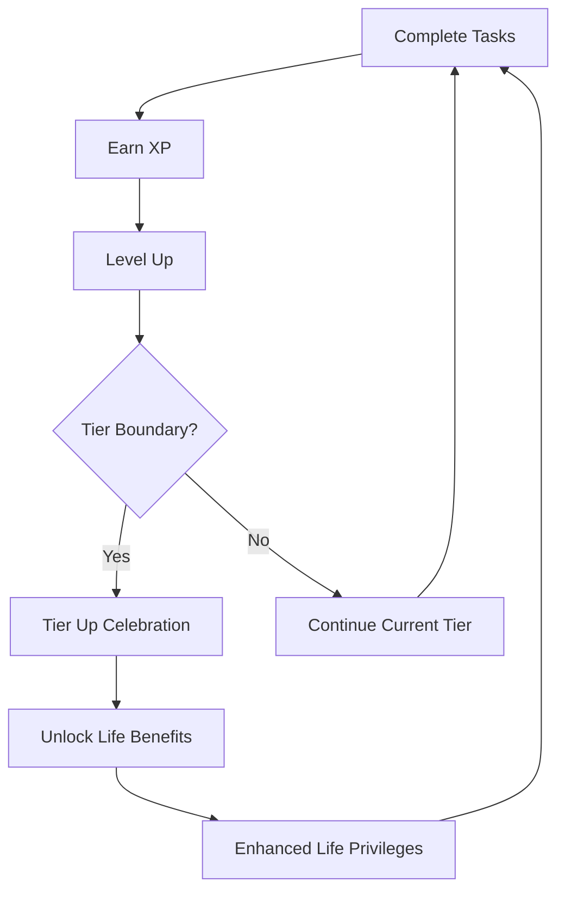

# 🌟 SISO Life Levels Documentation

> Transform your productivity system into a real-world life optimization engine

## 📖 Documentation Overview

This documentation covers the complete SISO Life Levels system - a revolutionary gamification upgrade that turns your XP and levels into meaningful real-world benefits and life privileges.

### 📚 Documentation Structure

```
docs/siso-life-levels/
├── README.md                          # This overview
├── user-guide/                        # User-facing documentation
│   ├── getting-started.md             # Quick start guide
│   ├── tier-system-explained.md       # Understanding tiers and benefits
│   ├── life-benefits-catalog.md       # Complete benefits reference
│   └── troubleshooting.md             # Common issues and solutions
├── technical/                         # Developer documentation
│   ├── implementation-guide.md        # Step-by-step technical implementation
│   ├── api-reference.md               # API documentation and interfaces
│   ├── architecture-overview.md       # System design and architecture
│   └── integration-patterns.md        # Best practices for integration
├── planning/                          # Project planning and roadmap
│   ├── development-roadmap.md         # Phase-by-phase implementation plan
│   ├── feature-specifications.md      # Detailed feature requirements
│   ├── success-metrics.md             # KPIs and measurement criteria
│   └── risk-assessment.md             # Potential challenges and mitigations
├── testing/                           # Quality assurance documentation
│   ├── testing-strategy.md            # QA approach and methodology
│   ├── test-cases.md                  # Comprehensive test scenarios
│   └── performance-benchmarks.md      # Performance requirements and tests
└── deployment/                        # Deployment and operations
    ├── deployment-guide.md            # Step-by-step deployment process
    ├── configuration-reference.md     # Configuration options and settings
    └── maintenance-procedures.md      # Ongoing maintenance and updates
```

## 🎯 System Overview

### What is SISO Life Levels?

SISO Life Levels transforms your existing XP/gamification system into a **Life Operating System** where digital progress unlocks tangible real-world benefits. Instead of meaningless levels, you progress through meaningful tiers that grant you actual life privileges.

### 🏆 Tier System

| Tier | Levels | Focus | Key Benefits |
|------|--------|-------|--------------|
| 🥉 **Bronze** | 1-10 | Foundation Builder | Basic treats, flexible wake-up times |
| 🥈 **Silver** | 11-25 | Consistency Master | Hobby time, coffee shop sessions |
| 🥇 **Gold** | 26-50 | Peak Performer | Premium subscriptions, office upgrades |
| 💎 **Platinum** | 51-100 | Life Optimizer | Education investments, sabbatical planning |
| 👑 **Legend** | 101-200 | Reality Architect | Career pivots, major investments |
| 🌟 **Transcendent** | 201+ | System Transcendent | Complete autonomy, unlimited development |

### 🚀 Quick Start

1. **For Users**: Start with [Getting Started Guide](user-guide/getting-started.md)
2. **For Developers**: Begin with [Implementation Guide](technical/implementation-guide.md)
3. **For Project Managers**: Review [Development Roadmap](planning/development-roadmap.md)

## 💡 Core Principles

### 1. **Real-World Impact**
Every tier unlock provides tangible life benefits - not just digital rewards.

### 2. **Progressive Challenge**
Each tier represents genuine personal mastery and increased life optimization.

### 3. **Seamless Integration**
Builds on existing XP system without disrupting current functionality.

### 4. **Meaningful Milestones**
Clear progression path from Foundation Builder to Reality Architect.

### 5. **Life Operating System**
Your productivity level directly influences your life privileges and autonomy.

## 🎮 How It Works



## 📊 Success Metrics

- **Engagement**: 40% increase in app usage time
- **Consistency**: 60% improvement in daily streaks
- **Motivation**: 50% better user retention
- **Life Integration**: 80% user satisfaction with real benefits
- **Progression**: Clear, achievable path through all tiers

## 🛠️ Technical Stack

- **Frontend**: React/TypeScript with existing SISO-INTERNAL architecture
- **State Management**: LocalStorage + existing gamification service
- **Animations**: Framer Motion (already integrated)
- **UI Components**: Existing shadcn/ui component library
- **Notifications**: Toast system + custom tier celebration modals

## 📈 Implementation Timeline

- **Phase 1** (Week 1): Core tier system and logic
- **Phase 2** (Week 2): UI integration and components
- **Phase 3** (Week 3): Life benefit system and tracking
- **Phase 4** (Week 4): Advanced features and polish

## 🤝 Contributing

This system is designed for personal use within the SISO-INTERNAL project. For modifications or enhancements:

1. Review existing gamification service architecture
2. Follow established TypeScript and React patterns
3. Maintain backward compatibility with current XP system
4. Test thoroughly with existing user data

## 📞 Support

For questions or issues:
- Review the [Troubleshooting Guide](user-guide/troubleshooting.md)
- Check [API Reference](technical/api-reference.md) for technical details
- Consult [Implementation Guide](technical/implementation-guide.md) for development help

---

**🌟 Ready to transform your productivity into life optimization? Let's build the future of personal development!**