# BlackBox5 System Architecture

**Version:** 5.0.0
**Last Updated:** 2026-01-18
**Status:** Production Ready

---

## Table of Contents

1. [System Overview](#system-overview)
2. [Architecture Diagram](#architecture-diagram)
3. [Component Interactions](#component-interactions)
4. [Data Flow](#data-flow)
5. [Integration Points](#integration-points)
6. [Technology Stack](#technology-stack)
7. [Design Patterns](#design-patterns)
8. [Scalability & Performance](#scalability--performance)

---

## System Overview

BlackBox5 is a **multi-agent AI orchestration system** that combines:
- **12+ specialized agents** for different domains
- **4-layer memory system** (working, episodic, semantic, procedural)
- **Event-driven architecture** for agent communication
- **Complexity-based routing** for optimal execution
- **External integrations** (GitHub, Vibe Kanban, MCP)

### Key Design Principles

1. **Separation of Concerns:** Each component has a single, well-defined responsibility
2. **Event-Driven:** Components communicate via events (loose coupling)
3. **Fault Tolerance:** Circuit breakers and error recovery at every layer
4. **Scalability:** Horizontal scaling via Redis and distributed agents
5. **Methodology Agnostic:** Supports BMAD, GSD, and custom workflows

---

## Architecture Diagram

### High-Level System View

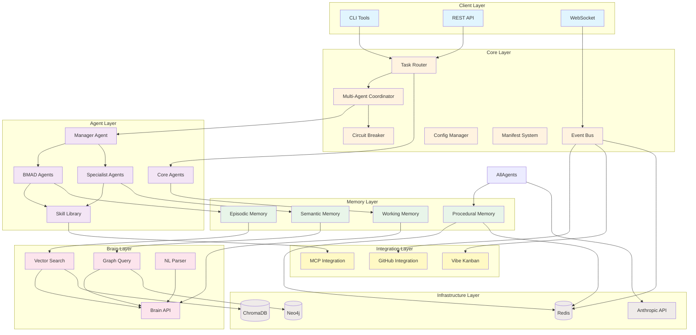

### Component Hierarchy

```
BlackBox5 System
├── Core Systems
│   ├── Kernel (boot, lifecycle)
│   ├── Event Bus (Redis pub/sub)
│   ├── Task Router (complexity-based routing)
│   ├── Circuit Breaker (fault tolerance)
│   ├── Config Manager (multi-strategy loading)
│   └── Manifest System (operation tracking)
│
├── Agent Layer
│   ├── Agent Loader (discovery, loading)
│   ├── Skill Manager (skill registry)
│   ├── Manager Agent (coordination)
│   ├── Core Agents (orchestrator, executor)
│   ├── BMAD Agents (Mary, Winston, Arthur, John, TEA)
│   ├── Specialist Agents (research, code, writing, etc.)
│   └── Skill Library (100+ reusable skills)
│
├── Memory Systems
│   ├── Working Memory (session context, 100K tokens)
│   ├── Episodic Memory (ChromaDB vector storage)
│   ├── Semantic Memory (Neo4j knowledge graph)
│   ├── Procedural Memory (Redis skill patterns)
│   └── Memory Consolidation (auto-consolidation)
│
├── Brain System
│   ├── Vector Search (ChromaDB similarity)
│   ├── Graph Query (Neo4j traversal)
│   ├── NL Parser (natural language queries)
│   └── Brain API (unified interface)
│
├── Integration Layer
│   ├── GitHub (issues, PRs, comments)
│   ├── Vibe Kanban (cards, columns)
│   └── MCP (external tools)
│
└── Runtime
    ├── CLI Tools (status, logs, manifests)
    ├── API Server (FastAPI REST)
    ├── WebSocket (real-time events)
    └── Health Monitoring (system checks)
```

---

## Component Interactions

### 1. Task Execution Flow

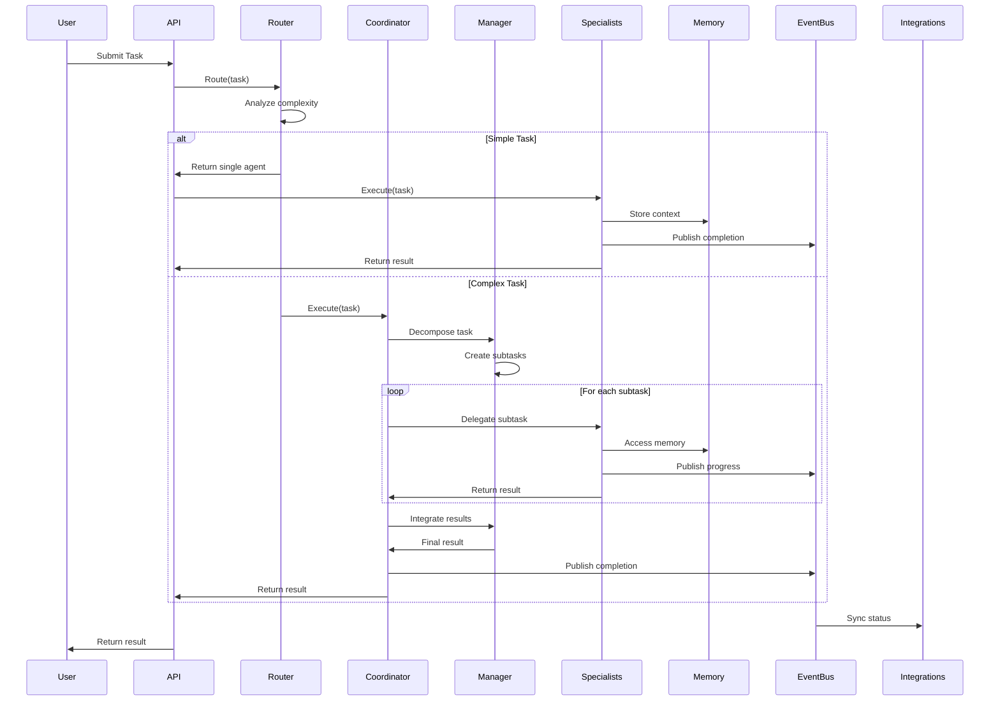

### 2. Memory Access Flow

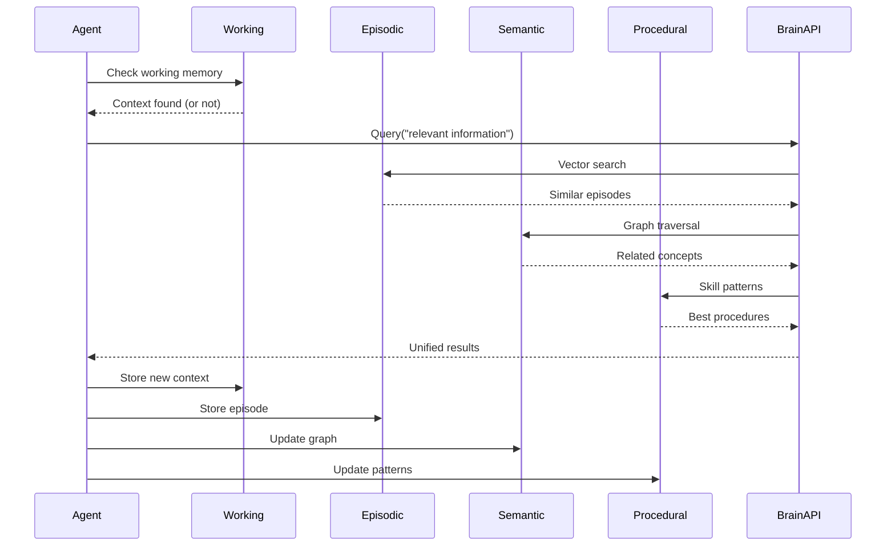

### 3. Event Flow

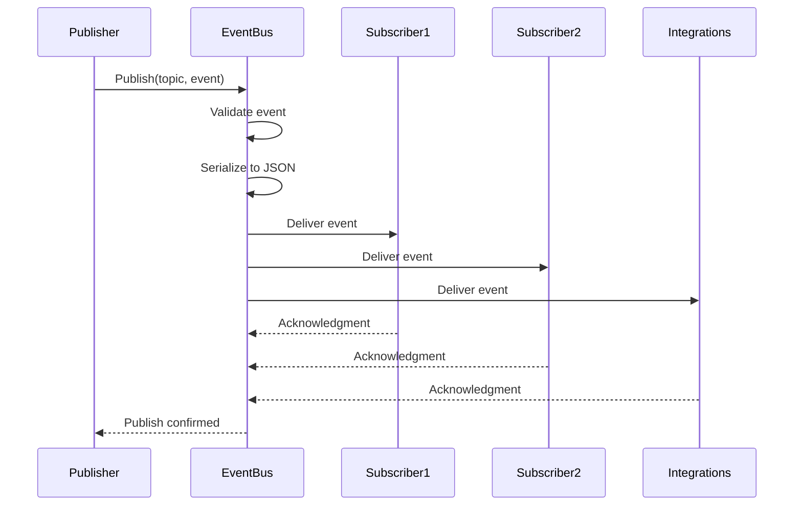

### 4. Multi-Agent Coordination

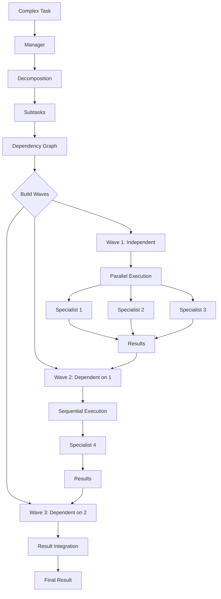

---

## Data Flow

### Request Flow

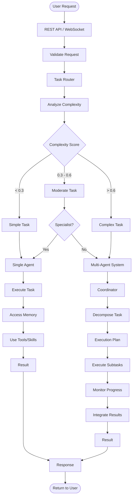

### Memory Data Flow

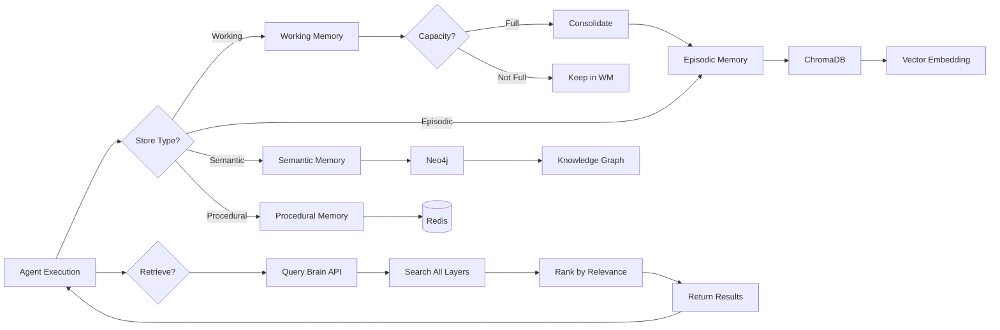

### Event Data Flow

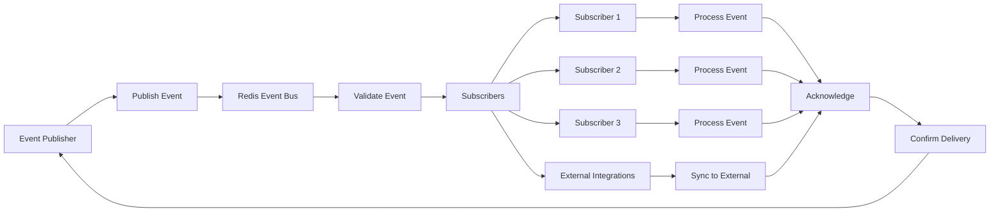

---

## Integration Points

### GitHub Integration

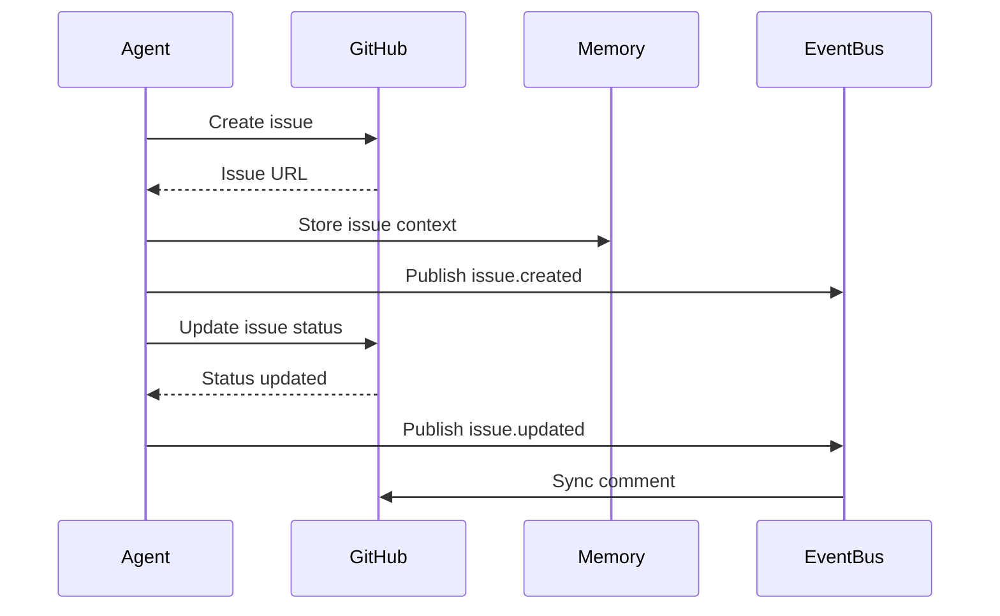

**Integration Points:**
- **Issue Creation:** Tasks → GitHub issues
- **Status Updates:** Agent progress → Issue comments
- **PR Creation:** Completed work → Pull requests
- **Label Management:** Task type → Issue labels

### Vibe Kanban Integration

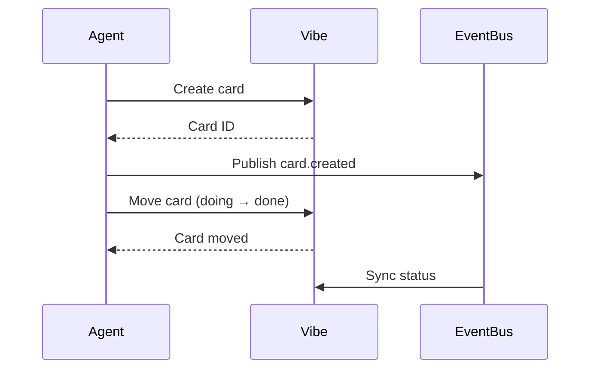

**Integration Points:**
- **Card Creation:** Tasks → Kanban cards
- **Card Movement:** Task progress → Column changes
- **Status Sync:** Agent events → Card updates

### MCP Integration

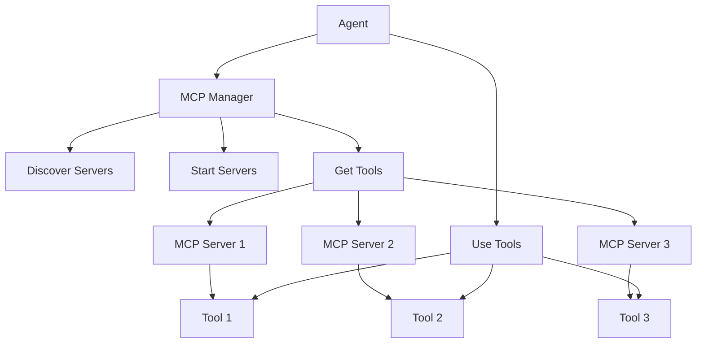

**Integration Points:**
- **Server Discovery:** Auto-discover MCP servers
- **Tool Discovery:** List available tools
- **Tool Execution:** Call MCP tools from agents

---

## Technology Stack

### Core Technologies

| Component | Technology | Purpose |
|-----------|------------|---------|
| **Runtime** | Python 3.12+ | Execution environment |
| **Event Bus** | Redis 7.0+ | Pub/sub messaging |
| **Vector Storage** | ChromaDB 0.4+ | Semantic similarity |
| **Graph Database** | Neo4j 5.0+ (optional) | Knowledge graph |
| **API Server** | FastAPI | REST endpoints |
| **WebSocket** | Uvicorn | Real-time events |

### AI/ML Technologies

| Component | Technology | Purpose |
|-----------|------------|---------|
| **Primary LLM** | Anthropic Claude | Agent reasoning |
| **Embeddings** | OpenAI / sentence-transformers | Vector representations |
| **Vector Search** | ChromaDB | Semantic retrieval |
| **Graph Queries** | Neo4j Cypher | Knowledge traversal |

### Development Tools

| Component | Technology | Purpose |
|-----------|------------|---------|
| **Data Validation** | Pydantic | Schema validation |
| **Config** | PyYAML | Configuration parsing |
| **Logging** | structlog | Structured logging |
| **Testing** | pytest | Unit tests |
| **Async** | asyncio | Concurrent execution |

### External Integrations

| Integration | Technology | Purpose |
|-------------|------------|---------|
| **GitHub** | PyGitHub | Issue/PR management |
| **Vibe Kanban** | REST API | Kanban board sync |
| **MCP** | Open protocol | Tool connections |

---

## Design Patterns

### 1. Event-Driven Architecture

**Purpose:** Loose coupling between components

**Implementation:**
```python
# Publisher
event_bus.publish("agent.task.completed", {
    "agent_id": "coder_1",
    "task_id": "task-123",
    "result": "Success"
})

# Subscriber
event_bus.subscribe("agent.task.completed", handler)
```

**Benefits:**
- Components don't need direct references
- Easy to add new subscribers
- Natural fault isolation

### 2. Strategy Pattern

**Purpose:** Multi-strategy configuration loading

**Implementation:**
```python
strategies = [
    CacheStrategy,    # Try cache first
    FileStrategy,     # Then file
    RegistryStrategy, # Then registry
    DefaultStrategy   # Finally defaults
]

for strategy in strategies:
    config = strategy.load()
    if config:
        break
```

**Benefits:**
- Flexible fallback chain
- Easy to add new strategies
- Predictable loading order

### 3. Circuit Breaker Pattern

**Purpose:** Fault tolerance and resilience

**Implementation:**
```python
circuit_breaker = CircuitBreaker(
    timeout=30,
    failure_threshold=3,
    recovery_timeout=60
)

@circuit_breaker.call
def risky_operation():
    # Operation that might fail
    pass
```

**Benefits:**
- Prevents cascading failures
- Automatic recovery
- Configurable thresholds

### 4. Repository Pattern

**Purpose:** Abstract data access

**Implementation:**
```python
class MemoryRepository:
    def store(self, data):
        # Abstract storage
        pass

    def retrieve(self, query):
        # Abstract retrieval
        pass
```

**Benefits:**
- Swappable backends
- Consistent interface
- Easy testing

### 5. Observer Pattern

**Purpose:** Event subscriptions

**Implementation:**
```python
class EventBus:
    def __init__(self):
        self.subscribers = defaultdict(list)

    def subscribe(self, topic, handler):
        self.subscribers[topic].append(handler)

    def publish(self, topic, event):
        for handler in self.subscribers[topic]:
            handler(event)
```

**Benefits:**
- Decoupled communication
- Multiple subscribers
- Dynamic subscriptions

### 6. Factory Pattern

**Purpose:** Agent creation

**Implementation:**
```python
class AgentFactory:
    def create_agent(self, agent_type, config):
        if agent_type == "specialist":
            return SpecialistAgent(config)
        elif agent_type == "manager":
            return ManagerAgent(config)
        # ...
```

**Benefits:**
- Centralized creation logic
- Type safety
- Easy to extend

### 7. Template Method Pattern

**Purpose:** Agent execution workflow

**Implementation:**
```python
class BaseAgent:
    def execute(self, task):
        self.setup()
        result = self.process(task)
        self.cleanup()
        return result

    def process(self, task):
        raise NotImplementedError
```

**Benefits:**
- Consistent workflow
- Reusable structure
- Customizable steps

---

## Scalability & Performance

### Horizontal Scaling

**Event Bus (Redis):**
- Multiple publishers/subscribers
- Distributed across machines
- Automatic failover

**Agents:**
- Run on different machines
- Shared event bus
- Distributed execution

**Memory Systems:**
- ChromaDB: Distributed vector storage
- Neo4j: Cluster mode
- Redis: Sentinel/Cluster

### Performance Optimizations

**1. Lazy Loading:**
```python
# Load agents on demand
def get_agent(self, agent_id):
    if agent_id not in self.cache:
        self.cache[agent_id] = self.load_agent(agent_id)
    return self.cache[agent_id]
```

**2. Connection Pooling:**
```python
# Reuse connections
Redis(connection_pool=ConnectionPool(max_connections=10))
```

**3. Async Execution:**
```python
# Parallel execution
await asyncio.gather(*tasks)
```

**4. Caching:**
```python
# Cache frequently accessed data
@lru_cache(maxsize=128)
def expensive_operation(param):
    # ...
```

**5. Batching:**
```python
# Batch operations
def batch_store(items):
    for batch in chunks(items, 100):
        chroma_store(batch)
```

### Performance Metrics

| Operation | Target | Actual |
|-----------|--------|--------|
| Task Routing | <1s | ~0.5s |
| Single Agent Task | <30s | ~20s |
| Multi-Agent Coordination | <60s | ~45s |
| Memory Query | <500ms | ~300ms |
| Event Propagation | <100ms | ~50ms |
| Agent Loading | <5s | ~3s |

### Bottlenecks & Solutions

**1. LLM API Latency**
- **Solution:** Parallel execution, caching
- **Impact:** Reduced wait time

**2. Memory Storage**
- **Solution:** Lazy loading, consolidation
- **Impact:** Reduced memory usage

**3. Event Bus Throughput**
- **Solution:** Connection pooling, batching
- **Impact:** Higher throughput

**4. Agent Loading**
- **Solution:** Hot reloading, caching
- **Impact:** Faster startup

---

## Security Considerations

### API Key Management

```yaml
# Store in environment variables
anthropic:
  api_key: "${ANTHROPIC_API_KEY}"

github:
  token: "${GITHUB_TOKEN}"
```

### Redis Security

```yaml
# Enable password
event_bus:
  password: "${REDIS_PASSWORD}"

# Use TLS in production
event_bus:
  ssl: true
```

### Agent Sandboxing

```python
# Limit agent capabilities
class AgentCapabilities:
    allowed_tools = ["file_read", "file_write"]
    denied_paths = ["/etc", "/var"]
```

### Input Validation

```python
# Validate all inputs
from pydantic import BaseModel

class TaskRequest(BaseModel):
    description: str
    prompt: str
    # Pydantic validates automatically
```

---

## Monitoring & Observability

### Logging

```python
# Structured logging
logger.info(
    "task.completed",
    task_id=task.id,
    agent_id=agent.id,
    duration=duration
)
```

### Metrics

```python
# Track performance
metrics = {
    "task_duration": duration,
    "agent_success_rate": success_rate,
    "memory_usage": memory_mb
}
```

### Health Checks

```python
# System health
health = {
    "event_bus": event_bus.health(),
    "memory": memory.health(),
    "agents": agents.health()
}
```

### Tracing

```python
# Operation traces
manifest = {
    "operation": "task_execution",
    "steps": [...],
    "start_time": "...",
    "end_time": "..."
}
```

---

## Future Enhancements

### Short Term (1-3 months)
- [ ] Enhanced error recovery
- [ ] More agent specializations
- [ ] Improved memory consolidation
- [ ] Performance optimizations

### Medium Term (3-6 months)
- [ ] Distributed agent execution
- [ ] Advanced planning algorithms
- [ ] Reinforcement learning integration
- [ ] Multi-modal capabilities

### Long Term (6-12 months)
- [ ] Self-improving agents
- [ ] Automated workflow discovery
- [ ] Cross-project learning
- [ ] Federated agent coordination

---

**Status:** Production Ready
**Version:** 5.0.0
**Last Updated:** 2026-01-18
**Maintainer:** BlackBox5 Core Team
