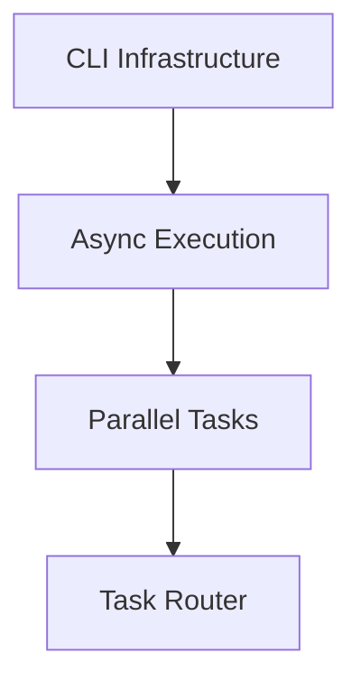

# BlackBox5 Roadmap System - Design Summary

**Date:** 2026-01-19
**Status:** Ready for Implementation
**Purpose:** System for tracking BlackBox5 improvements from idea to completion

---

## Overview

The roadmap system provides a structured way to plan, track, and learn from BlackBox5 improvements. It's designed to scale from 10 to 500+ improvements while maintaining clarity and enabling continuous learning.

---

## Folder Structure

```
.blackbox5/roadmap/
├── 00-proposed/              # Initial ideas and proposals
├── 01-research/              # Investigation and feasibility
├── 02-design/                # Technical design and architecture
├── 03-planned/               # Ready to implement, fully scoped
├── 04-active/                # Currently being implemented
├── 05-completed/             # Shipped improvements (by date)
│   └── 2026/
│       ├── 01-january/
│       ├── 02-february/
│       └── ...
├── 06-cancelled/             # Cancelled improvements (with reasons)
├── 07-backlog/               # Good ideas, not prioritized
├── templates/                # Document templates
├── dependencies.yaml         # Cross-improvement dependency graph
├── roadmap.md                # High-level roadmap view
└── INDEX.yaml                # Master index
```

**Why Numbered Prefixes?**
- ✅ Matches existing pattern (`1-core/`, `2-bmad/`, etc.)
- ✅ Natural sort order in all tools
- ✅ Clear workflow progression
- ✅ Scales to 99+ stages

---

## Pipeline Design

### Visual Flow

```
┌─────────────────────────────────────────────────────────────────┐
│                    IMPROVEMENT LIFECYCLE                        │
├─────────────────────────────────────────────────────────────────┤
│                                                                  │
│  00. PROPOSED                                                   │
│  ├─ Idea submitted                                             │
│  ├─ Initial triage (category, domain, priority)                │
│  └─ Gate: Is this worth pursuing?                              │
│       ↓ Yes → 01-Research                                       │
│       ↓ No → 07-Backlog or 06-Cancelled                        │
│                                                                  │
│  01. RESEARCH                                                   │
│  ├─ Investigation                                              │
│  ├─ Feasibility study                                          │
│  ├─ Technology research                                        │
│  └─ Gate: Is this feasible and valuable?                       │
│       ↓ Yes → 02-Design                                         │
│       ↓ No → 06-Cancelled                                       │
│                                                                  │
│  02. DESIGN                                                     │
│  ├─ Technical design                                           │
│  ├─ Architecture                                               │
│  ├─ Risk assessment                                            │
│  └─ Gate: Is design sound and complete?                        │
│       ↓ Yes → 03-Planned                                        │
│       ↓ No → 01-Research (more info needed)                    │
│                                                                  │
│  03. PLANNED                                                    │
│  ├─ Task breakdown                                             │
│  ├─ Dependency resolution                                      │
│  ├─ Resource allocation                                        │
│  ├─ Timeline estimation                                        │
│  └─ Gate: Ready to implement?                                  │
│       ↓ Yes → 04-Active                                         │
│       ↓ No → Continue planning                                 │
│                                                                  │
│  04. ACTIVE                                                     │
│  ├─ Implementation in progress                                 │
│  ├─ Daily/weekly progress updates                              │
│  ├─ Blocker tracking                                           │
│  └─ Gate: Implementation complete and tested?                  │
│       ↓ Yes → 05-Completed                                     │
│       ↓ Blocked → Stay in active, update blockers              │
│                                                                  │
│  05. COMPLETED                                                  │
│  ├─ Final review                                               │
│  ├─ Documentation updated                                      │
│  ├─ Retrospective (lessons learned)                            │
│  ├─ Deployment (if applicable)                                 │
│  └─ Archive by date                                            │
│                                                                  │
│  Side Gates:                                                    │
│  ├─ 06. CANCELLED (can enter from any stage)                   │
│  └─ 07. BACKLOG (can enter from any stage)                     │
│                                                                  │
└─────────────────────────────────────────────────────────────────┘
```

### Gates at Each Stage

Each stage has a **gate** that must be passed before proceeding:

**Proposed → Research**
- [ ] Idea is clearly articulated
- [ ] Category and domain identified
- [ ] Initial priority assessed
- [ ] Not a duplicate of existing work

**Research → Design**
- [ ] Feasibility demonstrated
- [ ] Business value confirmed
- [ ] Risks identified and mitigated
- [ ] Technology options evaluated

**Design → Planned**
- [ ] Technical design complete
- [ ] Architecture documented
- [ ] Dependencies identified
- [ ] Implementation approach clear

**Planned → Active**
- [ ] Tasks created and linked
- [ ] Dependencies resolved
- [ ] Resources allocated
- [ ] Timeline estimated

**Active → Completed**
- [ ] All tasks complete
- [ ] Tests passing
- [ ] Documentation updated
- [ ] Review approved

---

## File Naming Convention

### Pattern: `{STATUS}-{ID:04d}-{SLUG}.md`

**Examples:**
- `PROPOSAL-0001-async-agent-execution.md`
- `RESEARCH-0002-chromadb-performance.md`
- `DESIGN-0003-memory-consolidation.md`
- `PLAN-0004-task-routing-v2.md`
- `ACTIVE-0005-bmad-integration.md`
- `COMPLETED-0006-cli-refactor.md`

**ID Format:**
- Sequential: `0001`, `0002`, `0003`, etc.
- Or date-based: `2026-01-19-001`

**SLUG Format:**
- kebab-case (lowercase, hyphens)
- Max 50 characters
- Descriptive but concise

---

## YAML Frontmatter Template

```yaml
---
id: "PROPOSAL-0001"
title: "Async Agent Execution System"
slug: "async-agent-execution"
status: "proposed"
stage: "00-proposed"

# Metadata
created_at: "2026-01-19T10:30:00Z"
created_by: "human" # or agent name
updated_at: "2026-01-19T10:30:00Z"

# Classification
category: "feature" # feature, bugfix, refactor, research, infrastructure
domain: "agents"    # agents, skills, memory, tools, cli, etc.
priority: "high"    # critical, high, medium, low, backlog

# Relationships
depends_on: []      # IDs this depends on
blocks: []          # IDs this blocks
blocked_by: []      # IDs blocking this
relates_to: []      # Related IDs
parent_improvement: null  # Part of larger improvement

# Tasks
related_tasks: []   # Links to .blackbox5/tasks/
parent_prd: null
parent_epic: null

# Effort Tracking
estimated_hours: null
actual_hours: null
progress: 0.0       # 0.0 to 1.0

# Review
review_status: "not-reviewed" # not-reviewed, in-review, approved, rejected
reviewed_by: null
reviewed_at: null
approval_notes: null

# Tags
tags: ["agents", "async", "performance"]

# Links (filled in as improvement progresses)
proposal_link: null    # Path to this file
research_link: null    # Path to research file
design_link: null      # Path to design file
plan_link: null        # Path to plan file
active_link: null      # Path to active file
completion_link: null  # Path to completion file

# Git Integration
git_branch: null
git_pr: null

# Custom Metadata
metadata: {}
---
```

---

## Artifacts at Each Stage

| Stage | Required Artifacts | Location |
|-------|-------------------|----------|
| **Proposed** | Proposal document, initial triage | `00-proposed/PROPOSAL-{id}-{slug}.md` |
| **Research** | Research summary, findings, feasibility | `01-research/RESEARCH-{id}-{slug}.md` |
| **Design** | Design doc, architecture diagrams, API specs | `02-design/DESIGN-{id}-{slug}.md` |
| **Planned** | Implementation plan, task list, dependencies | `03-planned/PLAN-{id}-{slug}.md` |
| **Active** | Progress logs, code changes, test results | `04-active/ACTIVE-{id}-{slug}.md` |
| **Completed** | Completion report, retrospective, metrics | `05-completed/COMPLETED-{id}-{slug}.md` |

---

## Dependencies Tracking

### Cross-Improvement Dependencies

**File:** `dependencies.yaml`

```yaml
dependencies:
  - id: "PROPOSAL-0001"
    depends_on:
      - id: "COMPLETED-0005"
        type: "blocking"  # blocking, optional, recommended
        reason: "Requires CLI infrastructure to be in place"
    blocks:
      - id: "PROPOSAL-0002"
        type: "blocking"
        reason: "Async execution must exist before parallel tasks"

  - id: "RESEARCH-0002"
    depends_on:
      - id: "PROPOSAL-0001"
        type: "optional"
        reason: "Related research can inform this"
```

### Dependency Graph



---

## Integration with Existing Systems

### Link to Tasks (`.blackbox5/tasks/`)

```yaml
# In improvement file
related_tasks:
  - "TASK-2026-01-19-001"
  - "TASK-2026-01-19-002"
```

### Link to PRDs/Epics

```yaml
parent_prd: "PRD-001"
parent_epic: "EPIC-002"
```

### Link to Memory System

```yaml
# In .blackbox5/memory/INDEX.yaml
improvements:
  active: 5
  completed: 12
  pending: 18
```

---

## Master Index

**File:** `INDEX.yaml`

```yaml
# ============================================================================
# METADATA
# ============================================================================
system:
  version: "1.0"
  name: "roadmap"
  updated: "2026-01-19T12:00:00Z"

# ============================================================================
# IMPROVEMENTS
# ============================================================================
improvements:
  proposed:
    - id: "PROPOSAL-0001"
      title: "Async Agent Execution"
      priority: "high"
      domain: "agents"
      created_at: "2026-01-19"

  research:
    - id: "RESEARCH-0001"
      title: "ChromaDB Performance"
      priority: "medium"
      domain: "memory"
      created_at: "2026-01-18"

  design:
    - id: "DESIGN-0001"
      title: "Memory Consolidation"
      priority: "high"
      domain: "memory"
      created_at: "2026-01-17"

  planned:
    - id: "PLAN-0001"
      title: "Task Router v2"
      priority: "critical"
      domain: "tools"
      created_at: "2026-01-16"

  active:
    - id: "ACTIVE-0001"
      title: "BMAD Integration"
      priority: "high"
      domain: "agents"
      progress: 0.45
      started_at: "2026-01-15"

  completed:
    - id: "COMPLETED-0001"
      title: "CLI Infrastructure"
      priority: "critical"
      domain: "cli"
      completed_at: "2026-01-14"
      actual_hours: 24

# ============================================================================
# STATUS SUMMARY
# ============================================================================
status:
  total: 50
  by_stage:
    proposed: 15
    research: 5
    design: 8
    planned: 10
    active: 5
    completed: 5
    cancelled: 2
  by_priority:
    critical: 3
    high: 15
    medium: 20
    low: 10
    backlog: 2
  by_domain:
    agents: 12
    skills: 8
    memory: 10
    tools: 9
    cli: 6
    infrastructure: 5

# ============================================================================
# DEPENDENCIES
# ============================================================================
dependencies:
  blocking:
    - from: "PROPOSAL-0002"
      to: "PROPOSAL-0001"
      reason: "Requires async execution"

  blocked:
    - from: "PROPOSAL-0001"
      by: "COMPLETED-0005"
      reason: "Waiting for CLI infrastructure"
```

---

## Usage Workflow

### Creating a New Improvement

1. **Submit Proposal**
   ```bash
   # Create file in 00-proposed/
   vim .blackbox5/roadmap/00-proposed/PROPOSAL-0001-async-execution.md
   ```

2. **Initial Triage**
   - Review proposal
   - Assign category, domain, priority
   - Decide: pursue, backlog, or cancel

3. **Move to Research** (if approved)
   ```bash
   mv 00-proposed/PROPOSAL-0001-* 01-research/RESEARCH-0001-*
   # Update YAML: status: "research", stage: "01-research"
   ```

4. **Conduct Research**
   - Investigation
   - Feasibility study
   - Document findings

5. **Move to Design** (if feasible)
   ```bash
   mv 01-research/RESEARCH-0001-* 02-design/DESIGN-0001-*
   ```

6. **Create Design**
   - Technical design
   - Architecture diagrams
   - Risk assessment

7. **Move to Planned** (if design approved)
   ```bash
   mv 02-design/DESIGN-0001-* 03-planned/PLAN-0001-*
   ```

8. **Create Implementation Plan**
   - Task breakdown
   - Dependencies
   - Timeline

9. **Move to Active** (when starting)
   ```bash
   mv 03-planned/PLAN-0001-* 04-active/ACTIVE-0001-*
   ```

10. **Implement**
    - Track progress
    - Update daily/weekly
    - Resolve blockers

11. **Move to Completed** (when done)
    ```bash
    mv 04-active/ACTIVE-0001-* 05-completed/2026/01-january/COMPLETED-0001-*
    ```

12. **Retrospective**
    - Document lessons learned
    - Update metrics
    - Archive

---

## Scaling Considerations

### To 50+ Improvements
- ✅ Numbered folders maintain order
- ✅ INDEX.yaml provides quick lookup
- ✅ Date-based archival in completed/

### To 100+ Improvements
- Add subdirectories by domain:
  ```
  04-active/
  ├── agents/
  ├── skills/
  ├── memory/
  └── infrastructure/
  ```

### To 500+ Improvements
- Implement search via INDEX.yaml
- Use query system like `.blackbox5/memory/INDEX.yaml`
- Add database backend if needed (ChromaDB/Neo4j)

---

## Next Steps

1. **Create Structure**
   ```bash
   mkdir -p .blackbox5/roadmap/{00-proposed,01-research,02-design,03-planned,04-active,05-completed/2026/{01-january,02-february,03-march,04-april,05-may,06-june},06-cancelled,07-backlog,templates}
   ```

2. **Create Templates**
   - `templates/proposal-template.md`
   - `templates/research-template.md`
   - `templates/design-template.md`
   - `templates/plan-template.md`
   - `templates/active-template.md`
   - `templates/completed-template.md`

3. **Create Index Files**
   - `INDEX.yaml`
   - `dependencies.yaml`
   - `roadmap.md`

4. **Migrate Existing Files**
   - Move implementation plans from `docs/`
   - Move task analysis files
   - Organize by stage

5. **Integrate with Tasks**
   - Link improvements to tasks
   - Link tasks to improvements
   - Update memory system

---

## Summary

This roadmap system provides:

✅ **Clear Structure** - 8 stages from idea to completion
✅ **Quality Gates** - Each stage has requirements before proceeding
✅ **Scalability** - Works from 10 to 500+ improvements
✅ **Integration** - Links to tasks, memory, and git
✅ **Learning** - Retrospectives and lessons learned
✅ **Tracking** - Dependencies, blockers, progress
✅ **Alignment** - Matches existing BlackBox5 patterns

The system is ready to implement and will provide a robust foundation for continuous improvement of BlackBox5.
