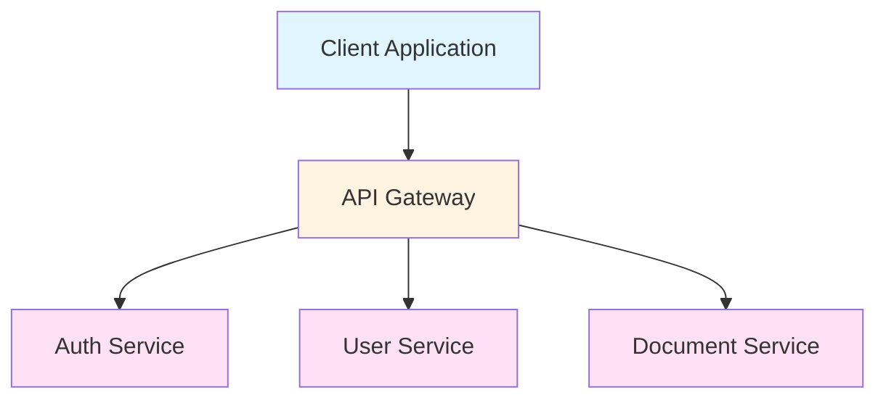
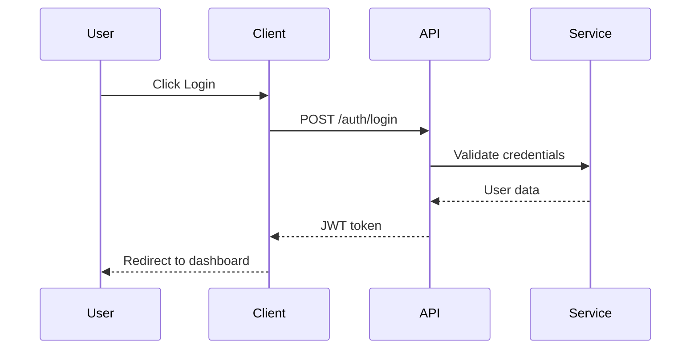

# Technical Specification Writing

<context>
Technical specifications are the foundation of successful software development projects. They bridge the gap between business requirements and implementation, ensuring all stakeholders have a shared understanding of what needs to be built, how it should behave, and what constraints must be considered.

## Why Technical Specs Matter

**Communication & Alignment:**
- Provide single source of truth for technical teams
- Enable cross-functional collaboration between developers, designers, PMs
- Reduce miscommunication and misunderstandings
- Create shared vocabulary and understanding

**Risk Mitigation:**
- Identify technical challenges early
- Surface dependencies and integration points
- Reveal scalability and performance considerations
- Highlight security and compliance requirements

**Development Efficiency:**
- Reduce rework and implementation churn
- Enable parallel work streams with clear interfaces
- Accelerate onboarding for new team members
- Provide clear acceptance criteria for testing

**Quality Assurance:**
- Define measurable success criteria
- Enable comprehensive test planning
- Facilitate code review against clear standards
- Support maintenance and future iterations

## When to Write Technical Specs

**Required For:**
- Major features or epics
- Cross-system integrations
- Architecture changes
- API design and contracts
- Database schema changes
- Performance-critical components
- Security-sensitive features
- External service integrations

**Optional But Recommended:**
- Complex UI interactions
- Bug fixes with broad impact
- Refactoring initiatives
- Developer tooling features
- Internal process improvements

## Spec Audience Considerations

**Developers:**
- Implementation details and patterns
- Code structure and organization
- Technical constraints and limitations
- Dependencies and integration points

**Product Managers:**
- Feature scope and boundaries
- User experience flows
- Success metrics and KPIs
- Trade-offs and alternatives

**Designers:**
- User interaction patterns
- Visual specifications
- Edge case handling
- Responsive behavior

**QA Engineers:**
- Acceptance criteria
- Test scenarios and edge cases
- Error conditions
- Performance benchmarks

**DevOps/SRE:**
- Deployment requirements
- Monitoring and observability
- Scalability considerations
- Operational requirements
</context>

<instructions>
## Writing Effective Technical Specifications

### 1. Preparation Phase

**Understand the Problem:**
- Talk to stakeholders about requirements
- Identify user needs and pain points
- Research existing solutions and patterns
- Document assumptions and constraints

**Gather Requirements:**
- Functional requirements (what it does)
- Non-functional requirements (how it performs)
- Business requirements (why it matters)
- Technical requirements (how it's built)

**Define Scope:**
- In-scope items
- Out-of-scope items (future considerations)
- Success criteria
- Definition of done

### 2. Specification Writing

**Structure Your Spec:**
1. **Overview**: High-level description and goals
2. **Requirements**: Functional and non-functional
3. **Approach**: Technical solution and architecture
4. **Implementation**: Detailed design and patterns
5. **Testing**: Test strategy and acceptance criteria
6. **Rollout**: Deployment and migration plan

**Be Specific and Precise:**
- Use clear, unambiguous language
- Define technical terms and acronyms
- Include concrete examples
- Specify exact behavior for edge cases
- Quantify performance requirements

**Include Visuals:**
- Architecture diagrams
- Data flow diagrams
- Sequence diagrams
- State machine diagrams
- UI mockups or wireframes

### 3. Review and Iterate

**Internal Review:**
- Technical feasibility assessment
- Architecture review
- Security review
- Performance review

**Stakeholder Review:**
- Product team validation
- Design team alignment
- Engineering team feedback
- QA team input

**Iterate:**
- Address feedback and concerns
- Resolve open questions
- Update diagrams and examples
- Get final approval

### 4. Maintenance

**Keep Specs Current:**
- Update as requirements change
- Document decisions and rationale
- Track version history
- Archive deprecated specs

**Use Specs Throughout Development:**
- Reference during implementation
- Update based on learnings
- Document deviations and reasons
- Conduct post-mortem analysis
</instructions>

<rules>
## Core Principles of Technical Specifications

### 1. Clarity
- Use simple, direct language
- Avoid jargon unless defined
- Write for your audience's expertise level
- Use examples to illustrate complex concepts
- Define all acronyms on first use

### 2. Completeness
- Cover all functional requirements
- Include non-functional requirements
- Document all constraints and assumptions
- Specify error handling and edge cases
- List all dependencies and integrations

### 3. Feasibility
- Assess technical viability early
- Consider resource constraints
- Evaluate timeline implications
- Identify technical risks
- Propose mitigation strategies

### 4. Traceability
- Link requirements to business goals
- Map features to user stories
- Connect design to implementation
- Trace tests to requirements
- Document decision rationale

### 5. Maintainability
- Use clear organization and structure
- Employ consistent formatting
- Include version history
- Make updates easy and obvious
- Keep docs close to code

### 6. Testability
- Write verifiable requirements
- Include acceptance criteria
- Define measurable outcomes
- Specify test scenarios
- Include performance benchmarks

## Quality Standards

**Every spec must:**
- Have a clear, concise title
- State the problem being solved
- Define success criteria
- Include technical approach
- Specify implementation details
- List testing requirements
- Identify risks and dependencies
- Provide rollout considerations

**Every spec should avoid:**
- Ambiguous requirements
- Vague timelines
- Undefined terminology
- Missing acceptance criteria
- Incomplete error handling
- Undocumented assumptions
- Unclear ownership
- Outdated information
</rules>

<workflow>
## Technical Specification Workflow

### Phase 1: Requirements Gathering

**Activities:**
- Stakeholder interviews and discussions
- User story and use case analysis
- Technical research and feasibility studies
- Constraint and dependency identification
- Risk assessment and mitigation planning

**Deliverables:**
- Requirement summary document
- User stories or use cases
- Technical research notes
- Risk register
- Initial scope definition

**Checkpoints:**
- ✓ Requirements clearly understood
- ✓ Stakeholders aligned on goals
- ✓ Technical viability confirmed
- ✓ Major risks identified
- ✓ Initial scope defined

### Phase 2: Specification Writing

**Activities:**
- Draft technical specification document
- Create architecture and design diagrams
- Define data structures and interfaces
- Specify algorithms and logic
- Document error handling and edge cases

**Deliverables:**
- Complete technical specification
- Architecture diagrams
- Data model documentation
- API specifications (if applicable)
- Test plan outline

**Checkpoints:**
- ✓ All requirements addressed
- ✓ Technical approach documented
- ✓ Implementation details specified
- ✓ Acceptance criteria defined
- ✓ Testing approach outlined

### Phase 3: Review and Feedback

**Activities:**
- Distribute spec for review
- Conduct review meetings
- Gather feedback and concerns
- Address open questions
- Incorporate valid feedback

**Deliverables:**
- Review feedback document
- Updated specification
- Decision log with rationale
- Action items for implementation

**Checkpoints:**
- ✓ All stakeholders reviewed
- ✓ Technical concerns addressed
- ✓ Feasibility confirmed
- ✓ Risks mitigated or accepted
- ✓ Final approval obtained

### Phase 4: Approval and Handoff

**Activities:**
- Final stakeholder sign-off
- Create implementation tasks
- Schedule sprint planning
- Brief engineering team
- Archive approved specification

**Deliverables:**
- Approved specification document
- Implementation task breakdown
- Sprint plan
- Team presentation materials
- Archived spec in repository

**Checkpoints:**
- ✓ Formal approval received
- ✓ Implementation tasks created
- ✓ Team briefed and aligned
- ✓ Spec archived and versioned
- ✓ Dependencies identified

### Phase 5: Implementation Support

**Activities:**
- Answer implementation questions
- Clarify ambiguities as they arise
- Document deviations from spec
- Update spec based on learnings
- Conduct post-implementation review

**Deliverables:**
- Clarification documentation
- Change log
- Updated specification
- Lessons learned document
- Post-implementation review

**Checkpoints:**
- ✓ Questions answered promptly
- ✓ Changes documented
- ✓ Team stays aligned
- ✓ Lessons captured
- ✓ Spec updated for future reference

### Phase 6: Maintenance and Evolution

**Activities:**
- Monitor spec relevance
- Update for system changes
- Incorporate feedback
- Maintain version history
- Plan for next iteration

**Deliverables:**
- Updated specifications
- Version history
- Change documentation
- Migration guides (if needed)
- Evolution roadmap

**Checkpoints:**
- ✓ Specs remain current
- ✓ Versions properly tracked
- ✓ Changes communicated
- ✓ Migration plans created
- ✓ Continuous improvement applied
</workflow>

<best_practices>
## Technical Specification Best Practices

### Document Structure

**Organize for Readability:**
- Use clear headings and subheadings
- Include table of contents for long specs
- Group related information together
- Use progressive disclosure (overview → details)
- Include summary/TL;DR section

**Standard Sections:**
```markdown
# [Feature Name] Technical Specification

## Overview
[High-level description and goals]

## Requirements
### Functional Requirements
[What the feature does]

### Non-Functional Requirements
[Performance, security, usability]

### Business Requirements
[Why this matters, success metrics]

## Technical Approach
### Architecture
[System design and components]

### Data Model
[Structures and relationships]

### API Design
[Endpoints, contracts, schemas]

### Algorithms & Logic
[Key algorithms and business logic]

## Implementation Details
### Code Organization
[Directory structure, modules]

### Design Patterns
[Patterns and conventions]

### Dependencies
[Libraries, services, integrations]

### Error Handling
[Error conditions and recovery]

## Testing Strategy
### Unit Testing
[Test coverage approach]

### Integration Testing
[Cross-component testing]

### Performance Testing
[Load, stress, scalability]

### Acceptance Criteria
[Specific, measurable criteria]

## Rollout Plan
### Deployment Strategy
[Phased rollout, feature flags]

### Migration Path
[Data migration, backward compatibility]

### Monitoring
[Metrics, alerts, observability]

## Risks & Mitigations
[Technical risks and mitigation strategies]

## Alternatives Considered
[Other approaches and why not chosen]

## Open Questions
[Unresolved issues for discussion]
```

### Diagrams and Visuals

**Types of Diagrams:**
- **Architecture Diagrams**: System components and relationships
- **Sequence Diagrams**: Interactions between components
- **State Machines**: State transitions and flows
- **Data Flow Diagrams**: How data moves through system
- **Entity Relationship Diagrams**: Data model and relationships
- **User Flow Diagrams**: User interaction paths

**Diagram Best Practices:**
- Keep diagrams simple and clear
- Use consistent notation
- Label all components and connections
- Include legend if needed
- Use appropriate level of abstraction
- Update diagrams as spec evolves

### Acceptance Criteria

**Write SMART Criteria:**
- **Specific**: Clear and unambiguous
- **Measurable**: Quantifiable outcomes
- **Achievable**: Realistic and feasible
- **Relevant**: Aligned with goals
- **Time-bound**: Clear completion definition

**Example Format:**
```markdown
### Acceptance Criteria

**AC-1: User Authentication**
- GIVEN a registered user
- WHEN they submit valid credentials
- THEN they are authenticated and redirected to dashboard
- AND session token is set
- AND last login timestamp is updated

**AC-2: Invalid Credentials**
- GIVEN a registered user
- WHEN they submit invalid credentials
- THEN authentication fails with error message
- AND user is not logged in
- AND failed attempt is logged

**AC-3: Performance**
- GIVEN normal system load
- WHEN user authenticates
- THEN response time < 500ms
- AND 99.9% success rate
```

### Version Control

**Semantic Versioning:**
- **MAJOR**: Breaking changes or complete rewrites
- **MINOR**: Feature additions, backward compatible
- **PATCH**: Bug fixes, small updates

**Version History Format:**
```markdown
## Version History

### v1.2.0 (2025-01-15)
- Added OAuth2 authentication
- Updated API endpoints
- Breaking change: Removed legacy auth

### v1.1.0 (2024-12-10)
- Added rate limiting
- Improved error messages
- Updated dependencies

### v1.0.0 (2024-11-01)
- Initial release
```

### Collaboration

**Effective Spec Collaboration:**
- Use collaborative editing tools
- Enable comments and suggestions
- Conduct formal review meetings
- Assign clear ownership
- Set review deadlines
- Document all decisions with rationale

**Review Checklist:**
- [ ] Requirements complete and clear
- [ ] Technical approach sound
- [ ] Implementation feasible
- [ ] Testing adequate
- [ ] Risks identified and mitigated
- [ ] Acceptance criteria defined
- [ ] Rollout plan viable
- [ ] Documentation comprehensive

### Templates and Standards

**Use Standard Templates:**
- Feature specification template
- API specification template
- Database schema template
- Architecture decision record template
- Test specification template

**Maintain Template Library:**
- Version controlled templates
- Usage guidelines
- Examples of completed specs
- Training materials
- Quality checklists
</best_practices>

<anti_patterns>
## Common Anti-Patterns to Avoid

### Vague Requirements

**Anti-Pattern:**
```markdown
## Requirements
The system should be fast and user-friendly.
It should handle lots of users and be secure.
```

**Why It's Bad:**
- No measurable criteria
- Subjective and open to interpretation
- Can't verify if requirements are met
- Leads to disagreements and rework

**Better Approach:**
```markdown
## Requirements

### Performance Requirements
- API response time: p95 < 200ms, p99 < 500ms
- Support 10,000 concurrent users
- Database queries: < 100ms average

### Usability Requirements
- User onboarding: < 5 minutes to complete
- Error recovery: Clear, actionable error messages
- Mobile-responsive design

### Security Requirements
- HTTPS/TLS 1.3 for all connections
- Authentication: OAuth 2.0 + JWT
- Authorization: Role-based access control
- Data encryption: AES-256 at rest
```

### Missing Constraints

**Anti-Pattern:**
```markdown
## Approach
We'll use a microservices architecture with
event-driven communication.
```

**Why It's Bad:**
- Doesn't consider existing infrastructure
- Ignores resource limitations
- Misses team skill constraints
- Overlooks timeline pressures

**Better Approach:**
```markdown
## Approach

### Architecture
Monolithic architecture with modular design

### Rationale
- Team familiar with existing codebase
- Simpler deployment with current infrastructure
- Faster development timeline
- Lower operational complexity
- Can evolve to microservices later if needed

### Constraints
- Must deploy to existing Kubernetes cluster
- Limited to 3 development team members
- 8-week timeline to market
- Must reuse existing PostgreSQL database
- Budget: $10k for infrastructure
```

### Outdated Specifications

**Anti-Pattern:**
- Writing spec once and never updating
- Implementing diverging from spec without updates
- Team referencing outdated versions
- No version history or change tracking

**Consequences:**
- Wasted time on invalid approaches
- Confusion about actual requirements
- Repeat discussions and decisions
- Lost tribal knowledge

**Prevention:**
```markdown
## Version History

### v2.0.0 (Current) - 2025-01-18
**Changes from v1.0:**
- Changed from REST to GraphQL API
- Added WebSocket for real-time updates
- Updated data model for new requirements
- Revised performance targets

**Rationale:**
- GraphQL chosen for flexible client queries
- WebSocket required for live collaboration features
- Performance targets increased based on user expectations

### v1.0.0 - 2024-12-01
- Initial specification
```

### Analysis Paralysis

**Anti-Pattern:**
- Spending weeks writing perfect specs
- Seeking 100% requirement coverage
- Endless review cycles
- Delaying implementation for spec refinement

**Consequences:**
- Missed market windows
- Demotivated team
- Analysis costs exceed implementation costs
- Requirements change during prolonged analysis

**Better Approach:**
- Focus on 80/20 rule: spec 80% in 20% of time
- Document unknowns as open questions
- Iterate on spec during implementation
- Use agile, just-in-time specification
- Balance thoroughness with speed

### Missing Edge Cases

**Anti-Pattern:**
```markdown
## User Registration
User enters email and password, system creates account.
```

**Why It's Bad:**
- Doesn't handle existing users
- Doesn't handle invalid input
- Doesn't handle network failures
- Doesn't handle concurrent requests

**Better Approach:**
```markdown
## User Registration

### Normal Flow
1. User submits email and password
2. System validates input format
3. System checks if email already registered
4. System hashes password
5. System creates user record
6. System sends verification email
7. System redirects to confirmation page

### Edge Cases

**Email Already Registered:**
- Return clear error message
- Offer "forgot password" option
- Log attempt for security monitoring

**Invalid Input Format:**
- Validate email format (RFC 5322)
- Enforce password requirements
- Show specific validation errors
- Prevent brute force enumeration

**Network Failure:**
- Display user-friendly error
- Allow retry without data re-entry
- Log failure for monitoring
- Implement exponential backoff

**Concurrent Registration:**
- Use database unique constraint
- Handle race conditions gracefully
- Return appropriate error if duplicate
- Ensure idempotency for retries

**Security Considerations:**
- Rate limit registration attempts
- Detect and block bot registrations
- Verify email before activation
- Log security events
```

### Over-Specification

**Anti-Pattern:**
```markdown
## Implementation

### File Structure
```
/src
  /components
    /Button.tsx (exactly 47 lines)
    /Input.tsx (use specific imports)
```

### Variable Naming
- All variables must use camelCase
- Maximum 15 characters per variable
```

**Why It's Bad:**
- Micromanages implementation details
- Reduces developer autonomy
- May not be optimal in practice
- Focuses on wrong level of abstraction

**Better Approach:**
```markdown
## Implementation

### Architecture
- Follow atomic design pattern for components
- Use existing component library where possible
- Maintain consistency with current codebase

### Code Quality
- Follow project coding standards
- Maintain >80% test coverage
- Pass all linting rules
- Document complex logic
- Conduct peer code reviews

### Flexibility
- Developers can adapt implementation details
- Focus on outcomes, not prescriptions
- Trust engineering judgment
- Iterate based on implementation learnings
```
</anti_patterns>

<examples>
## Technical Specification Examples

### Example 1: API Specification

```markdown
# User Management API Specification

## Overview
RESTful API for user management operations including CRUD operations,
authentication, and profile management.

## Requirements

### Functional Requirements
- Create, read, update, delete user accounts
- User authentication and authorization
- Profile management and preferences
- Password reset functionality
- User search and filtering

### Non-Functional Requirements
- Response time: p95 < 100ms
- Availability: 99.9% uptime SLA
- Security: OAuth 2.0 + JWT
- Rate limiting: 100 req/min per user

## API Design

### Endpoints

#### Create User
```
POST /api/v1/users
```

**Request Body:**
```json
{
  "email": "user@example.com",
  "password": "SecurePass123!",
  "firstName": "John",
  "lastName": "Doe",
  "role": "user"
}
```

**Response (201 Created):**
```json
{
  "id": "usr_123ABC",
  "email": "user@example.com",
  "firstName": "John",
  "lastName": "Doe",
  "role": "user",
  "createdAt": "2025-01-18T10:30:00Z",
  "updatedAt": "2025-01-18T10:30:00Z"
}
```

**Error Responses:**
- 400: Invalid input
- 409: Email already exists
- 422: Validation failed

#### Get User
```
GET /api/v1/users/{userId}
```

**Response (200 OK):**
```json
{
  "id": "usr_123ABC",
  "email": "user@example.com",
  "firstName": "John",
  "lastName": "Doe",
  "role": "user",
  "lastLogin": "2025-01-18T09:15:00Z",
  "createdAt": "2025-01-15T14:20:00Z"
}
```

**Error Responses:**
- 404: User not found

#### Update User
```
PATCH /api/v1/users/{userId}
```

**Request Body:**
```json
{
  "firstName": "Jane",
  "preferences": {
    "theme": "dark",
    "notifications": true
  }
}
```

**Response (200 OK):**
```json
{
  "id": "usr_123ABC",
  "email": "user@example.com",
  "firstName": "Jane",
  "lastName": "Doe",
  "preferences": {
    "theme": "dark",
    "notifications": true
  },
  "updatedAt": "2025-01-18T11:00:00Z"
}
```

#### Delete User
```
DELETE /api/v1/users/{userId}
```

**Response (204 No Content)**

**Error Responses:**
- 404: User not found
- 403: Insufficient permissions

### Authentication
All endpoints (except signup/login) require:
```
Authorization: Bearer <JWT_TOKEN>
```

### Rate Limiting
- 100 requests per minute per user
- Response headers:
  - X-RateLimit-Limit: 100
  - X-RateLimit-Remaining: 95
  - X-RateLimit-Reset: 1642500000

## Data Model

### Users Table
```sql
CREATE TABLE users (
  id UUID PRIMARY KEY DEFAULT gen_random_uuid(),
  email VARCHAR(255) UNIQUE NOT NULL,
  password_hash VARCHAR(255) NOT NULL,
  first_name VARCHAR(100),
  last_name VARCHAR(100),
  role VARCHAR(50) DEFAULT 'user',
  preferences JSONB DEFAULT '{}',
  last_login TIMESTAMP,
  created_at TIMESTAMP DEFAULT NOW(),
  updated_at TIMESTAMP DEFAULT NOW()
);

CREATE INDEX idx_users_email ON users(email);
CREATE INDEX idx_users_role ON users(role);
```

## Testing Strategy

### Unit Tests
- Test all business logic
- Mock external dependencies
- Achieve >90% code coverage

### Integration Tests
- Test API endpoints
- Test database operations
- Test authentication flow

### Performance Tests
- Load test: 1000 concurrent users
- Stress test: Find breaking point
- Endurance test: 24-hour stability

### Acceptance Criteria
- [ ] All endpoints return correct responses
- [ ] Authentication works correctly
- [ ] Error handling covers all cases
- [ ] Performance targets met
- [ ] Security requirements satisfied
```

### Example 2: Feature Specification

```markdown
# Real-Time Collaboration Feature

## Overview
Enable multiple users to collaborate on documents in real-time,
similar to Google Docs, with presence indicators and conflict resolution.

## Requirements

### Functional Requirements
- Multiple users can edit same document simultaneously
- Changes sync in real-time (<100ms latency)
- Show presence indicators (cursors, selections)
- Automatic conflict resolution
- Edit history and undo/redo
- User presence awareness (who's viewing)

### Non-Functional Requirements
- Support 100 concurrent editors per document
- 99.9% availability during collaboration sessions
- Graceful degradation on poor connections
- Data consistency guarantee

### Business Requirements
- Increase user engagement by 25%
- Reduce meeting frequency
- Improve team collaboration efficiency

## Technical Approach

### Architecture

**Operational Transformation (OT) Strategy:**
- Client sends operations to server
- Server transforms and broadcasts operations
- Clients apply transformed operations
- Maintains consistent document state

**Components:**
- WebSocket server for real-time communication
- OT engine for conflict resolution
- Document store for persistence
- Presence service for user awareness

### Data Flow

```
User A edits → OT Transform → Broadcast → Apply → User B sees change
    ↓                      ↑
Presence Update      Presence Service
```

### Conflict Resolution

**Operational Transformation Rules:**
1. Receive operation from client
2. Transform against concurrent operations
3. Apply transformed operation
4. Broadcast to all clients
5. Clients apply and update UI

**Example:**
```
User A inserts "Hello" at position 0
User B inserts "World" at position 0

Concurrent operations:
- OpA: insert("Hello", 0)
- OpB: insert("World", 0)

Transformed:
- OpA': insert("Hello", 0)
- OpB': insert("World", 5)  // shifted by length of OpA

Result: "HelloWorld"
```

### Implementation Details

**WebSocket Protocol:**
```typescript
// Client message
interface ClientMessage {
  type: 'edit' | 'cursor' | 'presence';
  documentId: string;
  userId: string;
  operation?: Operation;
  cursor?: CursorPosition;
}

// Server broadcast
interface ServerMessage {
  type: 'edit' | 'presence' | 'user-joined' | 'user-left';
  operations?: Operation[];
  users?: UserPresence[];
}

// Operation format
interface Operation {
  type: 'insert' | 'delete' | 'retain';
  length?: number;
  content?: string;
}
```

**Presence Tracking:**
```typescript
interface UserPresence {
  userId: string;
  userName: string;
  cursor: {
    line: number;
    column: number;
  };
  selection?: {
    start: {line: number, column: number};
    end: {line: number, column: number};
  };
  lastSeen: timestamp;
}
```

### Performance Optimization

**Batching:**
- Batch operations every 50ms
- Reduce network overhead
- Maintain responsiveness

**Compression:**
- Compress operations before transmission
- Use binary protocol for efficiency

**Caching:**
- Cache document state in memory
- Reduce database load
- Improve sync speed

## Testing Strategy

### Unit Tests
- OT transformation logic
- Conflict resolution algorithms
- Operation serialization/deserialization

### Integration Tests
- WebSocket connection lifecycle
- Multi-user collaboration scenarios
- Presence tracking accuracy

### Load Tests
- 100 concurrent users editing
- Measure latency and throughput
- Identify performance bottlenecks

### Acceptance Criteria
- [ ] 10 users can edit simultaneously without conflicts
- [ ] Changes sync within 100ms on good connection
- [ ] Presence indicators update within 500ms
- [ ] Undo/redo works correctly across users
- [ ] Graceful handling of network disconnections
- [ ] Document state consistency guaranteed

## Rollout Plan

### Phase 1: Alpha (Internal)
- Deploy to internal users
- Test with 5-10 concurrent editors
- Collect feedback and fix bugs

### Phase 2: Beta (Selected Customers)
- Enable for trusted customers
- Monitor performance and usage
- Iterate based on feedback

### Phase 3: General Availability
- Roll out to all users
- Feature flag for easy rollback
- Monitor metrics and SLA compliance

### Monitoring
- WebSocket connection health
- Operation latency distribution
- Concurrent users per document
- Error rates and types
- System resource usage

## Risks & Mitigations

### Risk: High Latency on Poor Networks
**Mitigation:**
- Implement operation queuing
- Optimistic UI updates
- Connection quality indicators

### Risk: Conflict Resolution Bugs
**Mitigation:**
- Comprehensive testing
- Use proven OT library
- Fallback to last-write-wins if needed

### Risk: Scalability Issues
**Mitigation:**
- Load testing before rollout
- Horizontal scaling of WebSocket servers
- Document sharding strategy
```

### Example 3: Architecture Specification

```markdown
# Microservices Migration Architecture

## Overview
Migrate monolithic application to microservices architecture
to improve scalability, maintainability, and deployment velocity.

## Requirements

### Functional Requirements
- Decompose monolith into focused services
- Implement service-to-service communication
- Centralized configuration management
- Distributed tracing and monitoring
- Service discovery and load balancing

### Non-Functional Requirements
- Individual service deployment
- Fault isolation between services
- Independent scaling per service
- <50ms inter-service latency
- 99.95% overall availability

### Business Requirements
- Reduce deployment time by 60%
- Enable independent team scaling
- Improve system resilience
- Faster feature delivery

## Architecture Design

### Service Decomposition

**Identified Services:**

1. **User Service**
   - User management and authentication
   - Profile and preferences
   - Role-based access control

2. **Document Service**
   - Document CRUD operations
   - Version control and history
   - Search and indexing

3. **Collaboration Service**
   - Real-time editing
   - Presence awareness
   - Conflict resolution

4. **Notification Service**
   - Email notifications
   - In-app notifications
   - Notification preferences

5. **Search Service**
   - Full-text search
   - Filtering and sorting
   - Search analytics

### Communication Patterns

**Synchronous Communication:**
- REST APIs for request/response
- gRPC for high-performance scenarios
- Circuit breakers for fault tolerance

**Asynchronous Communication:**
- Event-driven architecture with message queues
- RabbitMQ for message routing
- Event sourcing for audit trails

### Data Management

**Database per Service:**
- Each service owns its data
- No direct cross-service database access
- API-based data sharing only

**Data Consistency:**
- Sagas for distributed transactions
- Eventual consistency for non-critical data
- Strong consistency for critical operations

### Infrastructure

**Container Orchestration:**
- Kubernetes for container management
- Auto-scaling based on load
- Rolling deployments with zero downtime

**Service Mesh:**
- Istio for traffic management
- mTLS for service-to-service security
- Observability and telemetry

## Implementation Plan

### Phase 1: Foundation (4 weeks)
- Set up Kubernetes cluster
- Implement service mesh
- Build CI/CD pipelines
- Establish monitoring baseline

### Phase 2: Extract User Service (3 weeks)
- Identify user domain boundaries
- Create user service API
- Migrate user data
- Switch traffic to new service
- Decommission monolith user code

### Phase 3: Extract Document Service (4 weeks)
- Design document service boundaries
- Implement document API
- Migrate document data
- Handle version control migration
- Deploy and monitor

### Phase 4: Extract Collaboration Service (5 weeks)
- Build real-time infrastructure
- Implement WebSocket service
- Migrate collaboration features
- Performance testing and optimization

### Phase 5: Extract Notification Service (3 weeks)
- Build notification system
- Implement email templates
- Migrate notification logic
- Deploy and verify

### Phase 6: Extract Search Service (4 weeks)
- Implement search indexing
- Build search API
- Migrate search data
- Optimize search performance

### Phase 7: Optimization (4 weeks)
- Performance tuning
- Security hardening
- Documentation and runbooks
- Team training

## Data Migration Strategy

### Approach: Strangler Fig Pattern

1. **Identify:** Choose domain to extract
2. **Build:** Create new microservice alongside monolith
3. **Route:** Use feature flags to route traffic
4. **Migrate:** Move data incrementally
5. **Verify:** Validate functionality and performance
6. **Decommission:** Remove old code from monolith

### Data Synchronization

**Dual-Write Phase:**
```typescript
// Monolith writes to both databases
async function createUser(data) {
  // Write to monolith database
  await monolithDB.users.create(data);

  // Write to user service database
  await userServiceAPI.createUser(data);
}
```

**Verification Phase:**
- Compare data between databases
- Monitor for inconsistencies
- Fix synchronization issues

**Cutover Phase:**
- Switch reads to new service
- Remove old database writes
- Monitor for issues

## Testing Strategy

### Contract Testing
- Define service API contracts
- Test against contracts
- Prevent breaking changes

### Integration Testing
- Test service interactions
- Test message queues
- Test data flows

### Performance Testing
- Load test individual services
- Test system under load
- Identify bottlenecks

### Chaos Testing
- Simulate service failures
- Test fault tolerance
- Verify graceful degradation

## Monitoring & Observability

### Metrics
- Service-level metrics (latency, throughput, errors)
- Resource metrics (CPU, memory, network)
- Business metrics (adoption, engagement)

### Logging
- Centralized logging (ELK stack)
- Structured JSON logs
- Correlation IDs for tracing

### Tracing
- Distributed tracing (Jaeger)
- Request flows across services
- Performance bottleneck identification

### Alerting
- Service health alerts
- Performance degradation alerts
- Error rate alerts

## Rollout Plan

### Canary Deployment
1. Deploy to canary (10% traffic)
2. Monitor metrics for 1 hour
3. If successful, expand to 50%
4. Monitor for additional hour
5. If successful, full deployment

### Rollback Plan
- Keep monolith deployable
- Feature flags for instant rollback
- Database rollback procedures
- Communication plan

## Risks & Mitigations

### Risk: Distributed System Complexity
**Mitigation:**
- Comprehensive monitoring
- Distributed tracing
- Clear documentation
- Team training

### Risk: Data Consistency Issues
**Mitigation:**
- Careful transaction design
- Comprehensive testing
- Monitoring for inconsistencies
- Rollback procedures

### Risk: Performance Degradation
**Mitigation:**
- Performance testing before rollout
- Gradual traffic migration
- Performance monitoring
- Optimization iterations
```
</examples>

<integration_notes>
## Integration with Spec Tools and Templates

### Specification Tools

**Markdown-Based Tools:**
- GitHub/GitLab for version-controlled specs
- Notion for collaborative spec writing
- Confluence for enterprise documentation
- Obsidian for personal knowledge management

**Specialized Tools:**
- Swagger/OpenAPI for API specs
- AsyncAPI for event-driven architectures
- PlantUML/Mermaid for diagrams
- DbSchema for database documentation

### Template Integration

**Using Agent OS Templates:**
```bash
# Create new spec from template
.agent-os/specs/2025-01-18-feature-name/
├── spec.md                 # Main specification
├── spec-lite.md           # Executive summary
├── sub-specs/
│   ├── technical-spec.md  # Technical details
│   ├── database-schema.md # Data model
│   ├── api-spec.md        # API contracts
│   └── tests.md           # Test strategy
└── tasks.md               # Implementation tasks
```

**Template Placeholders:**
- `[CURRENT_DATE]`: Auto-populated with date
- `[SPEC_NAME]`: Feature or component name
- `[FOLDER]`: Date-based folder name
- `@.agent-os/specs/...`: Relative file references

### Workflow Integration

**With Development Process:**
1. **Planning**: Use spec templates to document requirements
2. **Development**: Reference specs during implementation
3. **Review**: Update specs based on code reviews
4. **Testing**: Use acceptance criteria for test planning
5. **Deployment**: Verify specs match deployed behavior

**With Project Management:**
- Link specs to project tickets
- Track spec completion in sprints
- Use spec acceptance criteria as "definition of done"
- Update specs based on sprint retrospectives

### Version Control

**Git Workflow:**
```bash
# Create feature branch for spec
git checkout -b spec/user-authentication

# Write specification
# .agent-os/specs/2025-01-18-user-auth/spec.md

# Commit spec
git add .agent-os/specs/2025-01-18-user-auth/
git commit -m "spec: add user authentication specification"

# Create pull request for review
gh pr create --title "User Authentication Spec" \
             --body "Technical specification for OAuth2 implementation"
```

**Version Tagging:**
- Use semantic versioning for specs
- Tag spec releases in git
- Maintain CHANGELOG for spec updates

### Documentation Generation

**Automated Docs:**
- Generate API docs from OpenAPI specs
- Create architecture diagrams from code
- Auto-generate database schema docs
- Extract requirements from specs

**Static Site Generation:**
- Use MkDocs for spec documentation sites
- Generate HTML from markdown specs
- Include interactive diagrams
- Enable search across all specs
</integration_notes>

<error_handling>
## Handling Specification Challenges

### Ambiguous Requirements

**Symptoms:**
- Conflicting interpretations
- Unclear success criteria
- Open-ended requirements
- Missing details

**Resolution Process:**
1. Identify ambiguous language
2. List specific questions
3. Consult with stakeholders
4. Document clarifications
5. Update spec with precise language

**Example:**
```markdown
## Open Questions

### OQ-1: Performance Requirements
**Question:** What does "fast" mean for search results?

**Clarification Needed:**
- Target response time?
- Percentile requirements (p50, p95, p99)?
- Expected query complexity?

**Stakeholders:** Product, Engineering, QA
**Due:** 2025-01-20
```

### Requirement Conflicts

**Common Conflicts:**
- Performance vs. cost
- Features vs. timeline
- Security vs. usability
- Flexibility vs. simplicity

**Resolution Strategies:**
1. Identify conflicting requirements
2. Analyze trade-offs
3. Propose alternatives
4. Facilitate stakeholder discussion
5. Document decision with rationale

**Template:**
```markdown
## Trade-off Analysis

### Conflict: Real-time Updates vs. Infrastructure Cost

**Option 1: WebSockets (Real-time)**
- Pros: Instant updates, better UX
- Cons: Higher infrastructure cost ($500/mo vs $50/mo)
- Recommendation: Approved based on business value

### Conflict: Comprehensive Search vs. Development Time

**Option 1: Full-text search with Elasticsearch**
- Pros: Powerful search, better relevance
- Cons: 6 weeks development time
- Timeline impact: Delays launch by 2 weeks

**Option 2: Basic search with PostgreSQL**
- Pros: Faster to implement (2 weeks)
- Cons: Limited search capabilities
- Timeline impact: On schedule

**Decision: Option 2 for MVP, Option 1 for v2.0**

**Rationale:**
- Time-to-market critical for Q1 goals
- Can upgrade based on user feedback
- PostgreSQL search sufficient for initial scale
```

### Technical Feasibility Issues

**When Issues Arise:**
- Unknown technical challenges
- Underestimated complexity
- Unavailable dependencies
- Resource constraints

**Handling Process:**
1. Research technical options
2. Prototype risky components
3. Consult with technical experts
4. Identify mitigation strategies
5. Document findings and recommendations

**Template:**
```markdown
## Technical Risks

### Risk-001: Real-time Collaboration Scalability

**Concern:** WebSocket connection limits may not support 1000 concurrent users

**Investigation:**
- Research: WebSocket server capabilities
- Prototype: Load testing with 1000+ connections
- Results: Current stack supports ~500 connections

**Mitigation Options:**

**Option A: Upgrade Infrastructure**
- Scale WebSocket servers horizontally
- Implement connection pooling
- Cost: +$300/mo
- Confidence: High

**Option B: Alternative Approach**
- Use polling for less critical updates
- Use WebSockets only for active editors
- Complexity: Medium
- Confidence: Medium

**Recommendation:** Option A
- Approved budget increase
- Maintains optimal UX
- Proven scalability pattern
```

### Outdated Specifications

**Prevention:**
- Version control for all specs
- Clear ownership and maintenance
- Regular spec review schedule
- Automated freshness checks

**Updating Process:**
1. Identify outdated sections
2. Gather current requirements
3. Update specification
4. Document changes
5. Communicate updates to team

**Template:**
```markdown
## Specification Update

### Update: 2025-01-18

**Sections Updated:**
- API Endpoints: Added new pagination parameters
- Data Model: Added new fields to user object
- Authentication: Updated to OAuth 2.1

**Rationale:**
- Pagination needed for large datasets
- New user attributes required by product
- OAuth 2.1 provides better security

**Impact:**
- Breaking change to API clients
- Migration guide provided below
- Timeline: 2 weeks to adopt

**Migration Guide:**
```typescript
// Old API
GET /api/users

// New API (breaking change)
GET /api/users?page=1&limit=50

// Migration: Add pagination parameters
```
```

### Stakeholder Misalignment

**Detection:**
- Conflicting feedback
- Differing priorities
- Misunderstood requirements
- Unclear ownership

**Resolution:**
1. Facilitate alignment meeting
2. Document all perspectives
3. Identify common ground
4. Negotiate compromises
5. Document agreed approach

**Template:**
```markdown
## Decision Record

### Decision: API Versioning Strategy

**Date:** 2025-01-18
**Status:** Accepted

**Context:**
- Product wants flexible API for rapid iteration
- Mobile team wants stable API contracts
- Backend team wants to minimize maintenance

**Options Considered:**

**Option 1: No Versioning**
- Product: ⭐⭐⭐⭐⭐ (rapid iteration)
- Mobile: ⭐ (breaking changes)
- Backend: ⭐⭐⭐ (simple)

**Option 2: URL Versioning (/v1/, /v2/)**
- Product: ⭐⭐⭐ (some overhead)
- Mobile: ⭐⭐⭐⭐ (stable contracts)
- Backend: ⭐⭐⭐ (moderate maintenance)

**Option 3: Header Versioning (Accept: application/vnd.api+v1)**
- Product: ⭐⭐⭐⭐ (clean URLs)
- Mobile: ⭐⭐⭐⭐ (stable contracts)
- Backend: ⭐⭐ (complex routing)

**Decision: Option 2 - URL Versioning**

**Rationale:**
- Clear separation of versions
- Easy to understand and debug
- Tooling support good
- Balance of all needs

**Consequences:**
- Must support multiple API versions
- Deprecation policy needed
- Additional testing overhead
```
</error_handling>

<output_format>
## Specification Document Format

### File Organization

**Standard Structure:**
```
.agent-os/specs/YYYY-MM-DD-feature-name/
├── spec.md                    # Main specification document
├── spec-lite.md              # Executive summary
├── sub-specs/
│   ├── technical-spec.md     # Technical implementation details
│   ├── database-schema.md    # Database design and migrations
│   ├── api-spec.md           # API contracts and endpoints
│   └── tests.md              # Test coverage and strategy
└── tasks.md                  # Implementation task breakdown
```

### Markdown Formatting

**Use Consistent Formatting:**
```markdown
# [Feature Name] Specification

## Overview
[2-3 sentence summary]

## Requirements
### Functional Requirements
- [FR-001] User can log in with email and password
- [FR-002] System validates email format
- [FR-003] System enforces password complexity

### Non-Functional Requirements
- [NFR-001] API response time < 200ms (p95)
- [NFR-002] 99.9% availability
- [NFR-003] Support 10,000 concurrent users

## Technical Approach
### Architecture
[Architecture description and diagrams]

### Data Model
[Database schema and relationships]

### API Design
[Endpoint specifications]

## Implementation Details
[Code organization, patterns, dependencies]

## Testing Strategy
[Test types, coverage, acceptance criteria]

## Rollout Plan
[Deployment phases, migration path]

## Risks & Mitigations
[Risk assessment and mitigation strategies]
```

### Diagram Format

**Use Mermaid for Code-Generated Diagrams:**
```markdown
## Architecture Diagram



## Sequence Diagram



### Code Examples

**Format Code Blocks:**
````markdown
### API Request Example

```typescript
// TypeScript client example
interface LoginRequest {
  email: string;
  password: string;
}

const response = await fetch('/api/auth/login', {
  method: 'POST',
  headers: {'Content-Type': 'application/json'},
  body: JSON.stringify({
    email: 'user@example.com',
    password: 'securePassword123'
  })
});

const {token, user} = await response.json();
```

### Database Schema

```sql
CREATE TABLE users (
  id UUID PRIMARY KEY DEFAULT gen_random_uuid(),
  email VARCHAR(255) UNIQUE NOT NULL,
  password_hash VARCHAR(255) NOT NULL,
  created_at TIMESTAMP DEFAULT NOW(),
  updated_at TIMESTAMP DEFAULT NOW()
);
```
````

### Metadata Standards

**Document Header:**
```markdown
> Specification: User Authentication
> Author: John Doe
> Created: 2025-01-18
> Status: Draft
> Version: 1.0.0
> Reviewers: Jane Smith, Bob Johnson
```

**Change Log:**
```markdown
## Version History

| Version | Date       | Author      | Changes                      |
|---------|------------|-------------|------------------------------|
| 1.0.0   | 2025-01-18 | John Doe    | Initial specification        |
| 1.1.0   | 2025-01-20 | John Doe    | Added OAuth2 support         |
| 1.2.0   | 2025-01-25 | Jane Smith  | Added 2FA requirements       |
```

**Status Indicators:**
- **Draft**: Initial writing phase
- **In Review**: Under active review
- **Approved**: Ready for implementation
- **Implemented**: Feature delivered
- **Deprecated**: No longer current
</output_format>

<related_skills>
## Related Skills

### Complementary Skills

**writing-plans**
- Project planning and roadmap creation
- Sprint planning and task breakdown
- Milestone definition and tracking
- Resource allocation and timeline planning

**system-design**
- Architecture design and patterns
- Component interaction design
- Scalability and performance planning
- Technology stack selection

**api-design**
- RESTful API best practices
- GraphQL schema design
- API versioning strategies
- Contract testing and documentation

**database-design**
- Data modeling and normalization
- Schema design and migrations
- Performance optimization
- Data consistency strategies

**documentation**
- Technical writing standards
- README and guide creation
- Diagram and visual documentation
- Knowledge base management

### Skill Integration

**Typical Workflow:**
1. **writing-plans**: Create project plan and milestones
2. **technical-specs**: Write detailed technical specifications
3. **system-design**: Design system architecture
4. **api-design**: Design API contracts
5. **database-design**: Design data model
6. **documentation**: Document implementation

**Cross-Skill Best Practices:**
- Maintain consistency across all documentation
- Link related specs and documents
- Use standard templates and formats
- Keep all documentation version controlled
- Review and update regularly
</related_skills>

<see_also>
## Additional Resources

### Books and Guides

**Specification Writing:**
- "Writing Effective Use Cases" by Alistair Cockburn
- "Software Requirements" by Karl Wiegers
- "User Stories Applied" by Mike Cohn
- "The Art of Readable Code" by Dustin Boswell

**Technical Documentation:**
- "Docs for Developers" by Jared Bhatti
- "The DevOps Handbook" by Gene Kim
- "Building Microservices" by Sam Newman
- "System Design Interview" by Alex Xu

### Online Resources

**Specification Templates:**
- [Google AIPs (API Improvement Proposals)](https://google.aip.dev/)
- [AWS API Design Guide](https://github.com/awslabs/aws-api-design-guide)
- [Microsoft REST API Guidelines](https://github.com/microsoft/api-guidelines)
- [Stripe API Design](https://stripe.com/docs/api)

**Architecture Resources:**
- [The System Design Primer](https://github.com/donnemartin/system-design-primer)
- [AWS Architecture Center](https://aws.amazon.com/architecture/)
- [Google Cloud Architecture](https://cloud.google.com/architecture)
- [Microsoft Architecture](https://docs.microsoft.com/en-us/azure/architecture/)

**Documentation Tools:**
- [Mermaid Live Editor](https://mermaid.live/)
- [PlantUML](https://plantuml.com/)
- [Swagger Editor](https://editor.swagger.io/)
- [Notion API](https://developers.notion.com/)

### Internal Resources

**Agent OS Documentation:**
- `.agent-os/specs/` - Specification templates
- `.agent-os/product/` - Product documentation
- `.blackbox5/engine/agents/.skills-new/` - Agent skills

**Project-Specific Resources:**
- Architecture decision records (ADRs)
- Runbooks and operations guides
- API documentation
- Database schema documentation
</see_also>

---

**Skill Metadata:**
- **Skill ID**: technical-specs
- **Category**: knowledge-documentation/planning-architecture
- **Version**: 1.0.0
- **Last Updated**: 2025-01-18
- **Maintainer**: blackbox5/core
- **Status**: Active
- **Dependencies**: writing-plans, system-design, documentation

**Usage Instructions:**
This skill provides comprehensive guidance for writing technical specifications. Use it when creating detailed specs for features, APIs, databases, or architecture changes. Follow the workflow phases, apply best practices, and use the provided templates for consistent, high-quality specifications.
