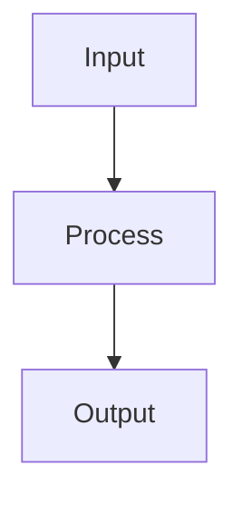

# [Feature Name]

**Status:** [documented/challenged/validated]
**Last Updated:** 2026-01-19
**Domain:** [agents/skills/memory/tools/cli/infrastructure]

---

## Purpose

What problem does this feature solve?

**Problem Statement:**
[Describe the problem clearly]

**Who Benefits:**
[Who has this problem? Users? Developers? System?]

**Why It Matters:**
[Why is this problem worth solving?]

---

## How It Works

Step-by-step explanation of the mechanism:

1. **Step 1:**
   - What happens?
   - Why is it necessary?

2. **Step 2:**
   - What happens?
   - Why is it necessary?

3. **Step 3:**
   - What happens?
   - Why is it necessary?

### Architecture Diagram

### Key Components

- **Component 1:** Purpose and function
- **Component 2:** Purpose and function
- **Component 3:** Purpose and function

---

## Underlying Assumptions

### Assumption 1: [Description]
- **What we believe:** [Statement of assumption]
- **Why we believe it:** [Rationale]
- **Confidence:** [high/medium/low]
- **Impact if wrong:** [What breaks?]

### Assumption 2: [Description]
- **What we believe:** [Statement of assumption]
- **Why we believe it:** [Rationale]
- **Confidence:** [high/medium/low]
- **Impact if wrong:** [What breaks?]

### Assumption 3: [Description]
- **What we believe:** [Statement of assumption]
- **Why we believe it:** [Rationale]
- **Confidence:** [high/medium/low]
- **Impact if wrong:** [What breaks?]

---

## Technologies Used

### Technology 1: [Name]
- **Purpose:** [What does it do?]
- **Why this technology:** [Why not alternatives?]
- **Alternatives considered:** [What else did we look at?]
- **Risks:** [What could go wrong?]

### Technology 2: [Name]
- **Purpose:** [What does it do?]
- **Why this technology:** [Why not alternatives?]
- **Alternatives considered:** [What else did we look at?]
- **Risks:** [What could go wrong?]

---

## Workflows

### Workflow 1: [Name]

**Purpose:** [What does this workflow achieve?]

**Steps:**
1. [Step]
2. [Step]
3. [Step]

**Assumptions:**
- [What must be true for this to work?]

**Alternatives:**
- [Could we do this differently?]

---

## Agents

### Agent 1: [Name/Type]

**Purpose:** [What is this agent's job?]

**How it works:**
- [Mechanism]

**Assumptions:**
- [What do we assume about this agent?]

**Capabilities:**
- [What can it do?]

**Limitations:**
- [What can't it do?]

---

## Challenges

### Questions that test the assumptions:

#### Assumption 1 Challenges
- What if [opposite of assumption]?
- How would we know if assumption 1 is false?
- What evidence do we have that assumption 1 is true?
- What would happen if assumption 1 changed tomorrow?

#### Design Challenges
- Is this the simplest way to solve the problem?
- What are we over-engineering?
- What would happen if we removed this feature?
- Could we achieve 80% of the value with 20% of the effort?

#### Technology Challenges
- Are we using the right tools?
- What if Technology 1 doesn't scale?
- What if Technology 2 becomes unmaintained?
- What if our assumptions about AI capabilities are wrong?

#### Workflow Challenges
- Are all these steps necessary?
- What's the bottleneck?
- What if we parallelized instead of sequential?
- What if we automated this step?

---

## Validation Plan

### Test 1: [Assumption name]
- **What we're testing:** [Which assumption?]
- **How we'll test it:** [Method]
- **Success criteria:** [What proves it's true?]
- **Alternative if false:** [What if it's wrong?]
- **Status:** [planned/in-progress/completed]

### Test 2: [Assumption name]
- **What we're testing:** [Which assumption?]
- **How we'll test it:** [Method]
- **Success criteria:** [What proves it's true?]
- **Alternative if false:** [What if it's wrong?]
- **Status:** [planned/in-progress/completed]

---

## Validation Results

### Test 1 Results: [Assumption name]

**Date:** [When did we test?]
**Method:** [How did we test?]
**Results:** [What did we find?]

**Conclusion:**
- [x] Assumption validated
- [ ] Assumption invalidated
- [ ] Inconclusive

**What we learned:**
[What does this mean for the feature?]

**Changes needed:**
[What should we do based on this?]

---

## Decisions

### Decision 1: [Topic]
- **Date:** [When did we decide?]
- **Decision:** [What did we decide?]
- **Rationale:** [Why?]
- **Alternatives considered:** [What else did we think about?]
- **Reversible?** [yes/no]

---

## Open Questions

- [Question 1 - Status: [investigating/validated/invalidated]]
- [Question 2 - Status: [investigating/validated/invalidated]]
- [Question 3 - Status: [investigating/validated/invalidated]]

---

## Next Steps

1. [ ] [Next action item]
2. [ ] [Next action item]
3. [ ] [Next action item]

---

## Related

- Related features: [links]
- Related workflows: [links]
- Related assumptions: [links]
