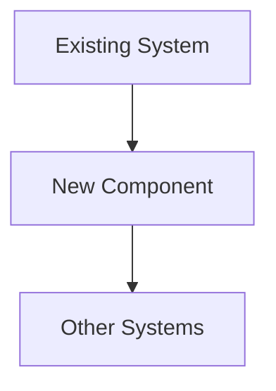

# Design: [Improvement Title]

## Overview

High-level summary of the design.

## Architecture

### System Architecture

How does this fit into the existing system?

### Component Design

What are the main components? How do they interact?

### Data Flow

How does data flow through the system?

## Technical Specifications

### APIs and Interfaces

What APIs or interfaces are we defining?

### Data Structures

What data structures are we using?

### Algorithms

What algorithms are relevant?

## Implementation Details

### Files to Modify

- `path/to/file1` - What changes?
- `path/to/file2` - What changes?

### Files to Create

- `path/to/newfile` - Purpose

### Dependencies

What new dependencies do we need?

## Testing Strategy

How will we test this?

- Unit tests:
- Integration tests:
- E2E tests:

## Risk Assessment

### Technical Risks

What could go wrong technically?

### Operational Risks

What could go wrong in production?

### Mitigation Strategies

How will we mitigate these risks?

## Rollout Plan

How will we roll this out?

### Phase 1:
### Phase 2:
### Phase 3:

## Design Review

- [ ] Technical design is sound
- [ ] Architecture is appropriate
- [ ] Risks are identified and mitigated
- [ ] Implementation approach is clear
- [ ] Testing strategy is adequate

## Next Steps

- [ ] Move to planned
- [ ] Return to research (more info needed)
