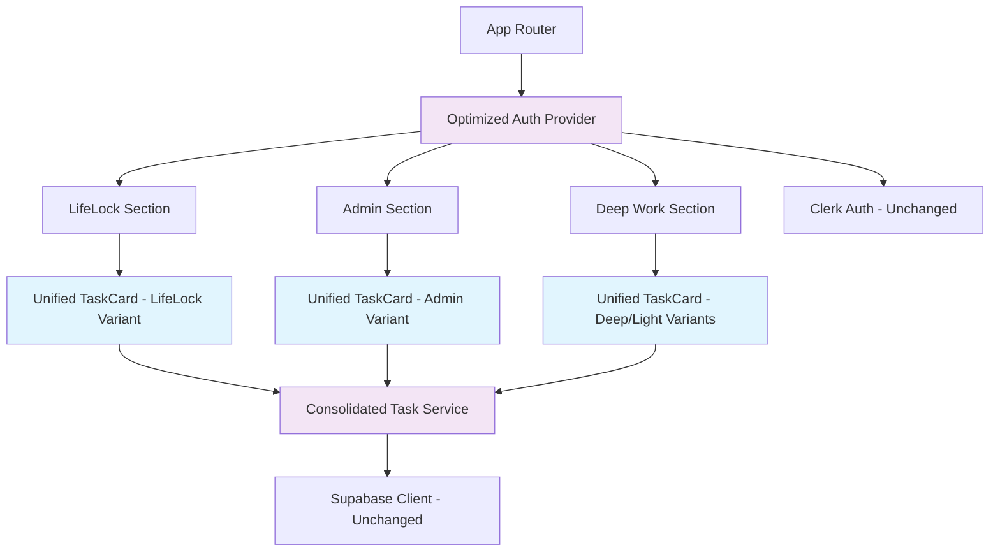

# SISO Internal Architectural Simplification Architecture

*Powered by BMAD™ Core v2.0 | Brownfield Enhancement Architecture*

## Introduction

This document outlines the architectural approach for enhancing SISO Internal with "Selective Architectural Collapse" - a systematic simplification strategy to reduce maintenance complexity by 60-70% while preserving all functionality and extensibility for planned features.

**Relationship to Existing Architecture:**
This document defines how to consolidate over-abstractions while maintaining the smart foundational decisions (PWA, Radix UI, React Query, TypeScript) that enable genuine extensibility.

### Existing Project Analysis

**Current Project State**
- **Primary Purpose:** Personal productivity PWA featuring LifeLock workflows, task management, and deep/light work planning
- **Current Tech Stack:** React 18.3.1 + TypeScript + Vite + Radix UI + Tailwind + Zustand + React Query + Clerk Auth + Supabase
- **Architecture Style:** Component-based React with service layer abstraction, over-engineered directory structure
- **Deployment Method:** Vite build + PWA service worker, likely Vercel deployment

**Available Documentation**
- ✅ Package.json with 100+ dependencies analyzed
- ✅ Directory structure mapped (32+ directories identified)
- ✅ Component patterns documented (7 TaskCard variants found)
- ✅ Service layer patterns analyzed (6 different service implementations)
- ✅ Authentication context patterns identified (8x re-render issue documented)
- ✅ 13 comprehensive technical debt reports created

**Identified Constraints**
- Must preserve 100% current functionality during consolidation
- PWA capabilities are core requirement for mobile usage
- Radix UI + Tailwind design system must remain intact
- TypeScript strict mode compliance required
- Clerk authentication flows must remain unchanged
- Supabase integrations must be preserved
- Build and deployment pipeline must remain functional

### Change Log
| Change | Date | Version | Description | Author |
|--------|------|---------|-------------|---------|
| Initial Architecture | 2025-01-16 | 1.0 | Brownfield simplification architecture | Claude + User |

## Enhancement Scope and Integration Strategy

### Enhancement Overview
**Enhancement Type:** Performance/Scalability Improvements + Technology Stack Cleanup
**Scope:** Selective architectural collapse affecting directory structure, component consolidation, service layer streamlining, and dependency optimization
**Integration Impact:** Significant - substantial existing code changes with preservation of all functionality

### Integration Approach
**Code Integration Strategy:** Incremental consolidation with rollback points, maintaining existing patterns while eliminating duplication
**Database Integration:** No database schema changes - preserve all Supabase operations and service patterns
**API Integration:** Maintain all existing API integrations, optimize authentication context usage
**UI Integration:** Consolidate duplicate components using composition patterns, preserve Radix UI foundation

### Compatibility Requirements
- **Existing API Compatibility:** All Supabase, Clerk, and external API integrations must function identically
- **Database Schema Compatibility:** Zero database changes - all operations must work exactly as before
- **UI/UX Consistency:** Visual appearance and user interactions must be pixel-perfect identical
- **Performance Impact:** Performance must be maintained or improved, especially bundle size and authentication rendering

## Tech Stack

### Existing Technology Stack
| Category | Current Technology | Version | Usage in Enhancement | Notes |
|----------|-------------------|---------|---------------------|-------|
| Framework | React | 18.3.1 | Preserve - core foundation | Component consolidation only |
| Language | TypeScript | ^5.5.3 | Preserve - strict mode maintained | Type safety critical |
| Build Tool | Vite | ^5.4.1 | Preserve with optimization | Bundle analysis and optimization |
| UI Library | Radix UI | ~1.x | Preserve - consolidation target | Foundation for component unification |
| Styling | Tailwind CSS | ^3.4.11 | Preserve | Design system consistency |
| State | Zustand | ^5.0.8 | Preserve | Proven state management |
| Data Fetching | React Query | ^5.56.2 | Preserve | Excellent caching and sync |
| Authentication | Clerk | ^5.43.1 | Preserve - optimize context | Fix re-render issues |
| Database | Supabase | ^2.49.4 | Preserve all integrations | Zero changes to operations |
| PWA | Vite PWA Plugin | ^1.0.3 | Preserve - critical capability | Mobile usage requirement |

### New Technology Additions
No new technologies required. Enhancement focuses on consolidation and optimization of existing stack.

## Data Models and Schema Changes

### Schema Integration Strategy
**Database Changes Required:**
- **New Tables:** None - zero database modifications
- **Modified Tables:** None - all existing operations preserved
- **New Indexes:** None - no performance changes to DB layer
- **Migration Strategy:** N/A - no schema changes

**Backward Compatibility:**
- All existing Supabase operations function identically
- Service layer consolidation maintains same API contracts

## Component Architecture

### New Components
*Note: These are consolidations of existing components, not net new additions*

#### Unified TaskCard Component
**Responsibility:** Single, composable task card component replacing 7 existing variants
**Integration Points:** All locations currently using TaskCard variants (LifeLock, Admin, Deep Work, Light Work contexts)

**Key Interfaces:**
- `variant?: 'lifelock' | 'admin' | 'deep' | 'light'` - Controls visual styling and behavior
- `task: TaskData` - Unified task data interface
- `onComplete: (taskId: string) => void` - Completion handler
- `onEdit: (taskId: string, data: Partial<TaskData>) => void` - Edit handler

**Dependencies:**
- **Existing Components:** Preserves all current usage patterns in LifeLock workflows, Admin dashboard, etc.
- **New Components:** None - pure consolidation

**Technology Stack:** React + TypeScript + Radix UI primitives + Tailwind variants

#### Optimized Authentication Context
**Responsibility:** Single authentication context eliminating 8x re-render performance issue
**Integration Points:** All components requiring authentication state

**Key Interfaces:**
- `useAuth(): AuthState` - Optimized hook with minimal re-renders
- `AuthProvider` - Context provider with render optimization

**Dependencies:**
- **Existing Components:** All current Clerk integration points
- **New Components:** None

**Technology Stack:** React Context API + Clerk React + useMemo/useCallback optimizations

### Component Interaction Diagram



## Source Tree

### Existing Project Structure
```
SISO-INTERNAL/
├── src/
│   ├── components/          # 7 TaskCard variants + others
│   ├── ecosystem/internal/  # LifeLock, Admin features
│   ├── shared/              # Contains entire features (problematic)
│   ├── services/            # 6 different service patterns
│   ├── hooks/               # Custom hooks
│   ├── utils/               # Utilities scattered
│   ├── types/               # TypeScript definitions
│   ├── context/             # Auth context with re-render issues
│   └── [28 other directories...]
```

### New File Organization
```
SISO-INTERNAL/
├── src/
│   ├── components/           # CONSOLIDATED
│   │   ├── ui/              # Radix UI components (existing)
│   │   ├── tasks/           # UNIFIED TaskCard + related
│   │   │   ├── TaskCard.tsx             # Single unified component
│   │   │   ├── TaskCardVariants.ts      # Variant configurations
│   │   │   └── task-card.types.ts       # Unified types
│   │   └── forms/           # Form components (existing)
│   ├── ecosystem/internal/   # PRESERVED STRUCTURE
│   │   ├── lifelock/        # LifeLock workflows (existing)
│   │   └── admin/           # Admin features (existing)
│   ├── services/            # CONSOLIDATED
│   │   ├── tasks/           # Unified task operations
│   │   │   ├── TaskService.ts           # Single task service
│   │   │   └── task-service.types.ts    # Service types
│   │   ├── auth/            # Optimized auth service
│   │   │   └── AuthService.ts           # Clerk integration
│   │   └── data/            # Unified data operations
│   │       └── DataService.ts           # Supabase operations
│   ├── shared/              # TRUE SHARED UTILITIES ONLY
│   │   ├── utils/           # Pure utility functions
│   │   ├── types/           # Global type definitions
│   │   └── constants/       # Application constants
│   ├── context/             # OPTIMIZED
│   │   └── AuthContext.tsx  # Optimized authentication context
│   └── hooks/               # Custom hooks (preserved)
```

### Integration Guidelines
- **File Naming:** Maintain existing PascalCase for components, camelCase for utilities
- **Folder Organization:** Consolidate by domain (tasks, auth, data) rather than technical layers
- **Import/Export Patterns:** Preserve existing barrel exports, add new ones for consolidated components

## Infrastructure and Deployment Integration

### Existing Infrastructure
**Current Deployment:** Vite build pipeline with PWA generation, likely Vercel deployment
**Infrastructure Tools:** Vite build system, PWA service worker, TypeScript compilation, ESLint/Prettier
**Environments:** Development (npm run dev), Production build (npm run build), Preview (npm run preview)

### Enhancement Deployment Strategy
**Deployment Approach:** Zero deployment changes - all consolidation happens at build time
**Infrastructure Changes:** None - same build pipeline, improved build performance expected
**Pipeline Integration:** Existing CI/CD remains unchanged, potentially faster due to fewer files to process

### Rollback Strategy
**Rollback Method:** Git-based rollback with branch strategy for each consolidation phase
**Risk Mitigation:** Incremental consolidation with testing gates after each phase
**Monitoring:** Existing error monitoring preserved, watch for bundle size improvements

## Coding Standards

### Existing Standards Compliance
**Code Style:** React + TypeScript patterns with functional components and hooks
**Linting Rules:** ESLint with TypeScript rules, Prettier formatting
**Testing Patterns:** Vitest for unit tests, Playwright for E2E, React Testing Library
**Documentation Style:** JSDoc comments for complex functions, README documentation

### Critical Integration Rules
- **Existing API Compatibility:** All Supabase operations must maintain identical behavior
- **Database Integration:** Zero changes to database interactions or service contracts
- **Error Handling:** Preserve existing error boundaries and error handling patterns
- **Logging Consistency:** Maintain existing console patterns and error reporting

## Testing Strategy

### Integration with Existing Tests
**Existing Test Framework:** Vitest + React Testing Library + Playwright E2E
**Test Organization:** Tests colocated with components, E2E tests in separate directory
**Coverage Requirements:** Maintain existing coverage levels, improve where consolidation allows

### New Testing Requirements

#### Unit Tests for New Components
- **Framework:** Vitest + React Testing Library (existing)
- **Location:** Colocated with consolidated components
- **Coverage Target:** 100% for new consolidated components
- **Integration with Existing:** Replace tests for deleted duplicate components

#### Integration Tests
- **Scope:** Verify consolidated components work identically in all contexts
- **Existing System Verification:** Regression tests to ensure no functionality changes
- **New Feature Testing:** Test consolidated component variants behave identically to originals

#### Regression Testing
- **Existing Feature Verification:** Comprehensive test suite to verify all workflows unchanged
- **Automated Regression Suite:** Add tests specifically for authentication optimization
- **Manual Testing Requirements:** User workflow testing after each consolidation phase

## Security Integration

### Existing Security Measures
**Authentication:** Clerk React integration with JWT tokens
**Authorization:** Role-based access through Clerk user metadata
**Data Protection:** Supabase RLS policies and client-side validation
**Security Tools:** TypeScript strict mode, input validation with Zod schemas

### Enhancement Security Requirements
**New Security Measures:** None - consolidation preserves all existing security patterns
**Integration Points:** Authentication context optimization must maintain same security model
**Compliance Requirements:** Preserve all existing data protection and access control patterns

### Security Testing
**Existing Security Tests:** Authentication flow tests, protected route verification
**New Security Test Requirements:** Verify optimized auth context maintains security boundaries
**Penetration Testing:** None required - no new attack surfaces introduced

## Next Steps

### Story Manager Handoff
**Prompt for Story Manager:**
"Create implementation stories for SISO Internal architectural simplification following the brownfield enhancement architecture document (.bmad-core/architecture/architectural-simplification-architecture.md). Key requirements: preserve 100% functionality, incremental consolidation with rollback points, comprehensive regression testing after each phase. Start with Story 1.1 (Authentication Context Optimization) as it's isolated and easily testable. Each story must include Integration Verification steps to ensure existing system integrity. Reference the PRD (.bmad-core/prd/architectural-simplification-prd.md) for acceptance criteria and validation requirements."

### Developer Handoff  
**Prompt for Developer:**
"Implement SISO Internal architectural simplification following the technical architecture (.bmad-core/architecture/architectural-simplification-architecture.md) and story requirements. CRITICAL: This is brownfield refactoring - preserve all existing functionality exactly. Use incremental approach with Git checkpoints after each component consolidation. Follow existing React + TypeScript + Radix UI patterns. Test extensively after each change. Verify PWA, authentication, and all user workflows remain identical. Priority sequence: Auth context → Service consolidation → Component unification → Directory cleanup → Dependency optimization."

---

*Architecture designed for zero-risk brownfield consolidation with comprehensive rollback capabilities*