# Orchestrator Agent Design

**Version:** 1.0.0
**Status:** Draft
**Purpose:** Define the Orchestrator Agent that coordinates multi-agent workflows in Interactive Mode

---

## Overview

The Orchestrator Agent is the **brain of Interactive Mode**. It runs within the AI chat conversation and coordinates all other agents. Unlike the script-based workflow, the Orchestrator is itself an AI agent that makes intelligent decisions about which agents to run, in what order, and how to handle edge cases.

---

## Core Responsibilities

```
┌─────────────────────────────────────────────────────────────┐
│                    ORCHESTRATOR AGENT                       │
├─────────────────────────────────────────────────────────────┤
│                                                               │
│  1. Task Understanding                                      │
│     → Parse user request                                     │
│     → Identify task type (feature/bugfix/etc)                │
│     → Detect complexity (simple/moderate/complex/critical)   │
│                                                               │
│  2. Workflow Planning                                       │
│     → Select appropriate agent sequence                     │
│     → Identify parallel execution opportunities             │
│     → Estimate time and resources                            │
│                                                               │
│  3. Agent Coordination                                      │
│     → Invoke agents in correct order                        │
│     → Pass outputs between agents                           │
│     → Handle parallel execution                             │
│                                                               │
│  4. Progress Monitoring                                     │
│     → Track agent completion                                │
│     → Detect and handle blockers                            │
│     → Provide real-time updates to user                     │
│                                                               │
│  5. Quality Assurance                                       │
│     → Validate agent outputs                                │
│     → Check completeness                                    │
│     → Request rework if needed                               │
│                                                               │
│  6. Artifact Management                                    │
│     → Auto-save agent outputs                               │
│     → Maintain artifact registry                            │
│     → Generate final summary                                │
│                                                               │
└─────────────────────────────────────────────────────────────┘
```

---

## Decision Tree

```mermaid
graph TD
    A[User Request] --> B{Task Type?}
    B -->|Feature| C{Complexity?}
    B -->|Bugfix| D{Complexity?}
    B -->|Research| E{Complexity?}
    B -->|Refactor| F{Complexity?}
    B -->|Docs| G{Complexity?}

    C -->|Simple| H[Dev only]
    C -->|Moderate| I{Can run parallel?}
    C -->|Complex| J[PM → Arch → Dev → QA]
    C -->|Critical| K[Orch → PM → Arch → Dev → QA]

    I -->|Yes| L[PM + Arch parallel → Dev]
    I -->|No| M[PM → Dev]

    D -->|Simple| N[Dev fast fix]
    D -->|Moderate| O[Dev → QA]
    D -->|Complex| P[Arch → Dev → QA]

    E -->|Simple| Q[Analyst quick]
    E -->|Moderate| R[Analyst → Tech Writer]
    E -->|Complex| S[Analyst deep → Tech Writer]

    F -->|Simple| T[Dev quick refactor]
    F -->|Moderate| U[Arch → Dev]
    F -->|Complex| V[Arch → Dev → QA]

    G -->|Simple| W[Tech Writer quick]
    G -->|Moderate| X[Tech Writer → Reviewer]
    G -->|Complex| Y[Tech Writer + PM → Finalize]
```



---

## State Machine

```typescript
/**
 * Orchestrator states
 */
type OrchestratorState =
  | "idle"              // Waiting for user input
  | "analyzing"         // Understanding the task
  | "planning"          // Creating workflow
  | "executing"         // Running agents
  | "waiting"           // Waiting for agent or user
  | "validating"        // Checking outputs
  | "complete"          // Workflow finished
  | "error";            // Handle error

/**
 * Orchestrator state machine
 */
interface OrchestratorStateMachine {
  transitions: {
    idle: {
      on_user_input: "analyzing";
    };

    analyzing: {
      task_understood: "planning";
      needs_clarification: "waiting";
    };

    planning: {
      workflow_ready: "executing";
      needs_approval: "waiting";
    };

    executing: {
      agent_complete: "executing";  // Continue with next agent
      all_agents_complete: "validating";
      agent_failed: "waiting";      // Decide recovery
    };

    waiting: {
      user_responded: "analyzing";  // Re-analyze with new info
      user_approved: "executing";
      timeout: "error";
    };

    validating: {
      validation_passed: "complete";
      validation_failed: "executing";  // Re-run with fixes
    };

    error: {
      recoverable: "executing";
      fatal: "idle";
    };

    complete: {
      new_task: "idle";
    };
  };
}
```

---

## Internal Architecture

```typescript
/**
 * Orchestrator Agent implementation
 */
class OrchestratorAgent implements Agent {
  name = "orchestrator";
  version = "1.0.0";
  type = "orchestrator" as AgentType;

  // ============= COMPONENTS =============

  /**
   * Task understanding module
   */
  private taskAnalyzer: TaskAnalyzer;

  /**
   * Workflow planner module
   */
  private workflowPlanner: WorkflowPlanner;

  /**
   * Agent registry (all available agents)
   */
  private agentRegistry: AgentRegistry;

  /**
   * Execution engine
   */
  private executionEngine: ExecutionEngine;

  /**
   * Artifact manager
   */
  private artifactManager: ArtifactManager;

  /**
   * Progress tracker
   */
  private progressTracker: ProgressTracker;

  // ============= STATE =============

  private currentWorkflow: Workflow;
  private executionState: Map<string, any>;
  private agentOutputs: Map<string, AgentOutput>;

  // ============= MAIN EXECUTION =============

  async execute(input: AgentInput): Promise<AgentOutput> {
    // 1. Analyze task
    const analysis = await this.taskAnalyzer.analyze(input.task);

    // 2. Plan workflow
    const workflow = await this.workflowPlanner.plan(analysis);

    // 3. Present plan to user
    await this.presentPlan(workflow);

    // 4. Execute workflow
    const results = await this.executionEngine.execute(workflow);

    // 5. Validate and summarize
    const summary = await this.generateSummary(results);

    return {
      agent_name: this.name,
      agent_type: this.type,
      timestamp: new Date().toISOString(),
      execution: { /* ... */ },
      output: { type: "analysis", content: { type: "analysis", data: summary } },
      artifacts: results.artifacts,
      recommendations: results.recommendations,
      quality: results.quality
    };
  }
}
```

---

## Task Analyzer

```typescript
/**
 * Analyzes user tasks to extract key information
 */
class TaskAnalyzer {
  /**
   * Main analysis method
   */
  async analyze(task: Task): Promise<TaskAnalysis> {
    return {
      task_type: await this.detectTaskType(task),
      complexity: await this.detectComplexity(task),
      scope: await this.estimateScope(task),
      risk_level: await this.assessRisk(task),
      keywords: this.extractKeywords(task),
      dependencies: this.identifyDependencies(task),
      confidence: this.calculateConfidence(task),

      // Reasoning for transparency
      reasoning: {
        task_type: this.explainTaskType(task),
        complexity: this.explainComplexity(task),
        risk_factors: this.listRiskFactors(task)
      }
    };
  }

  /**
   * Detect task type using multiple signals
   */
  private async detectTaskType(task: Task): Promise<TaskType> {
    const signals = {
      keywords: this.checkKeywords(task.description, TASK_TYPE_KEYWORDS),
      context: this.checkContext(task),
      user_intent: await this.inferIntent(task)
    };

    return this.weightedDecision(signals);
  }

  /**
   * Detect complexity using v2.0 criteria
   */
  private async detectComplexity(task: Task): Promise<Complexity> {
    const score = await this.calculateComplexityScore(task);

    // Score thresholds
    if (score >= 80) return "critical";
    if (score >= 60) return "complex";
    if (score >= 30) return "moderate";
    return "simple";
  }

  /**
   * Complexity scoring algorithm
   */
  private async calculateComplexityScore(task: Task): Promise<number> {
    let score = 0;

    // Keyword-based scoring
    const complexKeywords = [
      "microservices", "authentication", "payment processing",
      "database migration", "performance optimization", "GDPR"
    ];
    const keywordMatches = complexKeywords.filter(kw =>
      task.description.toLowerCase().includes(kw.toLowerCase())
    ).length;
    score += Math.min(keywordMatches * 15, 40);

    // Scope-based scoring
    const scope = await this.estimateScope(task);
    if (scope.estimated_files > 10) score += 20;
    if (scope.estimated_files > 5) score += 15;
    if (scope.estimated_lines > 1000) score += 15;

    // Risk-based scoring
    const risk = await this.assessRisk(task);
    score += risk.level * 20;

    // Integration complexity
    if (scope.integrations.length > 3) score += 15;
    if (scope.integrations.length > 1) score += 10;

    return Math.min(score, 100);
  }

  /**
   * Estimate scope of work
   */
  private async estimateScope(task: Task): Promise<ScopeEstimate> {
    return {
      estimated_files: this.countFilesMentioned(task),
      estimated_lines: this.estimateLinesOfCode(task),
      estimated_components: this.countComponents(task),
      integrations: this.identifyIntegrations(task),
      database_changes: this.detectDatabaseChanges(task),
      api_changes: this.detectAPIChanges(task)
    };
  }

  /**
   * Assess risk level
   */
  private async assessRisk(task: Task): Promise<RiskAssessment> {
    const riskFactors = [
      this.checkCoreSystemChanges(task),
      this.checkDataLossPotential(task),
      this.checkSecurityImplications(task),
      this.checkPerformanceSLAs(task),
      this.checkBreakingChanges(task)
    ];

    const presentFactors = riskFactors.filter(f => f.present);
    const level = presentFactors.length;

    return {
      level, // 0-5
      factors: presentFactors,
      mitigation: this.suggestMitigations(presentFactors)
    };
  }
}

/**
 * Task analysis output
 */
interface TaskAnalysis {
  task_type: TaskType;
  complexity: Complexity;
  scope: ScopeEstimate;
  risk_level: RiskAssessment;
  keywords: string[];
  dependencies: string[];
  confidence: number; // 0-100

  // For transparency
  reasoning: {
    task_type: string;
    complexity: string;
    risk_factors: string[];
  };
}

interface ScopeEstimate {
  estimated_files: number;
  estimated_lines: number;
  estimated_components: number;
  integrations: string[];
  database_changes: string[];
  api_changes: string[];
}

interface RiskAssessment {
  level: number; // 0-5
  factors: RiskFactor[];
  mitigation: string[];
}

interface RiskFactor {
  name: string;
  present: boolean;
  severity: "low" | "medium" | "high";
  description: string;
}
```

---

## Workflow Planner

```typescript
/**
 * Plans the agent workflow based on task analysis
 */
class WorkflowPlanner {
  constructor(
    private agentRegistry: AgentRegistry,
    private complexityMatrix: ComplexityMatrix
  ) {}

  /**
   * Generate workflow from task analysis
   */
  async plan(analysis: TaskAnalysis): Promise<Workflow> {
    // 1. Select base workflow from matrix
    const baseWorkflow = this.selectBaseWorkflow(analysis);

    // 2. Identify parallel opportunities
    const parallelGroups = this.identifyParallelGroups(analysis, baseWorkflow);

    // 3. Add conditional agents
    const conditionalAgents = this.addConditionalAgents(analysis);

    // 4. Calculate estimates
    const estimates = this.calculateEstimates(baseWorkflow, parallelGroups);

    // 5. Build final workflow
    return {
      id: this.generateWorkflowId(),
      task_analysis: analysis,
      agents: [...baseWorkflow.agents, ...conditionalAgents],
      parallel_groups: parallelGroups,
      dependencies: this.buildDependencies(baseWorkflow, parallelGroups),
      estimates,
      metadata: {
        created_at: new Date().toISOString(),
        total_agents: baseWorkflow.agents.length + conditionalAgents.length,
        parallel_potential: parallelGroups.length > 0,
        confidence: analysis.confidence
      }
    };
  }

  /**
   * Select base workflow from complexity matrix
   */
  private selectBaseWorkflow(analysis: TaskAnalysis): BaseWorkflow {
    const { task_type, complexity } = analysis;

    // Lookup in matrix
    return this.complexityMatrix.getWorkflow(task_type, complexity);
  }

  /**
   * Identify agents that can run in parallel
   */
  private identifyParallelGroups(
    analysis: TaskAnalysis,
    baseWorkflow: BaseWorkflow
  ): ParallelGroup[] {
    const groups: ParallelGroup[] = [];

    // Common parallel patterns
    const parallelPatterns = [
      {
        // Planning phase: PM + Architect can research simultaneously
        condition: (w: BaseWorkflow) =>
          w.agents.includes("pm") && w.agents.includes("architect"),
        group: ["pm", "architect"],
        phase: "planning"
      },
      {
        // Testing phase: QA + Security can test in parallel
        condition: (w: BaseWorkflow) =>
          w.agents.includes("qa") && analysis.risk_level.level >= 3,
        group: ["qa", "security"],
        phase: "validation"
      }
    ];

    for (const pattern of parallelPatterns) {
      if (pattern.condition(baseWorkflow)) {
        groups.push({
          id: `${pattern.phase}_parallel`,
          agents: pattern.group,
          phase: pattern.phase,
          can_run_parallel: this.checkParallelCapability(pattern.group)
        });
      }
    }

    return groups;
  }

  /**
   * Check if agents support parallel execution
   */
  private checkParallelCapability(agentNames: string[]): boolean {
    const agents = agentNames.map(name =>
      this.agentRegistry.getAgent(name)
    );

    return agents.every(agent => agent.can_run_in_parallel !== false);
  }

  /**
   * Add conditional agents based on specific criteria
   */
  private addConditionalAgents(analysis: TaskAnalysis): string[] {
    const extraAgents: string[] = [];

    // Add Scrum Master if multiple teams involved
    if (analysis.scope.integrations.length > 3) {
      extraAgents.push("sm");
    }

    // Add Security Agent for high-risk tasks
    if (analysis.risk_level.level >= 4) {
      extraAgents.push("security");
    }

    // Add Performance Agent for scale tasks
    if (analysis.keywords.includes("performance") ||
        analysis.keywords.includes("optimization")) {
      extraAgents.push("performance");
    }

    return extraAgents;
  }

  /**
   * Calculate time and resource estimates
   */
  private calculateEstimates(
    baseWorkflow: BaseWorkflow,
    parallelGroups: ParallelGroup[]
  ): WorkflowEstimates {
    let totalTime = 0;
    const agentTimes: Record<string, number> = {};

    // Calculate sequential time
    for (const agent of baseWorkflow.agents) {
      const avgTime = this.getAverageAgentTime(agent);
      agentTimes[agent] = avgTime;
      totalTime += avgTime;
    }

    // Subtract parallel time savings
    let parallelSavings = 0;
    for (const group of parallelGroups) {
      if (group.can_run_parallel) {
        // Time saved = longest agent in group
        const groupTimes = group.agents.map(a => agentTimes[a]);
        const longest = Math.max(...groupTimes);
        const sum = groupTimes.reduce((a, b) => a + b, 0);
        parallelSavings += (sum - longest);
      }
    }

    return {
      estimated_seconds: totalTime - parallelSavings,
      estimated_minutes: Math.round((totalTime - parallelSavings) / 60),
      parallel_savings_seconds: parallelSavings,
      agent_breakdown: agentTimes,
      confidence: 75 // Estimates have uncertainty
    };
  }
}

/**
 * Workflow definition
 */
interface Workflow {
  id: string;
  task_analysis: TaskAnalysis;
  agents: string[];
  parallel_groups: ParallelGroup[];
  dependencies: WorkflowDependency[];
  estimates: WorkflowEstimates;
  metadata: {
    created_at: string;
    total_agents: number;
    parallel_potential: boolean;
    confidence: number;
  };
}

interface ParallelGroup {
  id: string;
  agents: string[];
  phase: string;
  can_run_parallel: boolean;
}

interface WorkflowDependency {
  from_agent: string;
  to_agent: string;
  condition: "complete" | "output_provided" | "approved";
}

interface WorkflowEstimates {
  estimated_seconds: number;
  estimated_minutes: number;
  parallel_savings_seconds: number;
  agent_breakdown: Record<string, number>;
  confidence: number;
}
```

---

## Execution Engine

```typescript
/**
 * Executes the workflow by coordinating agents
 */
class ExecutionEngine {
  constructor(
    private agentRegistry: AgentRegistry,
    private artifactManager: ArtifactManager,
    private progressTracker: ProgressTracker
  ) {}

  /**
   * Execute the workflow
   */
  async execute(workflow: Workflow): Promise<ExecutionResults> {
    const results: ExecutionResults = {
      workflow_id: workflow.id,
      agent_outputs: new Map(),
      artifacts: [],
      duration_seconds: 0,
      status: "in_progress"
    };

    const startTime = Date.now();

    try {
      // 1. Execute parallel groups first
      for (const group of workflow.parallel_groups) {
        if (group.can_run_parallel) {
          await this.executeParallelGroup(group, workflow, results);
        }
      }

      // 2. Execute sequential agents
      for (const agentName of workflow.agents) {
        // Skip if already run in parallel
        if (results.agent_outputs.has(agentName)) continue;

        await this.executeAgent(agentName, workflow, results);
      }

      // 3. Mark complete
      results.status = "complete";
      results.duration_seconds = (Date.now() - startTime) / 1000;

    } catch (error) {
      results.status = "failed";
      results.error = error.message;
    }

    return results;
  }

  /**
   * Execute a group of agents in parallel
   */
  private async executeParallelGroup(
    group: ParallelGroup,
    workflow: Workflow,
    results: ExecutionResults
  ): Promise<void> {
    this.progressTracker.update(`Running ${group.agents.join(" + ")} in parallel...`);

    // Execute all agents in parallel
    const executions = group.agents.map(agentName =>
      this.executeAgent(agentName, workflow, results)
    );

    // Wait for all to complete
    await Promise.all(executions);
  }

  /**
   * Execute a single agent
   */
  private async executeAgent(
    agentName: string,
    workflow: Workflow,
    results: ExecutionResults
  ): Promise<void> {
    // 1. Get agent
    const agent = this.agentRegistry.getAgent(agentName);

    // 2. Prepare input
    const input = this.prepareAgentInput(agentName, workflow, results);

    // 3. Update progress
    this.progressTracker.update(`Starting ${agentName} agent...`);

    // 4. Execute
    const output = await agent.execute(input);

    // 5. Store output
    results.agent_outputs.set(agentName, output);

    // 6. Save artifacts
    for (const artifact of output.artifacts) {
      await this.artifactManager.save(artifact);
      results.artifacts.push(artifact);
    }

    // 7. Check for errors
    if (output.execution.status === "failed") {
      throw new Error(`Agent ${agentName} failed: ${output.execution.errors?.[0].message}`);
    }

    // 8. Update progress
    this.progressTracker.update(
      `${agentName} complete (${output.execution.duration_seconds.toFixed(1)}s)`
    );
  }

  /**
   * Prepare input for agent
   */
  private prepareAgentInput(
    agentName: string,
    workflow: Workflow,
    results: ExecutionResults
  ): AgentInput {
    return {
      task: workflow.task_analysis,
      workflow: {
        current_step: results.agent_outputs.size + 1,
        total_steps: workflow.agents.length,
        current_phase: this.determinePhase(agentName),
        agent_sequence: [],
        parallel_groups: workflow.parallel_groups
      },
      previous_outputs: results.agent_outputs,
      context: {
        project_root: process.cwd(),
        plan_folder: workflow.id,
        artifacts_folder: `${workflow.id}/artifacts`,
        session_id: workflow.id
      },
      config: {
        verbose: false,
        dry_run: false,
        timeout_seconds: 600
      }
    };
  }

  private determinePhase(agentName: string): "planning" | "execution" | "validation" {
    if (["pm", "architect", "analyst"].includes(agentName)) return "planning";
    if (["dev", "tech-writer"].includes(agentName)) return "execution";
    if (["qa", "security"].includes(agentName)) return "validation";
    return "execution";
  }
}

interface ExecutionResults {
  workflow_id: string;
  agent_outputs: Map<string, AgentOutput>;
  artifacts: Artifact[];
  duration_seconds: number;
  status: "in_progress" | "complete" | "failed";
  error?: string;
}
```

---

## Progress Tracker

```typescript
/**
 * Tracks and reports workflow progress to user
 */
class ProgressTracker {
  private updates: ProgressUpdate[] = [];

  /**
   * Update progress
   */
  update(message: string): void {
    const update: ProgressUpdate = {
      timestamp: new Date().toISOString(),
      message,
      type: this.detectUpdateType(message)
    };

    this.updates.push(update);

    // In real implementation, this would send to UI
    this.displayUpdate(update);
  }

  /**
   * Get progress summary
   */
  getSummary(): ProgressSummary {
    const completed = this.updates.filter(u =>
      u.message.includes("complete")
    ).length;

    const total = this.updates.filter(u =>
      u.type === "agent_start"
    ).length;

    return {
      total_updates: this.updates.length,
      agents_completed: completed,
      total_agents: total,
      current_phase: this.getCurrentPhase(),
      percentage: total > 0 ? (completed / total) * 100 : 0
    };
  }

  private displayUpdate(update: ProgressUpdate): void {
    // Format based on type
    const prefix = this.getPrefix(update.type);
    console.log(`${prefix} ${update.message}`);
  }

  private getPrefix(type: string): string {
    const prefixes = {
      workflow_start: "🚀",
      agent_start: "▶️",
      agent_complete: "✅",
      parallel_start: "⚡",
      error: "❌",
      complete: "🎉"
    };
    return prefixes[type] || "  ";
  }

  private detectUpdateType(message: string): string {
    if (message.includes("Starting")) return "agent_start";
    if (message.includes("complete")) return "agent_complete";
    if (message.includes("parallel")) return "parallel_start";
    if (message.includes("failed") || message.includes("error")) return "error";
    return "info";
  }

  private getCurrentPhase(): string {
    // Analyze recent updates to determine phase
    const recent = this.updates.slice(-5);
    // ... phase detection logic
    return "execution";
  }
}

interface ProgressUpdate {
  timestamp: string;
  message: string;
  type: string;
}

interface ProgressSummary {
  total_updates: number;
  agents_completed: number;
  total_agents: number;
  current_phase: string;
  percentage: number;
}
```

---

## User Interaction

```typescript
/**
 * Present workflow plan to user for approval
 */
class WorkflowPresenter {
  /**
   * Present the plan
   */
  async present(workflow: Workflow): Promise<boolean> {
    const presentation = this.formatPresentation(workflow);

    console.log(presentation);

    // Wait for user approval
    return await this.waitForApproval();
  }

  /**
   * Format workflow as readable text
   */
  private formatPresentation(workflow: Workflow): string {
    const analysis = workflow.task_analysis;

    return `
═══════════════════════════════════════════════════════════
                    ACTION PLAN
═══════════════════════════════════════════════════════════

Task: ${analysis.task_type.toUpperCase()}
Complexity: ${analysis.complexity.toUpperCase()} (${analysis.confidence}% confidence)

Estimated Time: ${workflow.estimates.estimated_minutes} minutes
${workflow.parallel_groups.length > 0 ?
  `⚡ Parallel execution saves ~${Math.round(workflow.estimates.parallel_savings_seconds / 60)} minutes` : ''
}

═══════════════════════════════════════════════════════════
                    WORKFLOW
═══════════════════════════════════════════════════════════

${this.formatAgentSequence(workflow)}

═══════════════════════════════════════════════════════════
                    ANALYSIS
═══════════════════════════════════════════════════════════

${this.formatAnalysis(analysis)}

═══════════════════════════════════════════════════════════

Press Enter to continue, or type 'changes' to modify.
`;
  }

  private formatAgentSequence(workflow: Workflow): string {
    let output = "";

    for (const group of workflow.parallel_groups) {
      if (group.can_run_parallel) {
        output += `⚡ PARALLEL: ${group.agents.join(" + ")}\n`;
      }
    }

    for (const agent of workflow.agents) {
      const alreadyInParallel = workflow.parallel_groups.some(g =>
        g.agents.includes(agent)
      );

      if (!alreadyInParallel) {
        const time = workflow.estimates.agent_breakdown[agent] || 0;
        output += `  → ${agent.padEnd(15)} ~${time}s\n`;
      }
    }

    return output;
  }

  private formatAnalysis(analysis: TaskAnalysis): string {
    return `
Task Type: ${analysis.reasoning.task_type}

Complexity: ${analysis.reasoning.complexity}

Scope:
  - Files: ${analysis.scope.estimated_files}
  - Lines: ${analysis.scope.estimated_lines}
  - Components: ${analysis.scope.estimated_components}

Risk Level: ${analysis.risk_level.level}/5
${analysis.risk_level.factors.length > 0 ?
  `  Factors: ${analysis.risk_level.factors.map(f => f.name).join(", ")}` : ''
}

Recommendations:
${analysis.risk_level.mitigation.length > 0 ?
  analysis.risk_level.mitigation.map(m => `  - ${m}`).join("\n") :
  "  - Standard workflow appropriate"
}
`;
  }
}
```

---

## Example Conversation

```
User: "Implement a search feature for 100K products"

Orchestrator: Analyzing task...

═══════════════════════════════════════════════════════════
                    ACTION PLAN
═══════════════════════════════════════════════════════════

Task: FEATURE
Complexity: COMPLEX (75% confidence)

Estimated Time: 45 minutes
⚡ Parallel execution saves ~5 minutes

═══════════════════════════════════════════════════════════
                    WORKFLOW
═══════════════════════════════════════════════════════════

⚡ PARALLEL: pm + architect
  → dev             ~900s
  → qa              ~300s

═══════════════════════════════════════════════════════════
                    ANALYSIS
═══════════════════════════════════════════════════════════

Task Type: New functionality requested

Complexity:
  - 5+ components expected
  - Performance considerations (100K products)
  - Database schema modifications
  - API design required

Scope:
  - Files: 8
  - Lines: 800+
  - Components: 6

Risk Level: 3/5
  Factors: Performance, Data Migration

Recommendations:
  - Database indexing critical
  - Redis caching recommended
  - Load testing before production

═══════════════════════════════════════════════════════════

Press Enter to continue, or type 'changes' to modify.

User: [Enter]

Orchestrator: Starting workflow...

⚡ Running PM + Architect in parallel...
▶️ Starting PM agent...
▶️ Starting Architect agent...
✅ PM complete (180s) - 15 user stories defined
✅ Architect complete (195s) - Database schema designed
  → Starting Dev agent...
✅ Dev complete (870s) - 6 components implemented
  → Starting QA agent...
✅ QA complete (290s) - 42 tests passed

═══════════════════════════════════════════════════════════
                    COMPLETE
═══════════════════════════════════════════════════════════

Total time: 25m 35s

Artifacts created:
  - PRD: 15 user stories, acceptance criteria
  - Architecture: Complete system design with indexes
  - Implementation: Database, API, components
  - Test Report: 42 tests, all performance targets met

Status: ✅ Production Ready
```

---

**Status:** Draft v1.0.0
**Last Updated:** 2026-01-15
