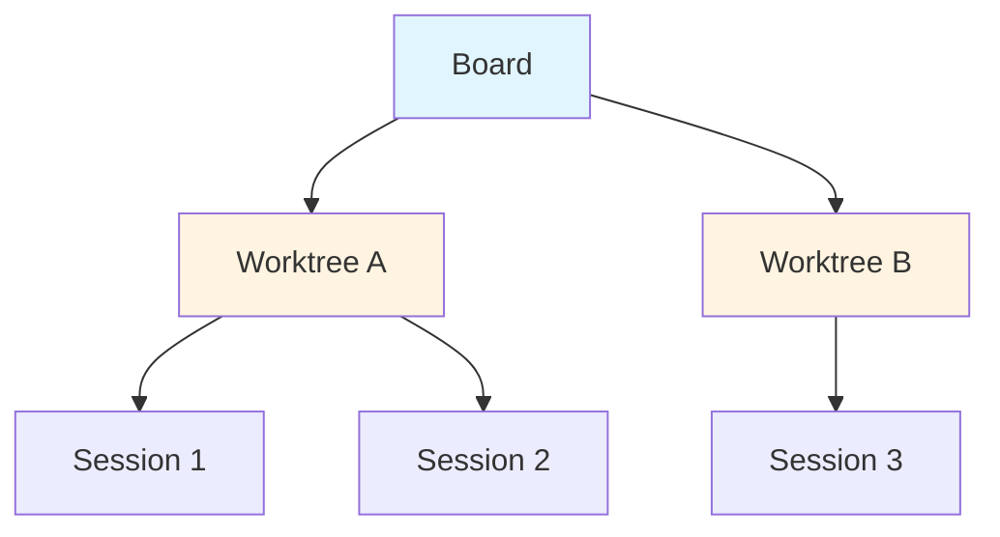

# Agor Framework Analysis

> Repository: https://github.com/preset-io/agor
> Version: 0.7.9
> Language: TypeScript/Node.js
> License: MIT (implied)
> Prerequisites: Node.js 20.x, Zellij ≥ 0.40

## Executive Summary

Agor is a multiplayer spatial canvas for orchestrating AI coding assistants. Think "Figma for AI agents" - a visual board where you coordinate multiple Claude Code, Codex, and Gemini sessions on parallel tasks with GitHub-linked worktrees and automated workflow zones.

**Key Strength**: Most innovative UI paradigm with spatial organization and real-time collaboration.

## What It Does

Multiplayer spatial canvas for AI agent coordination:

1. **Spatial Boards** - Figma-esque 2D canvases for organizing work
2. **Worktree Cards** - Primary units displayed on boards
3. **Zone Triggers** - Template-based workflows when worktrees are dropped
4. **Session Trees** - Fork and spawn subsessions with genealogy visualization
5. **Isolated Environments** - Unique ports per worktree, no conflicts
6. **Real-Time Collaboration** - Multiplayer with cursors and comments

## Key Features

### 1. Spatial Canvas Organization

Figma-like board layout:
- Drag-and-drop worktrees anywhere
- Zone-based workflow automation
- Scoped comments and reactions
- Real-time cursor broadcasting

**Use Case**: Parallel PR Workflow
```bash
# Create 5 worktrees linked to GitHub issues
# Spawn AI sessions for each
# Drop into zones for automated workflows
# Watch all 5 agents work simultaneously
# Push directly when ready
```

### 2. Zone Triggers

Template-based automation when worktrees are dropped:

```typescript
// Zone configuration
{
  name: "Analyze",
  trigger: "Review this issue: {{ worktree.issue_url }}"
}

{
  name: "Develop",
  trigger: "Implement the feature: {{ worktree.description }}"
}
```

**Benefits**:
- Kanban-style flows
- GitHub-native workflows
- Automatic context injection
- Template syntax for variables

### 3. Session Trees

Fork and spawn with genealogy:
- **Fork**: Explore alternatives without losing original
- **Spawn**: Create subsessions for subtasks
- **Visualize**: See session genealogy in tree view
- **Coordinate**: Parent/child relationships

### 4. Isolated Environments

Each worktree gets unique environment:
- Auto-managed unique ports
- Template-based start/stop commands
- Health monitoring
- No more "kill your server, I need to test"

```bash
PORT={{ add 9000 worktree.unique_id }} docker compose up -d
```

### 5. Multiplayer Real-Time

WebSocket-powered collaboration:
- Cursor broadcasting
- Facepiles showing teammates
- Spatial comments (Figma-style)
- Reactions and discussions

### 6. Extended Thinking Mode

Keyword-based thinking token allocation:
- `think` → 4,000 tokens
- `think hard` → 10,000 tokens
- `think harder` → 31,999 tokens

Auto-detected from prompts, manual override available.

## Interesting Patterns

### 1. Worktree-Centric Architecture

Boards display **Worktrees** as primary cards (NOT Sessions):



**Key Insight**: Worktrees are the persistent unit, sessions are ephemeral.

### 2. MCP HTTP Endpoint

Internal Agor MCP service for agent coordination:
- `/mcp?sessionToken=...`
- Agents can query board state
- Agents can discover other agents
- Enables agent-to-agent communication

### 3. FeathersJS Architecture

REST + WebSocket backend:
- Real-time updates via WebSocket
- REST for CRUD operations
- Service-oriented architecture
- LibSQL database

### 4. Zellij Integration

Required for persistent terminal sessions:
- Terminal multiplexer (like tmux)
- Persistent sessions
- Detach/reattach support
- Cross-platform

### 5. Multi-Provider SDKs

Agent SDK integrations:
- Claude Code (primary)
- OpenAI Codex
- Google Gemini
- Unified API abstraction

## Architecture Highlights

### Core Primitives

1. **Session** - Container for agent conversations with genealogy
2. **Task** - User prompts as first-class work units
3. **Worktree** - Git worktrees with isolated environments (PRIMARY)
4. **Report** - Markdown summaries after task completion
5. **Concept** - Modular context files

### Technology Stack

**Backend**:
- FeathersJS - REST + WebSocket
- Drizzle ORM - Type-safe database
- LibSQL - SQLite-compatible database
- simple-git - Git operations

**Frontend**:
- React 18 + TypeScript + Vite
- Ant Design - Component library
- React Flow - Canvas visualization
- Storybook - Component development

**CLI**:
- oclif - CLI framework

### Data Flow

```
┌─────────────────────────────────────────────────────────────┐
│                         Clients                              │
├─────────────────────────────────────────────────────────────┤
│  CLI (oclif)              Web UI (React)                     │
└────────────┬────────────────────────────────┬────────────────┘
             │                                │
             │        Feathers Client         │
             │        (REST + WebSocket)      │
             │                                │
             └────────────┬───────────────────┘
                          │
┌─────────────────────────────────────────────────────────────┐
│                      Agor Daemon                             │
├─────────────────────────────────────────────────────────────┤
│  Services: Sessions, Tasks, Messages, Boards, Worktrees     │
│  MCP HTTP Endpoint                                          │
│  Agent SDKs: Claude, Codex, Gemini                          │
└────────────┬────────────────────────────────┬────────────────┘
             │                                │
             │           Drizzle ORM          │
             │                                │
             └────────────┬───────────────────┘
                          │
┌─────────────────────────────────────────────────────────────┐
│                       Storage                                │
├─────────────────────────────────────────────────────────────┤
│  LibSQL Database      Git Worktrees      Config             │
│  ~/.agor/agor.db      ~/.agor/worktrees  ~/.agor/config.yaml│
└─────────────────────────────────────────────────────────────┘
```

## Potential Inspirations for BlackBox5

### 1. Spatial Organization
Visual board paradigm instead of lists:
- Drag-and-drop interface
- Spatial relationships matter
- Zone-based automation
- Visual workflow management

**Application**: Implement spatial canvas for BlackBox5 agent coordination.

### 2. Worktree-Centric Design
Worktrees as primary units:
- Persistent across sessions
- Multiple sessions per worktree
- Isolated environments
- Linked to GitHub issues/PRs

**Application**: Use worktrees as core unit in BlackBox5.

### 3. Zone Triggers
Template-based automation:
- Drop worktree in zone → trigger action
- GitHub context injection
- Variable substitution
- Kanban-style flows

**Application**: Implement zone-based workflows for BlackBox5.

### 4. Isolated Environments
Unique ports per worktree:
- No port conflicts
- Auto-managed
- Health monitoring
- Template-based configuration

**Application**: Implement environment isolation for BlackBox5 agents.

### 5. Real-Time Collaboration
Multiplayer features:
- Cursor broadcasting
- Facepiles
- Spatial comments
- Live updates

**Application**: Add collaboration features to BlackBox5.

### 6. Session Genealogy
Fork and spawn with visualization:
- Track session relationships
- Explore alternatives
- Subsession coordination
- Visual tree view

**Application**: Implement session tracking and visualization in BlackBox5.

### 7. Extended Thinking Mode
Keyword-based token allocation:
- Auto-detect from prompts
- Configurable levels
- Manual override
- Cost control

**Application**: Implement thinking mode detection in BlackBox5.

## Lessons Learned

### What Works
1. **Spatial paradigm** - More intuitive than lists
2. **Zone automation** - Reduces repetitive tasks
3. **Worktree isolation** - Eliminates conflicts
4. **Real-time collaboration** - Enables team coordination
5. **Multi-provider support** - Flexibility in AI choice

### What to Avoid
1. **Complex setup** - Zellij requirement adds friction
2. **Resource intensive** - Running multiple environments
3. **Learning curve** - New paradigm to learn
4. **Browser dependency** - Requires web UI for full experience

## Metrics & Stats

- **Current Version**: 0.7.9
- **Technology**: TypeScript, React, FeathersJS
- **Database**: LibSQL (SQLite-compatible)
- **Real-Time**: WebSocket (Socket.io)
- **Providers**: Claude, Codex, Gemini
- **Visualization**: React Flow

## Comparison to Other Frameworks

| Feature | Agor | Auto-Claude | Gastown | Claudio |
|---------|------|-------------|---------|---------|
| Spatial UI | ✅ Unique | ❌ Kanban | ❌ CLI | ❌ TUI |
| Multiplayer | ✅ Real-time | ❌ Single | ❌ Single | ❌ Single |
| Zone Triggers | ✅ Templates | ❌ None | ✅ Formulas | ❌ None |
| Isolated Envs | ✅ Unique ports | ❌ Shared | ❌ Shared | ❌ Shared |
| Worktree-Centric | ✅ Primary | ✅ Primary | ✅ Hooks | ✅ Worktrees |
| Session Trees | ✅ Genealogy | ❌ Flat | ❌ Flat | ❌ Flat |
| MCP Integration | ✅ Internal | ✅ Full | ✅ Partial | ❌ None |

## Key Files to Study

- `apps/agor-daemon/src/services/` - FeathersJS services
- `apps/agor-ui/src/components/` - React components
- `packages/core/src/types/` - Canonical types
- `context/concepts/` - Architecture documentation
- `context/concepts/worktrees.md` - Worktree architecture (critical)

## Further Reading

- [Agor Documentation](https://agor.live/)
- [Making of Agor](https://agor.live/blog/making-of-agor)
- [Architecture Guide](https://agor.live/guide/architecture)

## Notes

- Heavily prompted by @mistercrunch (Preset, Apache Superset, Airflow)
- Built by "an army of Claudes"
- Active development with roadmap
- Comprehensive context documentation
- Best for: Team coordination and visual workflow management

## Unique Contributions

1. **Spatial Canvas** - First framework to use Figma-like board paradigm
2. **Zone Triggers** - Template-based automation via spatial placement
3. **Worktree-Centric** - Worktrees as primary unit (not sessions)
4. **Isolated Environments** - Unique ports per worktree, auto-managed
5. **Session Genealogy** - Fork and spawn with tree visualization
6. **Internal MCP** - MCP service for agent-to-agent communication
7. **Extended Thinking** - Keyword-based thinking token allocation
