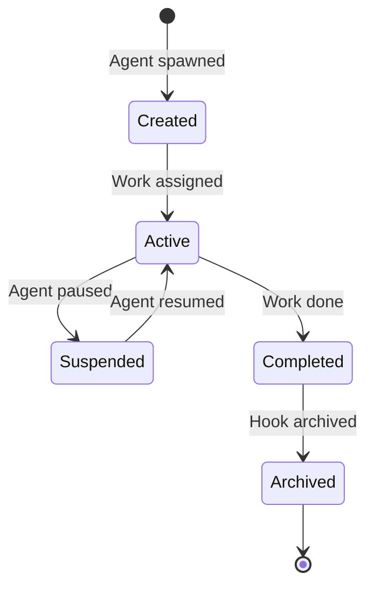

# Gastown Framework Analysis

> Repository: https://github.com/steveyegge/gastown
> Language: Go
> License: MIT
> Prerequisites: Go 1.23+, Git 2.25+, beads 0.44.0+, tmux 3.0+

## Executive Summary

Gastown is a sophisticated multi-agent orchestration system that uses git-backed hooks for persistent state. It introduces "The Mayor" pattern - an AI coordinator that manages 20-30 agents through convoys (work tracking units) and beads (git-backed issue tracking).

**Key Strength**: Best-in-class persistent state management and agent coordination pattern.

## What It Does

Workspace manager for coordinating multiple Claude Code agents with persistent work tracking:

1. **The Mayor** - AI coordinator that orchestrates all work
2. **Rigs** - Project containers wrapping git repositories
3. **Hooks** - Git worktree-based persistent storage
4. **Convoys** - Work tracking units that bundle beads
5. **Beads** - Git-backed issue tracking system

## Key Features

### 1. The Mayor Pattern

Primary AI coordinator with full workspace context:

```bash
gt mayor attach
# Tell the Mayor what you want to build
# Mayor creates convoys, spawns agents, monitors progress
# Mayor summarizes results when complete
```

**MEOW Workflow** (Mayor-Enhanced Orchestration Workflow):
1. Tell the Mayor what you want
2. Mayor analyzes and breaks down into tasks
3. Mayor creates convoy with beads
4. Mayor spawns appropriate agents
5. Beads slung to agents via hooks
6. Track progress through convoy status
7. Mayor summarizes results

### 2. Persistent Hooks

Git worktree-based storage that survives crashes:



**Benefits**:
- Work persists across agent restarts
- Version controlled (all changes in git)
- Rollback capability (revert to any state)
- Multi-agent coordination (shared through git)

### 3. Beads Integration

Git-backed issue tracking with structured data:

- **Bead IDs**: Prefix + 5-character alphanumeric (e.g., `gt-abc12`, `hq-x7k2m`)
- **Prefix indicates origin**: Different rigs have different prefixes
- **Commands**: `gt sling`, `gt convoy` accept bead IDs
- **Storage**: Git-backed for version control

**Beads Formula Workflow**:
```toml
# .beads/formulas/release.formula.toml
description = "Standard release process"
formula = "release"
version = 1

[vars.version]
description = "The semantic version to release (e.g., 1.2.0)"
required = true

[[steps]]
id = "bump-version"
title = "Bump version"
description = "Run ./scripts/bump-version.sh {{version}}"

[[steps]]
id = "run-tests"
title = "Run tests"
description = "Run make test"
needs = ["bump-version"]
```

Execute: `bd cook release --var version=1.2.0`

### 4. Multi-Runtime Support

Per-rig runtime configuration:

```json
{
  "runtime": {
    "provider": "codex",
    "command": "codex",
    "args": [],
    "prompt_mode": "none"
  }
}
```

**Built-in presets**: `claude`, `gemini`, `codex`, `cursor`, `auggie`, `amp`

### 5. Agent Scaling

Comfortably scales to 20-30 agents:
- Built-in mailboxes for agent communication
- Identities for agent differentiation
- Handoffs for work transfer
- Convoy tracking for coordination

## Interesting Patterns

### 1. Propulsion Principle

Git hooks as propulsion mechanism:

Each hook is a git worktree with:
1. **Persistent state** - Work survives agent restarts
2. **Version control** - All changes tracked in git
3. **Rollback capability** - Revert to any previous state
4. **Multi-agent coordination** - Shared through git

### 2. Spatial Work Organization

```
~/gt/                          # Town (workspace)
├── myproject/                 # Rig (project container)
│   ├── crew/yourname/         # Crew Member (your workspace)
│   └── hooks/                 # Hooks (persistent storage)
│       ├── gt-abc12/          # Hook for bead gt-abc12
│       └── gt-def34/          # Hook for bead gt-def34
└── settings/
    └── config.json            # Rig configuration
```

### 3. Mailbox System

Agents communicate via mailboxes:
- Mayor injects tasks into agent mailboxes
- Agents check mail on startup
- Handoffs transfer work between agents
- Async communication pattern

### 4. Convoy Tracking

Visual work tracking:
```bash
gt convoy list              # List all convoys
gt convoy show              # Show convoy details
gt convoy create "Feature X" gt-abc12 gt-def34
gt convoy add hq-cv-abc gt-m3k9p
```

### 5. Formula-Based Automation

Repeatable processes as formulas:
- TOML-defined workflows
- Variable substitution
- Dependency tracking
- Step-by-step execution

## Architecture Highlights

### Core Concepts

| Concept | Description | Primary Interface |
|---------|-------------|-------------------|
| **Mayor** | AI coordinator | `gt mayor attach` |
| **Town** | Workspace directory | `~/gt/` |
| **Rigs** | Project containers | `gt rig add` |
| **Crew Members** | Personal workspaces | `gt crew add` |
| **Polecats** | Ephemeral worker agents | Spawned by Mayor |
| **Hooks** | Persistent storage | Git worktrees |
| **Convoys** | Work trackers | `gt convoy` commands |
| **Beads** | Issue tracking | Beads CLI (`bd`) |

### Directory Structure

```
~/.gt/                          # Town workspace
├── rigs/
│   ├── myproject/              # Rig
│   │   ├── crew/yourname/      # Your workspace
│   │   ├── hooks/              # Agent hooks (worktrees)
│   │   │   ├── gt-abc12/
│   │   │   └── gt-def34/
│   │   └── .beads/             # Beads data
│   │       └── formulas/       # Workflow formulas
└── settings/
    └── config.json             # Global config
```

## Potential Inspirations for BlackBox5

### 1. The Mayor Pattern
Single AI coordinator that:
- Has full workspace context
- Breaks down high-level goals
- Spawns and manages workers
- Summarizes results

**Application**: Implement "Orchestrator Agent" in BlackBox5 that coordinates specialized agents.

### 2. Persistent Hooks
Git worktrees as persistent state:
- Survives crashes and restarts
- Version controlled
- Easy rollback
- Multi-agent coordination

**Application**: Use git worktrees for BlackBox5 agent state persistence.

### 3. Beads Integration
Git-backed issue tracking:
- Structured data in git
- Unique IDs with prefixes
- Formula-based workflows
- Dependency tracking

**Application**: Implement similar issue/task tracking in BlackBox5.

### 4. Convoy Tracking
Visual work tracking:
- Bundle related work items
- Track progress across agents
- Real-time status updates
- Easy visualization

**Application**: Implement work tracking UI for BlackBox5 agent coordination.

### 5. Formula Automation
Repeatable processes:
- TOML-defined workflows
- Variable substitution
- Dependency graphs
- Step-by-step execution

**Application**: Create workflow templates for common BlackBox5 tasks.

### 6. Multi-Runtime Support
Flexible AI runtime configuration:
- Claude, Codex, Gemini, Cursor
- Per-project settings
- Easy runtime switching
- Agent-specific overrides

**Application**: Support multiple AI runtimes in BlackBox5.

## Lessons Learned

### What Works
1. **Git as persistence layer** - Reliable, versioned, familiar
2. **Single coordinator (Mayor)** - Simplifies orchestration
3. **Worktree isolation** - Safe parallel work
4. **Formula automation** - Repeatable workflows
5. **Convoy tracking** - Visual progress monitoring

### What to Avoid
1. **Complex setup** - Many prerequisites (beads, tmux, etc.)
2. **Tmux dependency** - Required for full experience
3. **Steeper learning curve** - Many concepts to learn
4. **Manual configuration** - Requires setup of multiple components

## Metrics & Stats

- **Scaling**: 20-30 agents (vs 4-10 without)
- **Persistence**: Git worktree-based
- **Communication**: Mailbox system
- **Tracking**: Beads + Convoys
- **Runtimes**: Claude, Codex, Gemini, Cursor, Auggie, Amp

## Comparison to Other Frameworks

| Feature | Gastown | Auto-Claude | Claudio | Agor |
|---------|---------|-------------|---------|------|
| Coordinator | ✅ Mayor | ✅ Planner | ✅ Orchestrator | ✅ Daemon |
| Persistent State | ✅ Hooks | ✅ Worktrees | ✅ Session.json | ✅ Database |
| Git Tracking | ✅ Beads | ❌ None | ❌ None | ❌ Basic |
| Formulas | ✅ TOML | ❌ None | ❌ None | ✅ Zones |
| Mailboxes | ✅ Built-in | ❌ None | ❌ None | ❌ None |
| Multi-Runtime | ✅ 6+ | ✅ Claude only | ✅ Claude only | ✅ 3+ |

## Key Files to Study

- `cmd/gt/` - CLI entry point
- `internal/mayor/` - Mayor coordination logic
- `internal/hooks/` - Hook management
- `internal/convoy/` - Work tracking
- `.beads/formulas/` - Workflow templates

## Further Reading

- [Gastown Documentation](https://github.com/steveyegge/gastown)
- [Beads Repository](https://github.com/steveyeggie/beads)
- [Steve Yegge's Blog](https://steve-yegge.blogspot.com/)

## Notes

- Created by Steve Yegge (ex-Google, ex-Amazon)
- Inspired by his work on Google's internal tools
- MIT licensed (permissive)
- Active development
- Comprehensive documentation with glossary
- Best for: Complex multi-agent workflows requiring persistence

## Unique Contributions

1. **Mayor Pattern** - First framework to have dedicated coordinator agent
2. **Beads Integration** - Git-backed issue tracking for agent workflows
3. **Formula System** - TOML-based workflow automation
4. **Mailbox Communication** - Async agent messaging
5. **20-30 Agent Scaling** - Proven approach to large-scale coordination
