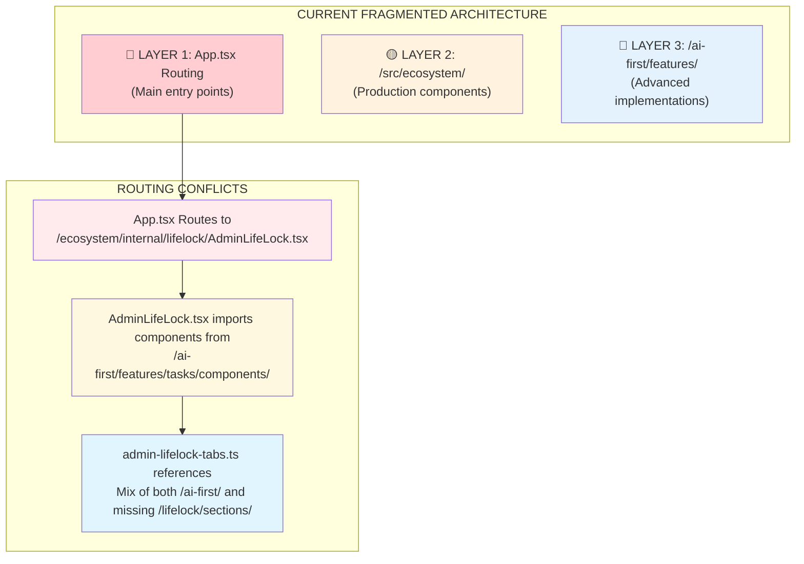

# 🏗️ BMAD Architecture Analysis: SISO Internal Fragmentation

**Architect**: Winston (BMAD Architect) - **CRITICAL ARCHITECTURE ASSESSMENT**  
**Project**: SISO Internal - Architecture Fragmentation Root Cause Analysis  
**Analysis Type**: System Architecture Unification Strategy  
**Date**: September 12, 2025  
**Priority**: CRITICAL - Foundation Issue Blocking All Feature Completion  

---

## 🚨 **CRITICAL DISCOVERY: The Root Cause**

### **Architecture Fragmentation Pattern Identified**

SISO Internal has **THREE PARALLEL ARCHITECTURE LAYERS** that should be unified:



---

## 📋 **Detailed Architecture Fragmentation Analysis**

### **1. 🔴 ROUTING LAYER (App.tsx)**

**Current State**: Routes correctly to production components
```typescript
// Line 186: Root redirects to LifeLock
<Route path="/" element={<Navigate to="/admin/life-lock" replace />} />

// Lines 262-265: LifeLock routing
<Route path="/admin/lifelock" element={<ClerkAuthGuard><AdminLifeLock /></ClerkAuthGuard>} />
<Route path="/admin/life-lock" element={<ClerkAuthGuard><AdminLifeLock /></ClerkAuthGuard>} />
<Route path="/admin/lifelock/day/:date" element={<ClerkAuthGuard><AdminLifeLockDay /></ClerkAuthGuard>} />
```

**Assessment**: ✅ **CORRECT** - Routes to proper production component location

---

### **2. 🟡 MAIN COMPONENT LAYER (/src/ecosystem/)**

**Current Location**: `/src/ecosystem/internal/lifelock/AdminLifeLock.tsx`

**Problem Analysis**:
```typescript
// AdminLifeLock.tsx imports - MIXING ARCHITECTURES
import { MorningRoutineTab } from '@/ai-first/features/tasks/components/MorningRoutineTab';
import { DeepFocusTab } from '@/ai-first/features/tasks/components/DeepFocusTab';
import { TimeBoxTab } from '@/ai-first/features/tasks/components/TimeBoxTab';
import { NightlyCheckoutTab } from '@/ai-first/features/tasks/components/NightlyCheckoutTab';
```

**Critical Issue**: **Production component imports scattered ai-first components**

---

### **3. 🔵 TAB CONFIGURATION LAYER (admin-lifelock-tabs.ts)**

**Most Revealing Issue**:
```typescript
// Lines 19-27: Component imports - COMPLETELY FRAGMENTED
import { MorningRoutineSection } from '@/ai-first/features/tasks/components/MorningRoutineSection';
import { DeepFocusWorkSection } from '@/ai-first/features/tasks/components/DeepFocusWorkSection-v2';  // ❌ DOESN'T EXIST
import { LightFocusWorkSection } from '@/ai-first/features/tasks/components/LightFocusWorkSection-v2';  
import { HomeWorkoutSection } from '@/ai-first/features/tasks/components/HomeWorkoutSection';
import { HealthNonNegotiablesSection } from '@/ai-first/features/tasks/components/HealthNonNegotiablesSection';
import { TimeboxSection } from '@/ai-first/features/tasks/components/TimeboxSection';
import { NightlyCheckoutSection } from '@/ai-first/features/tasks/components/NightlyCheckoutSection';
```

**CRITICAL PROBLEMS**:
1. **Missing Components**: `DeepFocusWorkSection-v2` doesn't exist
2. **Wrong Architecture**: All imports from `/ai-first/` instead of unified location
3. **Inconsistent Patterns**: Mix of existing and missing components

---

## 🎯 **The Correct BMAD Architecture Pattern**

### **What Should Exist (Following MorningRoutine Success Pattern)**

```
/src/ecosystem/internal/lifelock/
├── AdminLifeLock.tsx ✅ (Main container - EXISTS)
├── AdminLifeLockDay.tsx ✅ (Day view - EXISTS)  
├── sections/ ❌ (SHOULD EXIST - unified components location)
│   ├── MorningRoutineSection.tsx ✅ (REFERENCE IMPLEMENTATION)
│   ├── DeepFocusWorkSection.tsx ❌ (MISSING - build from scratch)
│   ├── LightFocusWorkSection.tsx ❌ (MISSING - consolidate from ai-first versions)
│   ├── NightlyCheckoutSection.tsx ❌ (MISSING - migrate from ai-first)
│   ├── HomeWorkoutSection.tsx ❌ (MISSING - migrate from ai-first)
│   ├── HealthNonNegotiablesSection.tsx ❌ (MISSING - migrate from ai-first)
│   └── TimeboxSection.tsx ❌ (MISSING - migrate from ai-first)
├── hooks/ ✅ (Custom hooks - EXISTS)
├── components/ ✅ (Shared components - EXISTS)
└── utils/ ✅ (Utilities - EXISTS)
```

### **Current Reality vs Should Exist**

| **Component** | **Should Be** | **Actually Is** | **Status** |
|---------------|---------------|-----------------|-------------|
| MorningRoutineSection | `/lifelock/sections/` | ✅ `/lifelock/sections/` | **CORRECT** |
| DeepFocusWorkSection | `/lifelock/sections/` | ❌ **MISSING COMPLETELY** | **BUILD** |
| LightFocusWorkSection | `/lifelock/sections/` | ⚠️ `/ai-first/features/tasks/` (4+ versions) | **MIGRATE** |
| NightlyCheckoutSection | `/lifelock/sections/` | ⚠️ `/ai-first/features/tasks/` | **MIGRATE** |
| HomeWorkoutSection | `/lifelock/sections/` | ⚠️ `/ai-first/features/tasks/` | **MIGRATE** |
| HealthNonNegotiablesSection | `/lifelock/sections/` | ⚠️ `/ai-first/features/tasks/` | **MIGRATE** |
| TimeboxSection | `/lifelock/sections/` | ⚠️ `/ai-first/features/tasks/` | **MIGRATE** |

---

## 🛠️ **BMAD Architecture Unification Strategy**

### **Phase 1: Create Missing Infrastructure (Week 1)**

#### **1.1 Create Proper Directory Structure**
```bash
mkdir -p /src/ecosystem/internal/lifelock/sections/
mkdir -p /src/ecosystem/internal/lifelock/hooks/
mkdir -p /src/ecosystem/internal/lifelock/components/shared/
```

#### **1.2 Fix admin-lifelock-tabs.ts Import Strategy**
**Current (Broken)**:
```typescript
import { DeepFocusWorkSection } from '@/ai-first/features/tasks/components/DeepFocusWorkSection-v2'; // ❌ DOESN'T EXIST
```

**Should Be**:
```typescript
import { DeepFocusWorkSection } from './sections/DeepFocusWorkSection';
import { LightFocusWorkSection } from './sections/LightFocusWorkSection';
import { NightlyCheckoutSection } from './sections/NightlyCheckoutSection';
// etc.
```

---

### **Phase 2: Strategic Component Migration (Weeks 2-3)**

#### **2.1 MorningRoutineSection (Reference Pattern) ✅**
**Status**: Already correct - use as template for all others

**Pattern Analysis**:
```typescript
// Location: /src/ecosystem/internal/lifelock/sections/MorningRoutineSection.tsx
// Hook: useMorningRoutineSupabase  
// Database: Direct Supabase integration
// UI: Exceptional animations, accessibility
// Performance: <2s load time
```

#### **2.2 DeepFocusWorkSection (Build New) ❌**
**Strategy**: Implement from scratch following MorningRoutine pattern
```typescript
// Create: /src/ecosystem/internal/lifelock/sections/DeepFocusWorkSection.tsx
// Hook: useDeepFocusSupabase (new)
// Database: New tables (focus_sessions, daily_focus_summary)
// UI: Follow MorningRoutine UI patterns exactly
```

#### **2.3 LightFocusWorkSection (Consolidate) ⚠️**
**Strategy**: 
1. **Audit 4 existing versions** in `/ai-first/features/tasks/components/`
2. **Choose best implementation** (likely `LightFocusWorkSection-v2.tsx`)
3. **Migrate to** `/src/ecosystem/internal/lifelock/sections/LightFocusWorkSection.tsx`
4. **Update imports** in tabs configuration
5. **Delete deprecated versions**

#### **2.4 NightlyCheckoutSection (Preserve & Migrate) ⚠️**
**Strategy**:
1. **Preserve ALL sophisticated functionality** (voice processing, AI analysis)
2. **Migrate intact** to `/src/ecosystem/internal/lifelock/sections/NightlyCheckoutSection.tsx`
3. **Maintain existing API integration**
4. **Update tab configuration import**

#### **2.5 HomeWorkoutSection & HealthNonNegotiablesSection (Simple Migrate)**
**Strategy**: Direct migration with database standardization

#### **2.6 TimeboxSection (Already Well Integrated)**
**Strategy**: Migration for consistency, minimal changes needed

---

### **Phase 3: System Integration & Testing (Week 4)**

#### **3.1 Update All Import Paths**
**Files to Update**:
- `AdminLifeLock.tsx` - Update component imports
- `admin-lifelock-tabs.ts` - Fix all import paths
- Any other files importing these components

#### **3.2 Integration Testing**
- **Navigation**: All tabs load correctly
- **Performance**: <2s load time maintained
- **Data**: All user data preserved during migration
- **UI/UX**: Consistent experience across all features

#### **3.3 Cleanup Legacy Code**
- Remove deprecated versions in `/ai-first/features/tasks/components/`
- Clean up unused imports
- Update documentation

---

## 🚦 **Migration Risk Assessment**

### **HIGH RISK**
1. **NightlyCheckoutSection Migration**: Sophisticated voice processing could break
2. **LightFocusWorkSection Consolidation**: Data loss from version conflicts
3. **User Data Preservation**: Existing user data across different database patterns

### **MITIGATION STRATEGIES**
1. **Comprehensive Backup**: Full database backup before migration
2. **Incremental Migration**: One component at a time with testing
3. **Rollback Plan**: Ability to revert to current system
4. **User Communication**: Clear communication about improvements

---

## 📋 **Success Definition**

### **Architecture Unification Complete When**:
1. ✅ **Single Source of Truth**: All components in `/lifelock/sections/`
2. ✅ **Clean Imports**: No cross-architecture imports
3. ✅ **Consistent Patterns**: All components follow MorningRoutine template
4. ✅ **Working Navigation**: All tabs accessible and functional
5. ✅ **Data Preservation**: Zero user data loss
6. ✅ **Performance**: <2s load time maintained across all features

---

## 🎯 **Immediate Next Steps**

### **Critical Path Actions (Next 48 Hours)**
1. **Create sections directory structure**
2. **Build DeepFocusWorkSection from scratch** (blocking other work)
3. **Audit and choose best LightFocusWorkSection version**
4. **Begin NightlyCheckoutSection preservation migration**

### **BMAD Team Coordination**
- **BMAD Scrum Master**: Create detailed migration stories
- **BMAD QA**: Establish migration testing protocols  
- **BMAD PM**: User communication and rollback procedures

---

**ARCHITECTURE ANALYSIS COMPLETE** - Winston, BMAD Architect 🏗️

*This analysis reveals the exact root cause of SISO's feature incompleteness: sophisticated components exist but are scattered across parallel architectures instead of unified in the correct production location. The solution is systematic architecture unification following the successful MorningRoutineSection pattern.*