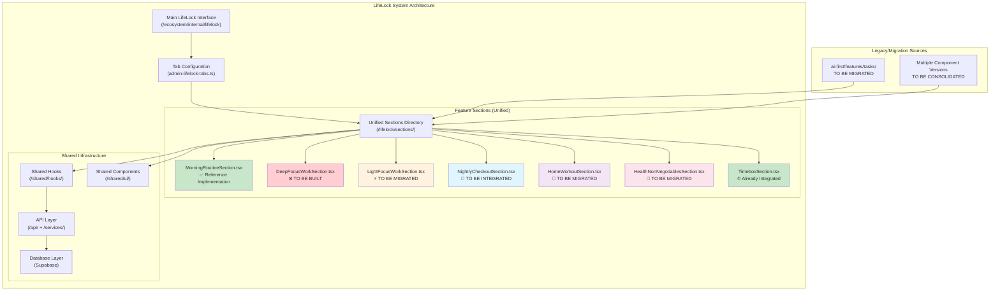
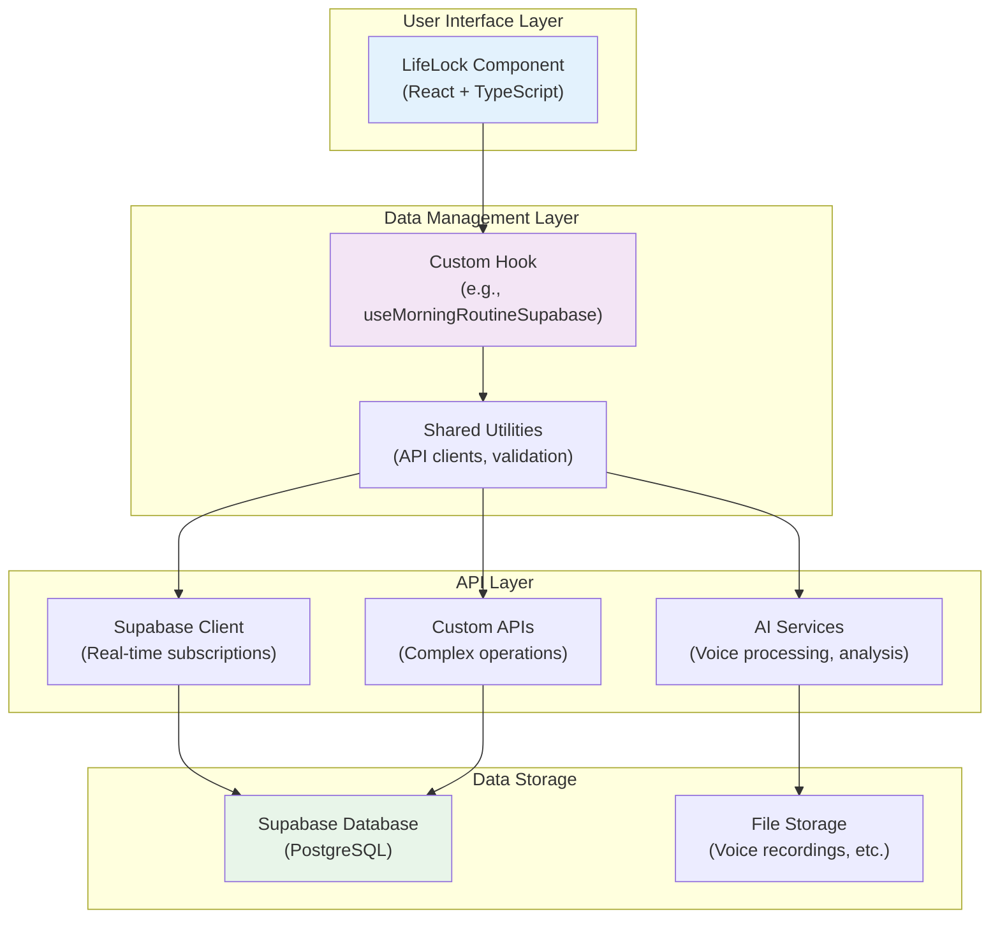
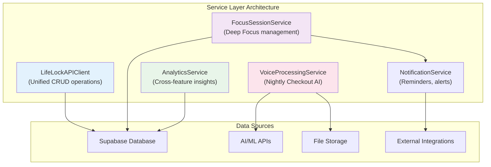
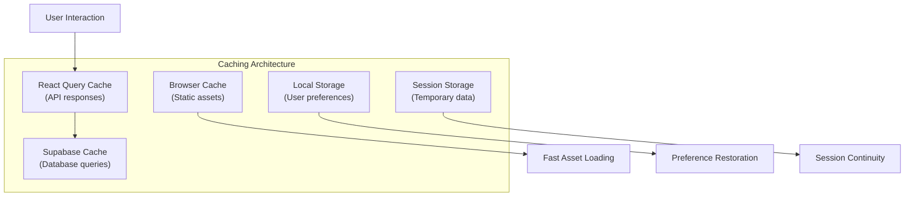
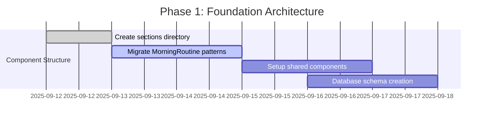
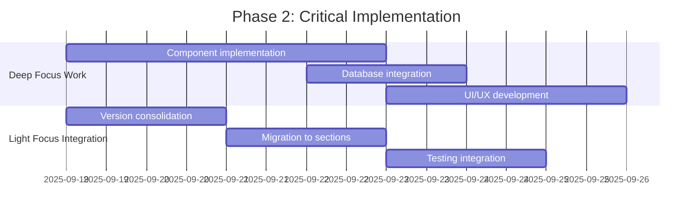

# 🏗️ SISO Internal: LifeLock Completion Architecture

**Architect**: Winston (BMAD Architect)  
**Project**: SISO Internal - LifeLock Feature Integration & Completion  
**Type**: Brownfield System Architecture  
**Version**: 1.0  
**Date**: September 12, 2025  
**Architecture Scope**: Complete LifeLock ecosystem unification and enhancement  

---

## 📊 Executive Architecture Summary

### **System Context**
SISO Internal operates as a **multi-ecosystem productivity platform** with the LifeLock system as its **core daily workflow engine**. Current architecture exhibits **critical fragmentation** requiring systematic unification while preserving advanced capabilities.

### **Architecture Challenge**
**Unify 6 productivity features** into cohesive LifeLock system:
- ✅ **Morning Routine** (properly integrated - reference pattern)
- ❌ **Deep Focus Work** (missing - full implementation required)
- ⚠️ **Light Focus Work** (fragmented - 4 versions, needs consolidation)
- ⚠️ **Nightly Checkout** (sophisticated but isolated - crown jewel integration)
- ⚠️ **Home Workout** (implemented but isolated)
- ⚠️ **Health Non-Negotiables** (isolated component)
- ✅ **Timebox System** (well integrated)

### **Strategic Architecture Goals**
1. **Unified Component Architecture**: Single source of truth for each feature
2. **Consistent Data Patterns**: Standardized database and API approaches
3. **Seamless User Experience**: Integrated daily workflow progression
4. **Performance Excellence**: <2s load times, smooth interactions
5. **Maintainable Codebase**: Clear patterns, excellent developer experience

---

## 🏛️ High-Level System Architecture

### **Core LifeLock Architecture Pattern**



---

## 🗄️ Database Architecture & Data Flow

### **Unified Database Schema Design**

**Design Principle**: Each LifeLock feature follows **consistent Supabase patterns** modeled after `MorningRoutineSection` implementation.

```sql
-- =================
-- MORNING ROUTINE (Reference Implementation)
-- =================
create table morning_routine_data (
  id uuid default gen_random_uuid() primary key,
  user_id text not null,
  date date not null,
  items jsonb not null, -- Array of habit objects
  created_at timestamptz default now(),
  updated_at timestamptz default now()
);

-- =================  
-- DEEP FOCUS WORK (New Implementation)
-- =================
create table deep_focus_sessions (
  id uuid default gen_random_uuid() primary key,
  user_id text not null,
  date date not null,
  session_type text not null, -- 'creative', 'analytical', 'learning', etc.
  planned_duration_minutes integer not null,
  actual_duration_minutes integer,
  completed boolean default false,
  focus_quality_rating integer, -- 1-5 scale
  session_notes text,
  distractions_count integer default 0,
  break_intervals jsonb, -- Track break patterns
  created_at timestamptz default now(),
  updated_at timestamptz default now()
);

-- Daily aggregation table for deep work analytics
create table daily_deep_work_summary (
  id uuid default gen_random_uuid() primary key,
  user_id text not null,
  date date not null unique,
  total_planned_minutes integer default 0,
  total_actual_minutes integer default 0,
  total_sessions integer default 0,
  completed_sessions integer default 0,
  average_focus_quality decimal,
  productivity_score decimal,
  created_at timestamptz default now(),
  updated_at timestamptz default now()
);

-- =================
-- LIGHT FOCUS WORK (Migration from existing)
-- =================  
-- Note: Current implementation uses useLightWorkTasksSupabase
-- Architecture: Preserve existing tables, ensure consistency

-- =================
-- NIGHTLY CHECKOUT (Migration from existing)
-- =================
-- Note: Current implementation uses daily-reflections API
-- Architecture: Preserve sophisticated data model

create table daily_reflections (
  id uuid default gen_random_uuid() primary key,
  user_id text not null,
  date date not null unique,
  went_well jsonb, -- Array of strings
  even_better_if jsonb, -- Array of strings  
  analysis jsonb, -- Array of strings
  patterns jsonb, -- Array of strings
  changes jsonb, -- Array of strings
  overall_rating integer, -- 1-10 scale
  key_learnings text,
  tomorrow_focus text,
  voice_analysis_result jsonb, -- AI processing results
  created_at timestamptz default now(),
  updated_at timestamptz default now()
);

-- =================
-- HOME WORKOUT (Migration from localStorage)
-- =================
create table home_workout_data (
  id uuid default gen_random_uuid() primary key,
  user_id text not null,
  date date not null,
  workout_items jsonb not null, -- Array of workout objects
  total_exercises integer,
  completed_exercises integer,
  completion_percentage decimal,
  created_at timestamptz default now(),
  updated_at timestamptz default now()
);

-- =================
-- HEALTH NON-NEGOTIABLES (New/Migration)
-- =================
create table health_non_negotiables_data (
  id uuid default gen_random_uuid() primary key,
  user_id text not null,
  date date not null,
  health_items jsonb not null, -- Array of health tracking objects
  completion_score decimal,
  notes text,
  created_at timestamptz default now(),
  updated_at timestamptz default now()
);
```

### **Data Flow Architecture**



---

## 🧩 Component Architecture & Integration Patterns

### **Reference Pattern: MorningRoutineSection Analysis**

**Why MorningRoutineSection is the Gold Standard**:
1. ✅ **Location**: Properly placed in `/src/ecosystem/internal/lifelock/sections/`
2. ✅ **Hook Pattern**: Uses `useMorningRoutineSupabase` for data management
3. ✅ **UI/UX Excellence**: Exceptional animations, swipe support, accessibility
4. ✅ **TypeScript Quality**: Strict typing, proper interfaces, error handling
5. ✅ **Performance**: Optimized loading, efficient state management

### **Component Migration Architecture**

```typescript
// Component Architecture Template (Based on MorningRoutineSection)

interface FeatureSectionProps {
  selectedDate: Date;
  // Standard props for all LifeLock features
}

export const FeatureSection: React.FC<FeatureSectionProps> = ({
  selectedDate
}) => {
  // 1. HOOKS LAYER - Consistent pattern
  const { user } = useClerkUser();
  const {
    data,
    loading,
    error,
    // CRUD operations
    createItem,
    updateItem,
    deleteItem,
    toggleCompletion
  } = useFeatureSupabase({ selectedDate });
  
  // 2. PERFORMANCE MONITORING - Consistent across features
  const { performanceRef } = useExceptionalPerformanceMonitor();
  const { accessibilityRef } = useExceptionalAccessibility();
  
  // 3. ANIMATION & INTERACTION - Consistent patterns
  const swipeHandlers = useSwipeable({
    // Standard swipe configuration
  });
  
  // 4. FEATURE-SPECIFIC LOGIC
  // Implement specific feature behavior while maintaining patterns
  
  // 5. RENDER - Consistent structure
  return (
    <motion.div
      ref={performanceRef}
      className="lifelock-section-container"
      // Standard motion configuration
    >
      <Card className="lifelock-feature-card">
        <CardHeader>
          {/* Standard header pattern */}
        </CardHeader>
        <CardContent>
          {/* Feature-specific content following UI patterns */}
        </CardContent>
      </Card>
    </motion.div>
  );
};
```

### **Hook Architecture Pattern**

```typescript
// Custom Hook Template (Based on useMorningRoutineSupabase)

export const useFeatureSupabase = ({ selectedDate }: { selectedDate: Date }) => {
  // 1. AUTHENTICATION & CONTEXT
  const { user } = useClerkUser();
  const { supabase } = useSupabase();
  
  // 2. STATE MANAGEMENT
  const [data, setData] = useState<FeatureData | null>(null);
  const [loading, setLoading] = useState(true);
  const [error, setError] = useState<string | null>(null);
  
  // 3. DATA OPERATIONS - Consistent CRUD pattern
  const loadData = useCallback(async () => {
    // Standard loading pattern
  }, [user?.id, selectedDate]);
  
  const saveData = useCallback(async (newData: FeatureData) => {
    // Standard saving pattern with optimistic updates
  }, [user?.id, selectedDate]);
  
  // 4. REAL-TIME SUBSCRIPTIONS - Where beneficial
  useEffect(() => {
    // Supabase real-time subscription setup
  }, []);
  
  // 5. RETURN CONSISTENT INTERFACE
  return {
    data,
    loading,
    error,
    // CRUD operations
    refresh: loadData,
    save: saveData,
    // Feature-specific operations
  };
};
```

---

## 🔧 API Architecture & Service Layer

### **API Design Patterns**

**Principle**: **Consistent RESTful patterns** with specialized services for complex features (AI, voice processing).

```typescript
// Unified API Client Pattern
export class LifeLockAPIClient {
  constructor(private supabase: SupabaseClient) {}
  
  // Generic CRUD operations for all features
  async getFeatureData<T>(
    table: string, 
    userId: string, 
    date: string
  ): Promise<T | null> {
    const { data, error } = await this.supabase
      .from(table)
      .select('*')
      .eq('user_id', userId)
      .eq('date', date)
      .single();
    
    if (error && error.code !== 'PGRST116') throw error;
    return data;
  }
  
  async saveFeatureData<T>(
    table: string,
    data: T
  ): Promise<T> {
    const { data: result, error } = await this.supabase
      .from(table)
      .upsert(data)
      .select()
      .single();
    
    if (error) throw error;
    return result;
  }
}

// Specialized Services for Complex Features
export class VoiceProcessingService {
  // Handle NightlyCheckout voice analysis
  async processVoiceReflection(audioBlob: Blob): Promise<VoiceAnalysisResult> {
    // AI-powered voice processing
  }
}

export class FocusSessionService {
  // Handle DeepFocusWork session management
  async startSession(sessionConfig: FocusSessionConfig): Promise<ActiveSession> {
    // Focus session initiation
  }
  
  async pauseSession(sessionId: string): Promise<void> {
    // Session pause handling
  }
}
```

### **Integration Service Architecture**



---

## 🎨 UI/UX Architecture & Design System

### **Design System Integration**

**Principle**: **Maintain exceptional UX standards** established by MorningRoutineSection while ensuring **visual consistency** across all LifeLock features.

### **Shared Component Library**

```typescript
// LifeLock Design System Components
export const LifeLockComponents = {
  // Core containers
  FeatureCard: styled(Card)`
    /* Consistent styling for all feature cards */
  `,
  
  SectionHeader: styled(CardHeader)`
    /* Standard header pattern */
  `,
  
  // Interactive elements
  ExceptionalAnimatedCheckbox, // From MorningRoutine
  ExceptionalProgressCounter,  // From MorningRoutine
  ExceptionalAnimatedTaskIcon, // From MorningRoutine
  ExceptionalSwipeHint,       // From MorningRoutine
  
  // New shared components
  FocusTimer,                 // For DeepFocusWork
  VoiceRecorder,              // For NightlyCheckout
  WorkoutTracker,             // For HomeWorkout
  
  // Animation presets
  LifeLockMotionPresets: {
    fadeIn: { /* Standard fade in */ },
    slideUp: { /* Standard slide up */ },
    swipeTransition: { /* Standard swipe */ }
  }
};
```

### **Animation & Interaction Patterns**

**Consistency Standards**:
- **Entrance Animations**: Consistent motion.div configurations
- **Loading States**: Unified loading patterns and skeletons
- **Error Handling**: Consistent error display and recovery
- **Swipe Interactions**: Standardized swipe behavior across features
- **Focus States**: Accessibility-compliant focus indicators

---

## 📱 Mobile-First Architecture

### **Responsive Design Strategy**

```scss
// LifeLock Responsive Architecture
.lifelock-section-container {
  // Mobile-first approach
  @media (min-width: 768px) {
    // Tablet optimizations
  }
  
  @media (min-width: 1024px) {
    // Desktop enhancements
  }
}

// Touch-friendly interactions
.lifelock-interactive-element {
  min-height: 44px; // iOS touch target minimum
  min-width: 44px;
  
  @media (hover: hover) {
    // Desktop-only hover states
  }
}
```

---

## ⚡ Performance Architecture

### **Performance Optimization Strategy**

**Core Performance Requirements**:
- **Initial Load**: <2s for any LifeLock feature
- **Interaction Response**: <100ms for user interactions  
- **Data Persistence**: <500ms for save operations
- **Cross-Feature Navigation**: <200ms transition time

### **Optimization Techniques**

```typescript
// Code Splitting for LifeLock Features
const DeepFocusWorkSection = lazy(() => 
  import('./sections/DeepFocusWorkSection')
);
const NightlyCheckoutSection = lazy(() => 
  import('./sections/NightlyCheckoutSection')
);

// Optimistic Updates Pattern
const useOptimisticUpdates = <T>(
  data: T,
  updateFn: (data: T) => Promise<T>
) => {
  const [optimisticData, setOptimisticData] = useState(data);
  
  const update = useCallback(async (newData: T) => {
    // Immediate UI update
    setOptimisticData(newData);
    
    try {
      // Background persistence
      await updateFn(newData);
    } catch (error) {
      // Rollback on error
      setOptimisticData(data);
      throw error;
    }
  }, [data, updateFn]);
  
  return { optimisticData, update };
};
```

### **Caching Strategy**



---

## 🔒 Security Architecture

### **Security-First Design**

**Core Security Principles**:
1. **Authentication**: Clerk integration for all features
2. **Authorization**: User-scoped data access only
3. **Input Validation**: Zod schemas for all user inputs
4. **Data Encryption**: Sensitive data encryption at rest
5. **API Security**: Rate limiting and request validation

### **Security Implementation Pattern**

```typescript
// Security Validation Pattern
export const createSecureHook = <T>(config: {
  table: string;
  schema: z.ZodType<T>;
  permissions: PermissionConfig;
}) => {
  return ({ selectedDate }: { selectedDate: Date }) => {
    const { user } = useClerkUser();
    
    // Authentication check
    if (!user) throw new Error('Authentication required');
    
    // Data validation
    const validateData = (data: unknown): T => {
      return config.schema.parse(data);
    };
    
    // Permission-scoped operations
    const secureOperation = async (operation: string, data?: unknown) => {
      // Check permissions
      if (!hasPermission(user, config.permissions, operation)) {
        throw new Error('Insufficient permissions');
      }
      
      // Validate input
      const validatedData = data ? validateData(data) : undefined;
      
      // Execute with user context
      return await executeOperation(config.table, user.id, validatedData);
    };
    
    return { secureOperation };
  };
};
```

---

## 🚀 Migration Strategy & Implementation Roadmap

### **Phase 1: Foundation Architecture (Week 1)**

**Goal**: Establish unified component architecture



**Deliverables**:
- [ ] Unified `/lifelock/sections/` directory structure
- [ ] Shared component library extraction
- [ ] Database schema implementation
- [ ] Performance monitoring setup

### **Phase 2: Critical Feature Implementation (Weeks 2-3)**

**Goal**: Implement missing DeepFocusWork and integrate high-priority features



**Deliverables**:
- [ ] Complete DeepFocusWorkSection implementation
- [ ] Light Focus Work consolidation and integration
- [ ] Cross-feature navigation testing
- [ ] Performance benchmarking

### **Phase 3: Sophisticated Feature Integration (Weeks 4-5)**

**Goal**: Integrate NightlyCheckout and other isolated features

**Focus**: Preserve advanced capabilities while ensuring system integration

**Deliverables**:
- [ ] NightlyCheckout integration with voice processing preserved
- [ ] HomeWorkout migration from localStorage to Supabase
- [ ] HealthNonNegotiables assessment and integration
- [ ] Cross-feature analytics implementation

### **Phase 4: Quality Assurance & Optimization (Week 6)**

**Goal**: Production readiness and system optimization

**Deliverables**:
- [ ] Comprehensive testing suite
- [ ] Performance optimization
- [ ] Accessibility compliance
- [ ] Documentation completion
- [ ] User acceptance testing

---

## 📊 Success Metrics & Monitoring

### **Architecture Success KPIs**

**Technical Metrics**:
- **Load Time**: <2s for all features
- **Error Rate**: <1% across all operations  
- **Code Coverage**: >95% for critical paths
- **Bundle Size**: <10% increase despite feature additions

**User Experience Metrics**:
- **Feature Adoption**: >80% users engage with integrated features
- **Daily Workflow Completion**: >60% complete full cycle
- **User Satisfaction**: >4.5/5 rating for integrated experience

**Developer Experience Metrics**:
- **Development Velocity**: 40% faster feature development with unified patterns
- **Code Quality**: Zero TypeScript errors, consistent patterns
- **Maintainability**: <2 hours for new feature integration

---

## 📋 Risk Assessment & Mitigation

### **High-Risk Areas**

1. **NightlyCheckout Integration Complexity**
   - *Risk*: Loss of sophisticated voice processing during migration
   - *Mitigation*: Preserve-and-integrate approach, comprehensive testing

2. **Performance Impact of Unified System**
   - *Risk*: Slower loading with integrated features
   - *Mitigation*: Code splitting, lazy loading, performance monitoring

3. **Data Migration Challenges**  
   - *Risk*: User data loss during database migrations
   - *Mitigation*: Comprehensive backup strategy, gradual migration

### **Mitigation Strategies**

- **Incremental Integration**: Phase-based rollout with rollback capabilities
- **Comprehensive Testing**: Unit, integration, E2E, and performance tests
- **User Communication**: Clear communication about improvements and changes
- **Monitoring & Alerting**: Real-time system health monitoring

---

## 🎯 Next BMAD Steps

### **Ready for BMAD Scrum Master**

**Architecture Documentation Complete** - This comprehensive architecture provides foundation for:

1. **Story Creation**: Detailed technical context for development stories
2. **Sprint Planning**: Clear phases and deliverable breakdown
3. **Task Prioritization**: Technical dependencies and critical path identification
4. **Quality Gates**: Specific architectural standards and checkpoints

### **Implementation Readiness**

**Development Team Ready for**:
- Clear component patterns and standards
- Database schema and migration scripts
- Performance requirements and benchmarks  
- Integration testing strategies
- Quality assurance checkpoints

---

**Architecture Complete** - Winston, BMAD Architect 🏗️

*This comprehensive architecture provides the technical foundation for successfully unifying SISO Internal's LifeLock productivity features while maintaining exceptional user experience and system performance.*