# 📊 BMAD Complete Feature Inventory: SISO Internal

**Analyst**: Mary (BMAD Analyst) - **EXPANDED ANALYSIS**  
**Project**: SISO Internal - Complete Half-Built Features Assessment  
**Analysis Type**: Comprehensive System-Wide Feature Inventory  
**Date**: September 12, 2025  
**Scope**: ALL incomplete features across entire SISO ecosystem  

---

## 🚨 **CRITICAL CORRECTION: BMAD Analysis Was Too Narrow**

**Initial Error**: Previously focused ONLY on LifeLock productivity features  
**Reality**: SISO Internal has **MULTIPLE MAJOR INCOMPLETE SYSTEMS** beyond LifeLock  
**Expanded Scope**: Complete ecosystem analysis including all three major systems:

1. **🏠 Internal Operations** (LifeLock, AI Chat, Wellness, Admin)
2. **🤝 Partnership Management** (Partner portals, collaboration tools)  
3. **👥 Client Services** (Client portals, project management)

---

## 🏗️ **Complete SISO Architecture Discovery**

### **Major Feature Categories Found**

```mermaid
graph TD
    subgraph "SISO Internal Complete System"
        A["🏠 Internal Operations"] --> A1["LifeLock Productivity (6 features)"]
        A --> A2["🤖 AI Chat Assistant System"]
        A --> A3["🧘 Wellness & Guardian System"] 
        A --> A4["⚙️ Admin & Management Tools"]
        A --> A5["📊 Analytics & Reporting"]
        
        B["🤝 Partnership Management"] --> B1["Partner Portals & Dashboards"]
        B --> B2["Airtable Integration Systems"]
        B --> B3["Collaboration & Communication"]
        B --> B4["Revenue & Performance Tracking"]
        
        C["👥 Client Services"] --> C1["Client Portals & Access"]
        C --> C2["Project Management & Tracking"]  
        C --> C3["Communication & Feedback"]
        C --> C4["Service Delivery & Support"]
    end
    
    style A1 fill:#fff3e0
    style A2 fill:#ffcdd2
    style A3 fill:#f3e5f5
    style A4 fill:#e8f5e9
```

---

## 🔍 **Expanded Feature Analysis by System**

### **1. 🏠 INTERNAL OPERATIONS SYSTEM**

#### **A. LifeLock Productivity (Previously Analyzed)**
- ✅ **Morning Routine** - Complete & integrated
- ❌ **Deep Focus Work** - Missing completely  
- ⚠️ **Light Focus Work** - Fragmented (4+ versions)
- ⚠️ **Nightly Checkout** - Sophisticated but isolated
- ⚠️ **Home Workout** - Isolated implementation
- ⚠️ **Health Non-Negotiables** - Isolated component
- ✅ **Timebox System** - Well integrated

#### **B. 🤖 AI Chat Assistant System - MAJOR INCOMPLETE FEATURE**
**Location**: Multiple implementations across `ai-first/`, `src/shared/ui/`, `docs/architecture/`

**Status**: **SOPHISTICATED DESIGN BUT FRAGMENTED IMPLEMENTATION**

**Discovered Components**:
- ✅ **AIChatView.tsx** - Basic chat interface (ai-first/features/dashboard/)
- ✅ **AITaskChat.tsx** - Task-focused chat variant
- ✅ **AIAssistantTab.tsx** - Tab integration component
- ✅ **ai-chat-assistant-design.md** - Comprehensive technical specification
- ✅ **ai-chat-schema.sql** - Database schema design
- ✅ **ai-chat-thread.service.ts** - Thread management service
- ❌ **Voice Processing Integration** - Planned but not fully implemented
- ❌ **Cross-Platform Deployment** - Documented but not built
- ❌ **Learning & Persistence** - Service exists but not integrated

**BMAD Assessment**: **HIGH-VALUE INCOMPLETE SYSTEM** - Excellent design documentation but scattered implementation requiring unification.

#### **C. 🧘 Wellness & Guardian System - INCOMPLETE FRAMEWORK**
**Location**: `src/services/wellnessGuardian.ts`, `src/services/gamification/`

**Status**: **ADVANCED CONCEPT WITH MINIMAL IMPLEMENTATION**

**Discovered Capabilities**:
- ✅ **WellnessGuardian.ts** - Sophisticated anti-addiction framework
- ✅ **Burnout Risk Assessment** - Complete interface design
- ✅ **Usage Pattern Analysis** - Comprehensive metrics system  
- ✅ **Wellness Boundaries** - Intervention framework
- ❌ **UI Implementation** - No interface components found
- ❌ **Integration** - Not connected to main system
- ❌ **Data Collection** - Monitoring systems not active

**BMAD Assessment**: **REVOLUTIONARY WELLNESS CONCEPT** - Could be industry-leading feature but needs complete implementation.

#### **D. ⚙️ Admin & Management Tools**
**Location**: `src/ecosystem/internal/admin/`, `ai-first/features/admin/`

**Status**: **EXTENSIVE BUT FRAGMENTED**

**Discovered Components**:
- ⚠️ **AdminLifeLock.tsx** - Heavily refactored but functional
- ⚠️ **AirtableExpensesGrid.tsx** - Financial management  
- ⚠️ **AirtableClientsTable.tsx** - Client relationship management
- ⚠️ **AIAutomationWidget.tsx** - Automation controls
- ⚠️ **Multiple Admin Components** - Scattered implementation

**BMAD Assessment**: **FUNCTIONAL BUT NEEDS CONSOLIDATION** - Many admin tools exist but lack unified experience.

---

### **2. 🤝 PARTNERSHIP MANAGEMENT SYSTEM**

#### **Location**: `src/ecosystem/partnership/`, `ai-first/features/partnerships/`

**Status**: **SUBSTANTIAL IMPLEMENTATION WITH GAPS**

**Discovered Components**:
- ✅ **AirtablePartnersTable.tsx** - Partner relationship management
- ✅ **Partnership Dashboard Components** - Multiple UI elements
- ⚠️ **Revenue Tracking** - Partial implementation
- ⚠️ **Communication Systems** - Basic but needs enhancement
- ❌ **Partner Portal Access** - Planned but not implemented

**BMAD Assessment**: **SOLID FOUNDATION NEEDING COMPLETION** - Core partnership management exists but user experience incomplete.

---

### **3. 👥 CLIENT SERVICES SYSTEM**

#### **Location**: `src/ecosystem/client/`, `ai-first/features/clients/`

**Status**: **COMPREHENSIVE BUT UNPOLISHED**

**Discovered Components**:
- ✅ **ClientDetailPage.tsx** - Individual client management
- ✅ **ClientDashboard.tsx** - Overview interface
- ✅ **ClientAppDetailsPage.tsx** - App-specific details
- ✅ **ClientPortalLogin.tsx** - Authentication system
- ⚠️ **Project Management** - Basic implementation
- ⚠️ **Communication Tools** - Limited functionality
- ❌ **Advanced Client Analytics** - Planned but incomplete

**BMAD Assessment**: **FUNCTIONAL BUT NEEDS POLISH** - Client system works but lacks professional finish expected for client-facing tools.

---

## 🎯 **Prioritized BMAD Feature Completion Strategy**

### **TIER 1: CRITICAL MISSING FEATURES (Immediate)**

#### **1. 🤖 AI Chat Assistant System - HIGHEST PRIORITY**
**Why Critical**: 
- Sophisticated design already documented
- Core differentiator for SISO platform
- Multiple partial implementations need unification
- High user value for daily productivity

**BMAD Approach**:
- **Analyst**: Comprehensive component audit and unification strategy
- **PM**: PRD for complete AI chat system with voice integration  
- **Architect**: Unified deployment architecture (standalone vs embedded)
- **SM**: Context-rich stories for implementation unification

#### **2. ❌ Deep Focus Work (LifeLock) - CRITICAL GAP**
**Why Critical**: Referenced in navigation but completely missing
**BMAD Status**: Already analyzed and documented

#### **3. 🧘 Wellness Guardian System - STRATEGIC ADVANTAGE**
**Why Critical**: 
- Revolutionary anti-addiction concept
- Industry differentiator
- Complete framework design exists
- Zero implementation

**BMAD Approach**: Full system implementation from sophisticated service layer

---

### **TIER 2: HIGH-VALUE INTEGRATIONS (Next Phase)**

#### **4. ⚠️ Light Focus Work Consolidation - HIGH PRIORITY**
**BMAD Status**: Already analyzed and documented

#### **5. 🌙 Nightly Checkout Integration - HIGH VALUE**  
**BMAD Status**: Already analyzed and documented

#### **6. 🤝 Partnership System Completion**
**Why Important**: Revenue-generating system needs professional finish
**Focus**: Partner portal access and advanced analytics

---

### **TIER 3: SYSTEM POLISH (Future Phases)**

#### **7. 👥 Client Services Enhancement**
**Focus**: Professional client-facing experience improvements

#### **8. ⚙️ Admin Tools Consolidation** 
**Focus**: Unified admin experience across all management tools

#### **9. 💪 Home Workout & Health Features Integration**
**Focus**: Complete LifeLock system unification

---

## 📊 **Complete BMAD Roadmap**

### **Phase 1: Foundation Systems (Weeks 1-4)**
1. **AI Chat Assistant Unification** - Complete system implementation
2. **Deep Focus Work Implementation** - Missing LifeLock feature
3. **Wellness Guardian Implementation** - Revolutionary wellness system
4. **Light Focus Work Consolidation** - Version unification

### **Phase 2: Experience Enhancement (Weeks 5-8)**  
5. **Nightly Checkout Integration** - Crown jewel feature integration
6. **Partnership System Completion** - Professional partner experience
7. **Admin Tools Consolidation** - Unified management experience

### **Phase 3: System Optimization (Weeks 9-12)**
8. **Client Services Polish** - Professional client-facing improvements
9. **LifeLock Completion** - Remaining productivity features
10. **Cross-System Integration** - Unified SISO experience

---

## 🚨 **Critical BMAD Findings - System-Wide**

### **Root Architectural Issue**
**"ai-first" vs "src/ecosystem" Fragmentation**: SISO has **TWO PARALLEL IMPLEMENTATIONS** of many features:
- **ai-first/features/** - Newer, more advanced implementations  
- **src/ecosystem/** - Production-integrated implementations
- **Result**: Confusion, duplication, incomplete feature sets

### **Strategic Recommendations**
1. **Architecture Unification**: Decide on single source of truth for each feature
2. **Component Consolidation**: Eliminate duplicate implementations  
3. **Integration Focus**: Connect isolated sophisticated components
4. **User Experience**: Transform scattered tools into cohesive platform

---

## 📋 **Next BMAD Steps - Expanded Scope**

### **Immediate Actions**
1. **BMAD PM**: Create PRDs for AI Chat Assistant and Wellness Guardian systems
2. **BMAD Architect**: Design unified architecture resolving ai-first vs src/ecosystem fragmentation
3. **BMAD SM**: Context-rich stories for top-priority system implementations
4. **Feature Prioritization**: Rank all discovered incomplete features by value and effort

---

**EXPANDED ANALYSIS COMPLETE** - Mary, BMAD Business Analyst 📊

*This comprehensive analysis reveals SISO Internal as a sophisticated multi-ecosystem platform with substantial incomplete features beyond the initially analyzed LifeLock productivity system. The AI Chat Assistant and Wellness Guardian systems represent particularly high-value incomplete implementations requiring immediate BMAD-driven completion.*