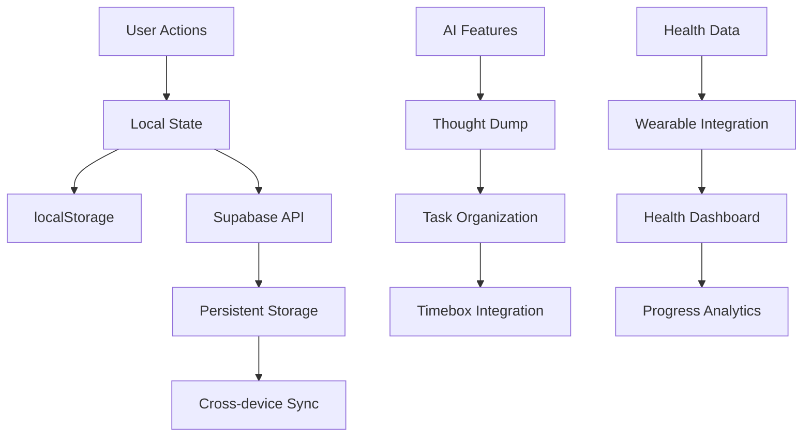

# 🌟 LifeLock Daily - Complete System Overview

## Introduction

LifeLock Daily is a comprehensive personal productivity and wellness system designed to help users optimize their day from morning to night. It combines habit tracking, task management, timeboxing, and reflective practices into a unified experience.

## System Philosophy

LifeLock is built on the principle that intentional daily practices lead to long-term success and well-being. The system guides users through a structured day while maintaining flexibility for individual needs and preferences.

## Architecture Overview (current layout)

```
lifelock/
├── 1-daily/          # daily UX, timeboxed sections
├── 2-weekly/         # weekly zoom-out views
├── 3-monthly/        # monthly planning
├── 4-yearly/         # yearly/OKR rollups
├── 5-life/           # life-level dashboards
├── _shared/          # cross-cutting pieces
│   ├── core/         # domain logic + state machines
│   ├── shell/        # admin shell (AdminLifeLock, tabs, day view)
│   ├── utils/        # helpers
│   ├── components/   # shared UI atoms/compounds
│   ├── docs/         # Documentation Index, Component Architecture
│   └── modals/       # daily-shared modals (create task/habit/goal/journal)
├── (section)/features/ # section-scoped feature modules (e.g., 1-daily/1-morning-routine/features)
└── README.md
```

## Daily Flow

### Morning (6 AM - 9 AM)
**Section**: Morning Routine 🌅
- Wake up time tracking
- Personal hygiene habits
- Physical activation (push-ups)
- Hydration and nutrition
- AI-powered day planning
- Meditation practice

### Late Morning (9 AM - 12 PM)
**Section**: Deep Work 🧠
- High-focus task management
- Session timer integration
- Complex project organization
- Minimal distraction environment
- Progress tracking

### Afternoon (12 PM - 5 PM)
**Section**: Light Work 💡
- Quick task completion
- Administrative work
- Communication tasks
- Flexible scheduling
- Priority management

### Throughout the Day
**Sections**: Wellness 🏃‍♂️
- **Home Workout**: Exercise tracking
- **Health Non-Negotiables**: Nutrition and hydration
- **Timebox**: Schedule management and time allocation

### Evening (8 PM - 10 PM)
**Section**: Nightly Checkout 🌙
- Daily reflection
- Achievement celebration
- Improvement identification
- Tomorrow's planning
- Bedtime tracking

## Section Details

### 🌅 Morning Routine
**Purpose**: Start the day with intention and energy
**Key Features**:
- Habit tracking with smart completion
- AI thought dump for day planning
- Motivational content
- Progress visualization
**Theme**: Yellow/Orange (energy, sunrise)

### 💡 Light Work
**Purpose**: Manage quick, low-intensity tasks
**Key Features**:
- Task creation and management
- Priority-based organization
- Calendar integration
- Subtask breakdown
**Theme**: Green/Emerald (growth, efficiency)

### 🧠 Deep Work
**Purpose**: Execute high-focus, cognitively demanding tasks
**Key Features**:
- Focus session management
- Complex task organization
- Project-based views
- Performance analytics
**Theme**: Blue/Indigo (focus, depth)

### 🏃‍♂️ Wellness
**Purpose**: Maintain physical health and energy
**Sub-sections**:
- **Home Workout**: Exercise tracking and routines
- **Health Non-Negotiables**: Nutrition, hydration, macros
**Theme**: Teal/Green (health, vitality)

### ⏰ Timebox
**Purpose**: Visual schedule and time management
**Key Features**:
- 24-hour timeline view
- Drag-and-drop scheduling
- Category-based organization
- Conflict detection
**Theme**: Multi-colored (time categories)

### 🌙 Nightly Checkout
**Purpose**: Reflect, learn, and prepare for tomorrow
**Key Features**:
- Structured reflection questions
- Progress tracking
- Action item generation
- Tomorrow's focus setting
**Theme**: Purple/Violet (reflection, wisdom)

## Data Flow Architecture



## Integration Points

### Cross-Section Integration
- **Tasks**: Flow between Light Work and Deep Work
- **Timebox**: Schedule tasks from all sections
- **Health**: Track wellness across all activities
- **Reflection**: Review all sections in checkout

### External Integrations
- **Calendar**: Sync with external calendars
- **Wearables**: Import health and fitness data
- **AI Services**: Power thought dump and insights
- **Payment**: Handle subscription features

## Technology Stack

### Frontend
- **React**: Component-based UI
- **TypeScript**: Type safety
- **Framer Motion**: Animations
- **Tailwind CSS**: Styling
- **Lucide React**: Icons

### Backend
- **Supabase**: Database and auth
- **Clerk**: User authentication
- **OpenAI**: AI features
- **Vercel**: Hosting

### State Management
- **React Hooks**: Local state
- **Supabase**: Server state
- **localStorage**: Offline support
- **Context API**: Global state

## Performance Optimizations

### Rendering
- Component memoization
- Lazy loading
- Virtual scrolling for large lists
- Optimistic updates

### Data Management
- Efficient caching strategies
- Batch API requests
- Offline-first architecture
- Background sync

### User Experience
- Smooth animations
- Progressive loading
- Error boundaries
- Graceful degradation

## Security Considerations

### Data Protection
- End-to-end encryption
- Secure API communication
- Privacy controls
- Data export options

### Authentication
- Secure login flows
- Session management
- Multi-factor authentication
- Account recovery

## Accessibility Features

### Visual
- High contrast themes
- Screen reader support
- Keyboard navigation
- Focus management

### Interaction
- Touch-friendly controls
- Voice input support
- Gesture recognition
- Adaptive interfaces

## Mobile Experience

### Responsive Design
- Mobile-first approach
- Touch-optimized interactions
- Progressive Web App features
- Offline functionality

### Performance
- Optimized bundle sizes
- Efficient image loading
- Smooth scrolling
- Fast interactions

## Future Roadmap

### Phase 1: Enhancement (Current)
- Complete documentation
- Refine existing features
- Improve mobile experience
- Enhance AI capabilities

### Phase 2: Expansion (Next 3 months)
- Social features
- Advanced analytics
- Customization options
- Integration marketplace

### Phase 3: Ecosystem (6+ months)
- Team collaboration
- Enterprise features
- API for third-party developers
- Advanced AI coaching

## Best Practices

### For Developers
1. **Component Architecture**: Keep components focused and reusable
2. **State Management**: Use appropriate state management patterns
3. **Performance**: Optimize for mobile and slow networks
4. **Testing**: Comprehensive test coverage
5. **Documentation**: Maintain up-to-date documentation

### For Users
1. **Consistency**: Use the system daily for best results
2. **Habit Formation**: Start small and build gradually
3. **Reflection**: Regularly review and adjust practices
4. **Balance**: Maintain work-life harmony
5. **Growth**: Continuously learn and improve

## Support Resources

### Documentation
- Section-specific README files
- Component documentation
- API documentation
- Troubleshooting guides

### Community
- User forums
- Feature requests
- Bug reporting
- Best practice sharing

### Help
- In-app guidance
- Video tutorials
- FAQ section
- Direct support

## Contributing

### Development Setup
1. Clone repository
2. Install dependencies
3. Set up environment variables
4. Run development server
5. Follow contribution guidelines

### Code Standards
- TypeScript for type safety
- ESLint for code quality
- Prettier for formatting
- Conventional commits
- Pull request reviews

---

**Last Updated**: 2025-10-13  
**Version**: 1.0  
**Maintainer**: SISO Development Team

## Quick Start Guide

### For New Users
1. **Morning**: Complete morning routine
2. **Planning**: Use AI thought dump for day planning
3. **Work**: Schedule tasks in timebox
4. **Health**: Track meals and exercise
5. **Evening**: Complete nightly checkout

### For Developers
1. **Read**: Section-specific README files
2. **Understand**: Data flow and integration points
3. **Follow**: Component architecture patterns
4. **Test**: Thoroughly test changes
5. **Document**: Update documentation

### For Designers
1. **Theme**: Understand color schemes and meanings
2. **Flow**: Follow daily user journey
3. **Components**: Use existing component library
4. **Responsive**: Design for mobile first
5. **Accessibility**: Ensure inclusive design

LifeLock Daily is more than a productivity app—it's a comprehensive system for intentional living. By integrating all aspects of daily life into a cohesive experience, it helps users build better habits, achieve their goals, and maintain balance in an increasingly complex world.
